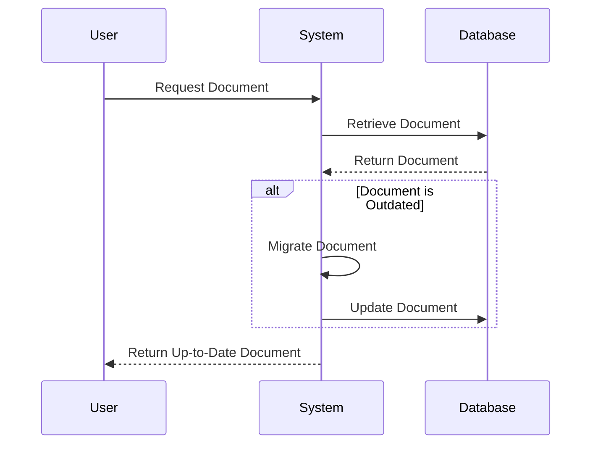

## Lazy Migration

### Description
Lazy Migration is a pattern designed to incrementally migrate documents in a NoSQL database to a new schema version. In contrast to a bulk migration, which updates all documents preemptively, Lazy Migration updates each document to the latest schema version only when it is accessed. This pattern is particularly useful when dealing with large datasets and minimizing the upfront cost of migrating the entire database.

### Architectural Approach
Lazy Migration leans heavily on the "eventual consistency" model prevalent in NoSQL systems, taking advantage of the flexible schema feature they provide. In implementing this pattern, documents are flagged with a version identifier. When a system component reads a document with an outdated version, it triggers the migration logic, updating the document in place transparently to the caller.

### Example Code
Here's a basic implementation example in JavaScript using a document-style NoSQL database:

```javascript
// Assume `db` is our NoSQL database instance
function getDocument(docId) {
  let document = db.findDocumentById(docId);

  if (document.schemaVersion < CURRENT_SCHEMA_VERSION) {
    document = migrateDocumentToCurrentVersion(document);
    db.updateDocument(docId, document);
  }

  return document;
}

function migrateDocumentToCurrentVersion(doc) {
  if (doc.schemaVersion === 1) {
    // Update from version 1 to version 2
    doc.newField = doc.oldFieldTransform();
    delete doc.oldField;
    doc.schemaVersion = 2;
  }
  // ... handle other version transitions if necessary

  return doc;
}
```

### Diagrams
Here is a simplified Mermaid sequence diagram to illustrate the process of a lazy migration when accessing a document:



### Related Patterns
- **Eager Migration**: Unlike Lazy Migration, Eager Migration updates all documents to a new schema version upfront, following a structured approach often through batch processing.
- **Versioned Schema**: This involves maintaining multiple schema versions concurrently and being able to process any version as needed.

### Best Practices
- **Versioning**: Always incorporate a version field in your documents to easily track and manage migrations.
- **Incremental Migration**: Consider breaking down migrations across versions to smaller, incremental ones to simplify logic and debugging.
- **Testing**: Rigorously test migration logic using a substantial set of representative data to identify edge cases early.

### Additional Resources
- "Designing Data-Intensive Applications" by Martin Kleppmann, which discusses data modeling strategies.
- Official documentation and whitepapers from leading NoSQL databases like MongoDB or Couchbase, which detail how they handle schema evolution.

### Summary
Lazy Migration allows developers to evolve a NoSQL database's schema without the immediate overhead of a full-database update. By migrating documents on access, it distributes the migration load over time and minimizes downtime. This pattern fits especially well in scenarios where the working set is much smaller than the complete data set, ensuring frequently-accessed data is always compliant with current application logic. While efficient, it also mandates precise and well-tested migration logic to avoid inconsistencies.
