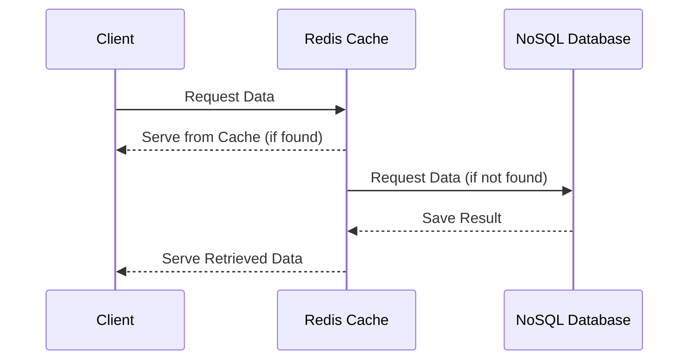
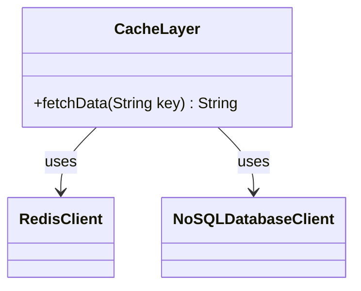

In the context of NoSQL databases, caching layers are fundamental to enhancing performance and efficiency. As demands on databases increase, introducing caches can significantly alleviate the burden by serving frequently accessed data rapidly. This pattern is particularly effective in systems where database load or latency must be minimized to improve response times.

## Design Pattern Overview

### Problem

As systems scale, the performance overhead on database operations increases. High query loads can lead to bottlenecks, increased latency, and might reach the system's read capacity limits. This can degrade user experience and escalate infrastructure costs.

### Solution

A caching layer is implemented to temporarily store frequently requested data in memory. By interposing this high-speed data retrieval architecture between the application and the database, access times are reduced. Caches can be leveraged at different levels of the system's architecture, including client-side, server-side, or as a dedicated caching service like Redis or Memcached.

### Implementation Example

1. **Architecture Setup**:
    - Use a distributed cache like Redis on top of a NoSQL database (e.g., MongoDB, Cassandra).
    - Configure the application to check for data in the Redis cache before querying the database.
    - Set expiration times and cache policies (e.g., Least Recently Used) appropriate for the application's needs.

2. **Code Example**:
    Here's a simple example using Redis with a hypothetical NoSQL database setup:

    ```java
    import redis.clients.jedis.Jedis;
    import com.datastax.oss.driver.api.core.CqlSession;
    
    public class NoSQLCache {
        private Jedis redis;
        private CqlSession cqlSession;
    
        public NoSQLCache() {
            this.redis = new Jedis("localhost");
            this.cqlSession = CqlSession.builder().build();
        }
    
        public String fetchData(String key) {
            String cachedData = redis.get(key);
            if (cachedData != null) {
                return cachedData;
            }
            String query = "SELECT value FROM our_table WHERE key = ?";
            PreparedStatement statement = cqlSession.prepare(query);
            ResultSet rs = cqlSession.execute(statement.bind(key));
            String dbData = rs.one().getString("value");
            redis.setex(key, 3600, dbData); // Set cache expiry to one hour
            return dbData;
        }
    }
    ```

## Diagrams

### Sequence Diagram

Below is a Mermaid sequence diagram illustrating how a typical request flows through the caching layer:



### Class Diagram

The following class diagram provides an abstract view of the components involved:



## Best Practices

- **Determine Cache Freshness**: Assess data access patterns to decide on expiration times adequately.
- **Consistency Management**: Implement consistency protocols to address potential data staleness.
- **Eviction Policies**: Consider suitable eviction strategies such as LRU (Least Recently Used) for cache entries.

## Related Patterns

- **Write-Behind Cache**: Ensures data written to the cache asynchronously updates the database, useful for applications prioritizing speed in other operations.
- **Read-Through Cache**: Data is fetched from the database and stored in cache simultaneously, ensuring synchronized data retrieval.

## Additional Resources

- [Redis Documentation](https://redis.io/documentation)
- [NoSQL Databases Explained](https://en.wikipedia.org/wiki/NoSQL)
- [Caching Strategies Guide](https://example.com/caching-strategies)

## Summary

Caching layers in NoSQL systems play a pivotal role in optimizing system performance and handling high throughput demands. By strategically deploying a caching layer, systems can avert direct load from databases, enhancing scalability and response times. Balancing cache freshness with resource management is crucial for ensuring efficiency and consistent user experiences.
