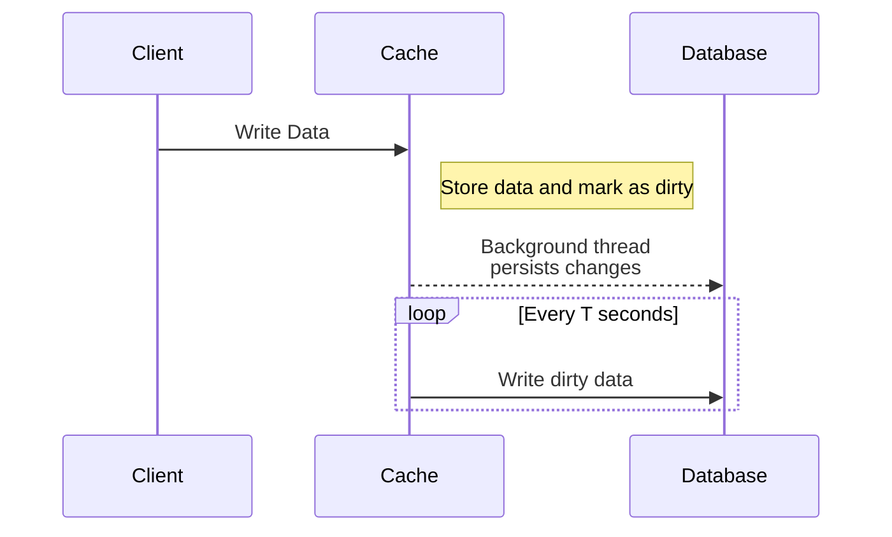

## Write-Back Cache

The Write-Back Cache pattern is a strategy where data modifications are initially applied only to the cache and then asynchronously written to the underlying database. This approach can significantly enhance application performance by reducing the latency associated with write operations and allowing complex or computationally expensive database operations to be batched and processed efficiently.

### Description

In a write-back cache system, when the data is altered or added, it is first written to the caching layer. The change is flagged for eventual persistence into the main database. A background process or thread periodically checks for data flagged as "dirty" or in need of syncing, and systematically updates the persistent storage.

### When to Use

- **High Throughput**: Systems require high throughput for write operations.
- **Temporary Storage**: Ideal when user data needs temporary storage before confirmation or batch processing.
- **Latency Sensitive Applications**: Reduces end-user experienced latency by offloading the write operations.
- **Cost Efficiency**: Reduces database write operations, leading to cost savings on database resources.

### Example Implementation

Below is a simplified Java pseudocode implementation using a write-back cache pattern:

```java
class WriteBackCache {
    private ConcurrentHashMap<String, Object> cache = new ConcurrentHashMap<>();
    private ScheduledExecutorService executor = Executors.newScheduledThreadPool(1);
    
    public WriteBackCache() {
        executor.scheduleAtFixedRate(this::persistChanges, 10, 10, TimeUnit.SECONDS);
    }

    public void put(String key, Object value) {
        cache.put(key, value);
        // Mark as dirty
    }

    public Object get(String key) {
        return cache.get(key);
    }

    private void persistChanges() {
        for (Map.Entry<String, Object> entry : cache.entrySet()) {
            // Assume this persists data to the database
            persist(entry.getKey(), entry.getValue());
        }
    }

    private void persist(String key, Object value) {
        // Implementation to write data to a database
    }
    
    // Cleanup and shutdown the executor service
}
```

### Diagram

Here's a Mermaid UML Sequence diagram illustrating a basic Write-Back Cache workflow:



### Related Patterns

- **Write-Through Cache**: Unlike write-back, data is written to both cache and database synchronously.
- **Read-Through Cache**: Cache acts as a proxy for read operations, fetching from the database if data is not present.
- **Cache-Aside**: Manual control over caching layer with explicit cache management logic.

### Best Practices

- **Consistency**: Ensure eventual consistency by carefully managing when data is synced.
- **Expiration Policies**: Implement a robust TTL policy to prevent stale data.
- **Error Handling**: Configure fallbacks and retries for handling persistence errors in the database.
- **Monitoring**: Actively monitor the health and size of cache to make adjustments as necessary.

### Additional Resources

- [Caching Strategies in Distributed Systems](https://example.com/caching-strategies)
- [Designing and Implementing Cache Solutions](https://example.com/cache-design)
- [Understanding NoSQL Databases](https://example.com/nosql-databases)

### Summary

The Write-Back Cache pattern is an effective way to optimize the performance of applications that handle high-volume writes by temporarily storing data in a cache and asynchronously persisting it to a database. This method improves write throughput and reduces latency, making it suitable for systems where quick user feedback is crucial. However, careful consideration of consistency and error handling strategies are necessary to balance performance gains with data reliability.
