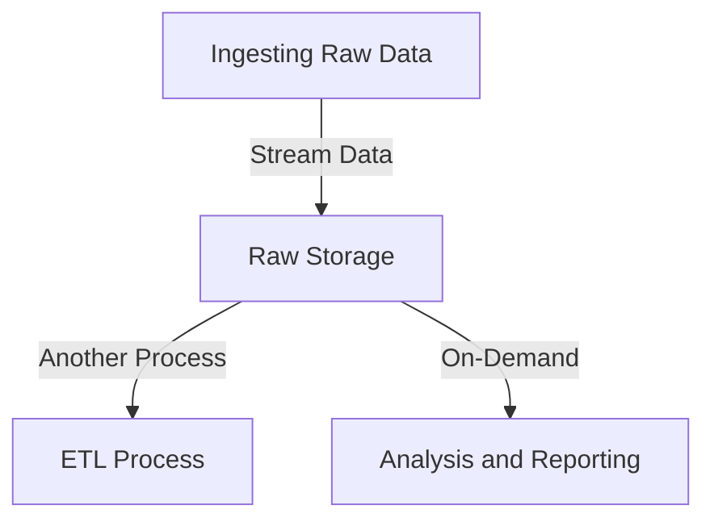

## Introduction

The Data Lake Pattern is a data management and storage strategy designed to handle large volumes of unstructured or semi-structured data. It serves as a centralized repository where raw data can be ingested and stored in its original format, accommodating various data types and sources. Unlike traditional data warehouses, data lakes do not require predefined schemas, offering flexibility for future data operations.

## Detailed Explanation

In a data lake, data is captured in its untouched state, preserving the native format and structure. This pattern is particularly beneficial when dealing with big data challenges, as it allows:
- **Scalability**: Easily handle enormous amounts of data without concern for volume constraints.
- **Flexibility**: Store multiple data formats and types, including log files, social media interactions, IoT sensor data, etc.
- **Future-proofing**: Deferred data modeling enables adapting to future analytical requirements and technologies without reconfiguring existing setups.

### Architectural Approaches
1. **Data Ingestion**: Utilizes tools such as Apache Kafka or AWS Kinesis for streaming data into the lake.
2. **Storage Solutions**: Commonly uses systems like Hadoop Distributed File System (HDFS), Amazon S3, or Azure Data Lake Storage for scalability and cost-effectiveness.
3. **Data Access and Processing**: Tools like Apache Spark, Presto, or Data Bricks are used to process data on-demand, converting it into information.
4. **Governance and Security**: Implements robust policies for data lifecycle management, access control, and data cataloging (using services such as AWS Glue or Azure Data Catalog).

## Best Practices
- **Metadata Management**: Efficient cataloging and tagging of data sources for easier data retrieval and analysis.
- **Data Governance**: Implement strict policies and frameworks to ensure data quality, compliance, and security.
- **Cost Optimization**: Leverage tiered storage and lifecycle policies to manage costs effectively.
- **Performance Considerations**: Use indexing, partitioning, and caching strategies to enable faster data retrieval.

## Example Code

```scala
// Simple example using Apache Spark to read data from a Data Lake (e.g., AWS S3 bucket)
val spark = SparkSession.builder.appName("DataLakeExample").getOrCreate()

val dataFrame = spark.read
  .option("header", "true")
  .csv("s3a://my-datalake-bucket/path-to-data")

dataFrame.show()
```

## Diagrams



## Related Patterns
- **Lambda Architecture**: Combines batch and stream processing for real-time analytics.
- **Polyglot Persistence**: Uses multiple data storage technologies optimized for different use cases.
- **Data Warehouse**: Provides structured storage with predefined schema for specific analytics.

## Additional Resources
- "The Enterprise Big Data Lake: Delivering the Promise of Hadoop and Data Science" by Alex Gorelik
- AWS Lake Formation guide and tutorials
- Azure Data Lake Storage documentation

## Summary

The Data Lake Pattern is an innovative approach to storing and managing large amounts of data in its raw form. It provides a foundation for big data and analytics initiatives, allowing organizations to store varied data types in a single, scalable repository. Implementing a Data Lake requires careful consideration of data governance, cost management, and processing strategies, but it offers extensive flexibility and future-proofing advantages vital for modern data needs.
