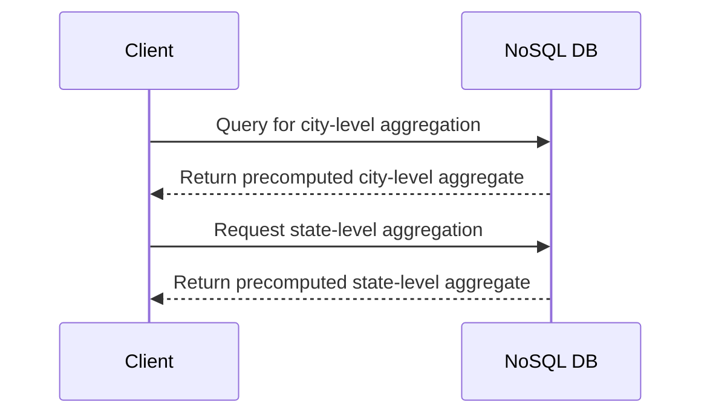

## Introduction

The Hierarchical Aggregation pattern is a data modeling technique commonly employed in NoSQL databases, aimed at efficiently aggregating data across various levels of a defined hierarchy. This pattern is integral for scenarios where data needs to be summarized and analyzed at multiple hierarchical levels, such as city, state, and country in a sales dataset.

## Detailed Explanation

### Architectural Approach

Hierarchical Aggregation involves creating a structure where data can be aggregated or rolled-up at multiple levels. This method is valuable in NoSQL databases due to their flexible schema designs and ability to handle large volumes of data without the need for complex joins typical in relational databases.

Different levels of aggregation can include:
- **Individual**: The most detailed level, perhaps capturing transactions per customer.
- **City Level**: Aggregating transactions across all customers within a city.
- **State Level**: Further aggregation to summarize all city data within a state.
- **Country Level**: An overall aggregation for a bird’s-eye view across states.

In essence, this hierarchical structuring facilitates both bottom-up and top-down data queries.

### Design Strategies

1. **Vertical Partitioning**: Dividing your data table such that each partition represents a level of the hierarchy. This can improve read performance as queries hitting specific levels don’t interact with unnecessary data.
   
2. **Denormalization**: Storing pre-computed aggregates at each level reduces the need for run-time computation, speeding up query responses but potentially increasing storage and complexity.

3. **Batch Processing**: Employ frameworks like Apache Flink or Spark to periodically recompute aggregates in bulk, ensuring data freshness without continuously burdening the system.

### Implementation Example

Consider a JSON document structure in a NoSQL database like MongoDB to illustrate hierarchical aggregation:

```json
{
  "country": "USA",
  "state": "California",
  "city": "San Francisco",
  "sales": 100000,
  "aggregates": [
    {
      "level": "state",
      "totalSales": 2000000
    },
    {
      "level": "country",
      "totalSales": 5000000
    }
  ]
}
```

In this example, targeted queries can quickly access aggregated sales data at different hierarchical levels based on the pre-stored aggregates.

### Diagrams

#### Hierarchical Aggregation Sequence Diagram



## Best Practices

- **Ensure Data Consistency**: Use transactional databases or compensating transactions to maintain consistency across hierarchical levels.
- **Update Strategies**: Implement incremental update strategies to manage aggregates without recalculating entire datasets.
- **Caching for Performance**: Employ in-memory caching solutions, like Redis, to store frequently accessed hierarchical aggregates.

## Related Patterns

- **Bucket Pattern**: Segments data into time-based or other logical subdivisions, similar to hierarchical divisions but more time or event-bound.
- **Materialized View Pattern**: Maintains precomputed results of queries to improve performance, similar in precomputing logic to hierarchical splits.

## Additional Resources

- "Designing Data-Intensive Applications" by Martin Kleppmann provides in-depth insights into data modeling patterns including aggregates.
- Official guidelines on MongoDB’s data modeling best practices.
- Apache Hadoop’s documentation on batch processing for large data sets.

## Summary

The Hierarchical Aggregation pattern efficiently structures data for summarization across hierarchical tiers. It enhances query performance in NoSQL databases by allowing pre-calculated aggregates to be quickly accessed, paving the way for real-time analytics and broad-scale data analysis. By adopting appropriate partitioning and batch processing strategies, it is possible to maintain data freshness while supporting various levels of data granularity.
