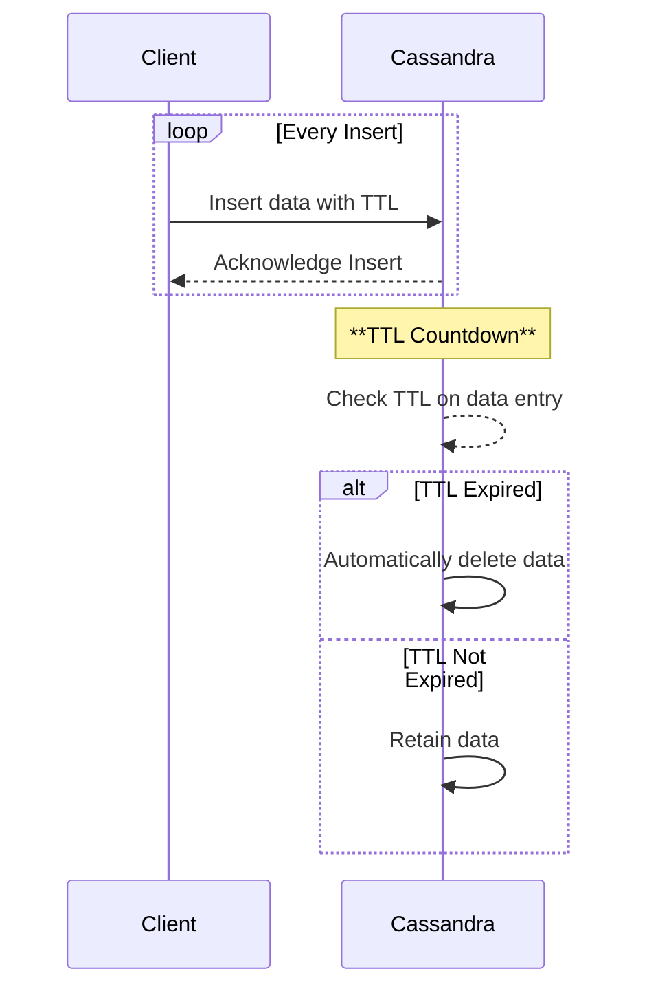

## Time to Live (TTL) Settings

### Overview

The Time to Live (TTL) settings pattern is a key design principle used primarily in NoSQL databases to manage data lifecycle efficiently. By attaching a TTL to data entries, databases can automatically handle the expiration and deletion of obsolete data, which simplifies data management and ensures optimal storage utilization. This pattern is particularly beneficial in scenarios where data relevance diminishes over time.

### Detailed Explanation

In a TTL architecture, each data entry or row in a database is associated with a timestamp that denotes its expiry time. Once this time is reached, the database will automatically delete the data, minimizing the need for manual intervention.

#### Benefits:
- **Automated Data Cleansing**: Reduces overhead of manual data management by automatically expiring irrelevant data.
- **Storage Optimization**: Continuously clears up space by purging outdated records.
- **Performance Improvement**: Facilitates better read/write operations by shrinking data workloads over time.
- **Compliance and Retention**: Helps meet regulatory requirements by systematically managing data lifecycles.

### Example Code

Let's consider a scenario using Apache Cassandra where we want to set a TTL for social media posts to automatically expire after seven days.

```cql
// Creating a posts table with TTL set
CREATE TABLE social_media.posts (
    id UUID PRIMARY KEY,
    user_id UUID,
    content TEXT,
    created_at TIMESTAMP
);

// Inserting a post with a TTL of 604800 seconds (7 days)
INSERT INTO social_media.posts (id, user_id, content, created_at) 
VALUES (uuid(), uuid(), 'Sample post content', toTimestamp(now()))
USING TTL 604800;
```

### Architectural Approaches

#### TTL Contexts:
- **Session Management**: Automatically removing sessions after inactivity (ex: shopping carts, user sessions).
- **Message Queues**: Deleting messages after they have been processed or expired.
- **Cache Management**: Evicting stale cache entries to refresh datasets.

### Related Patterns

- **Data Sharding**: Use with TTL to distribute and manage larger data sets horizontally.
- **Event Sourcing**: Combine with TTL for managing event streams where older events are no longer needed.
- **Write-Ahead Logging (WAL)**: Can assist with durable implied deletions after applying TTL settings through compaction processes.

### Diagrams

#### Mermaid UML Sequence Diagram
Below is a sequence diagram that describes the lifecycle of a data entry with TTL settings from creation to expiration:



### Additional Resources

- [Cassandra TTL Documentation](https://cassandra.apache.org/doc/latest/cassandra/cql/dml.html#ttl)
- [Redis TTL Management](https://redis.io/commands/expire/)

### Summary

The Time to Live (TTL) Settings pattern is an invaluable approach in modern data architectures, specifically within NoSQL databases, to manage data effectively over its lifecycle. By automating data expiration, organizations can enhance their data management practices, ensuring they maintain compliance, optimize performance, and control storage requirements efficiently. As technologies evolve, TTL settings continue to play a crucial role in sustainable data architecture design.
