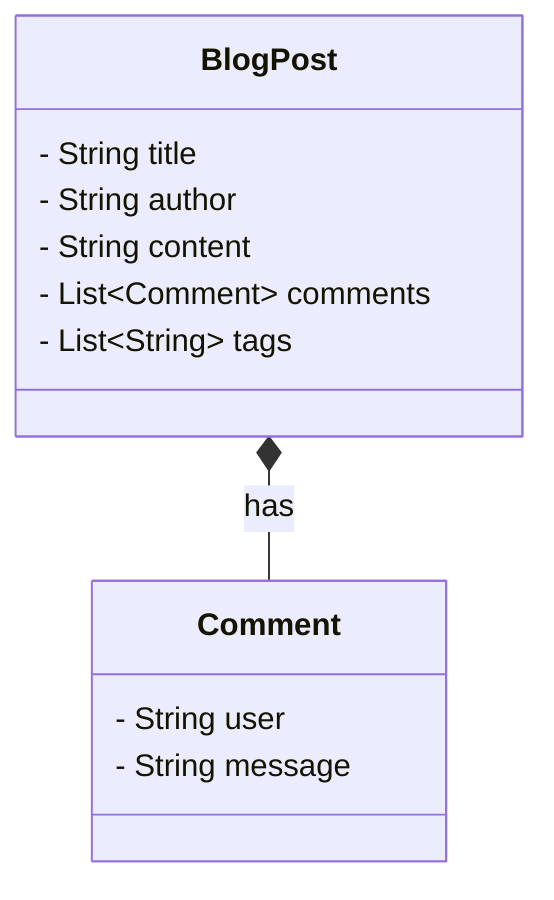

---

linkTitle: "Document Embedding"
title: "Document Embedding"
category: "3. NoSQL Data Modeling Patterns"
series: "Data Modeling Design Patterns"
description: "A NoSQL data modeling pattern where related data is embedded within a single document to optimize for quick retrieval, exemplified by storing related content such as comments within a blog post document."
categories:
- Data Modeling
- NoSQL
- Document Stores
tags:
- Design Patterns
- MongoDB
- Database Design
- Data Embedding
- NoSQL
date: 2024-07-07
type: docs

canonical: "https://softwarepatternslexicon.com/102/3/3"
license: "© 2024 Tokenizer Inc. CC BY-NC-SA 4.0"
---

## Document Embedding

In the realm of NoSQL databases, particularly document-oriented stores like MongoDB, document embedding is a prevalent design pattern. This pattern advocates storing related data within a single document, enhancing access speed and minimizing the need for multiple queries.

### Description
Document embedding involves including related data directly within a main document, rather than spreading it across various collections or tables. This structure is particularly useful when the embedded data shares a strong relationship with the main entity and is frequently accessed together.

### Benefits
- **Performance Improvement**: Reduces the number of read operations required to fetch related data, significantly boosting performance for read-heavy applications.
- **Atomic Operations**: Allows for atomic updates to related data, as all related information resides within a single document.
- **Simplified Data Management**: Consolidates related entities, simplifying the logic needed to manage and access them.

### Drawbacks
- **Size Limitations**: Each document size potentially can grow significantly, potentially hitting the database's maximum document size constraint.
- **Wasted Space**: If related data isn't consistently utilized, you might end up storing extra data unnecessarily.
- **Data Duplication**: If the same embedded structure is duplicated in many documents, any changes require updates to all instances.

### Architectural Approaches

In practice, document embedding can be seen in scenarios such as modeling one-to-many relationships where the "many" side doesn’t outgrow the constraints of a single document size limit. Example use cases include:

- User Profiles: Embedding a list of addresses or phone numbers directly in the user document.
- Order Histories: Embedding line items within an order document to simplify accessing an entire order history in one read operation.

### Example Code

Below is a simple example using a MongoDB-like structure to illustrate document embedding for a blog post with comments.

```json
{
  "title": "NoSQL Design Patterns",
  "author": "John Doe",
  "content": "Exploring document embedding in MongoDB...",
  "comments": [
    {
      "user": "Alice",
      "message": "Great article!"
    },
    {
      "user": "Bob",
      "message": "Very insightful."
    }
  ],
  "tags": ["NoSQL", "Data Modeling", "Document Store"]
}
```

### Diagram 

Here's a simplified conceptual representation of the document embedding pattern using Mermaid UML sequence diagram:



### Best Practices
- **Evaluate Data Access Patterns**: Embed data when it is regularly retrieved together, and updates are not frequent.
- **Document Size Monitoring**: Always monitor the size of your documents to avoid excessive bloating that could degrade performance or hit maximum size limitations.
- **Consider Document Life Cycle**: Embedding data where lifecycle mismatch could require frequent updates might not be ideal.

### Related Patterns
- **Document Linking**: Contrasts with document embedding by maintaining related data outside the primary document, common in scenarios where individual components change frequently.
- **Attribute Store Pattern**: Utilizes key-value pairs for design simplicity, useful when fields are optional or vary widely across records.

### Additional Resources
- [MongoDB Official Documentation](https://docs.mongodb.com/manual/data-modeling/)
- [NoSQL Data Modeling Techniques](https://www.oreilly.com/library/view/nosql-distilled/9780133036121/)

### Summary
Document embedding is a powerful NoSQL design pattern that optimizes read performance by co-locating related data within a single document structure. By understanding its benefits and limitations, developers can better structure their data models to exploit NoSQL’s strengths, particularly in applications with high-read requirements where related data is commonly accessed together. While it brings performance improvements, careful consideration must be given to data size constraints and the nature of updates.
