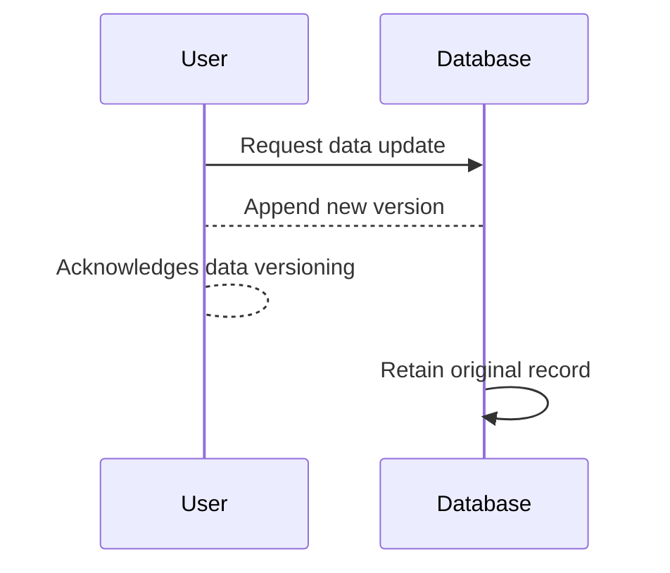

## Immutable Data Pattern

### Description
The Immutable Data Pattern involves treating data as immutable, meaning once a piece of data is created, it cannot be changed. Instead of modifying existing records, new versions of records are appended to the data store. This ensures that all historical versions of the data are retained, accurately reflecting the sequence of changes over time.

### Architectural Approaches

1. **Versioned Records**: Every modification to a data entity results in a new version (or copy) of that entity being stored. The system maintains pointers or references to previous versions for auditing or rollback purposes.

2. **Event Sourcing**: All changes to the application state are stored as a sequence of events. Each event represents a fact describing something that happened, thus allowing the current state to be rebuilt by replaying the events.

3. **Temporal Databases**: These databases inherently support storing different versions of data. They are designed to recognize time-based data changes, either bi-temporally (both transaction-time and valid-time) or only valid-time.

### Paradigms and Best Practices

- Utilize Write-Once Read-Many (WORM) storage methodologies to advantage the high-throughput and append-only nature of immutable data structures.
- Leverage structured or semi-structured logs in systems like Apache Kafka for capturing changes in a scalable, ordered, and replayable format.
- Implement comprehensive versioning strategies that tag each record with version identifiers along with timestamps, ensuring reliable auditing trails.
- Adopt microservice patterns like CQRS (Command Query Responsibility Segregation) to separate read models from write models, aligning with immutable data retrieval and storage practices.

### Example Code

**Example in Java Using MongoDB**

Here's a simple implementation of an immutable data approach using a MongoDB document collection, where each change results in a new document being created.

```java
import com.mongodb.client.MongoClients;
import com.mongodb.client.MongoCollection;
import org.bson.Document;

import java.util.UUID;

public class ImmutableDataExample {

    public static void main(String[] args) {
        var client = MongoClients.create("mongodb://localhost:27017");
        var database = client.getDatabase("exampleDB");
        var collection = database.getCollection("documents");

        // Insert a new immutable document
        insertNewDocument(collection, "Initial content.");

        // Append a new version
        insertNewDocument(collection, "Updated content.");
    }

    private static void insertNewDocument(MongoCollection<Document> collection, String content) {
        Document document = new Document("_id", UUID.randomUUID().toString())
                .append("content", content)
                .append("version", System.currentTimeMillis());

        collection.insertOne(document);
    }
}
```

### Diagrams

#### Mermaid UML Sequence Diagram


### Related Patterns

- **Event Sourcing Pattern**: Closely tied to immutable data, it suggests persisting changes as a sequence of events.
- **CQRS (Command Query Responsibility Segregation)**: Divides the read and write concerns, making immutable data more manageable.
- **Snapshot Pattern**: Captures the state of an application at specific intervals, supporting efficient state reconstruction from events.

### Additional Resources

- [Martin Fowler on Event Sourcing](https://martinfowler.com/eaaDev/EventSourcing.html)
- [Why Use Immutable Data Structures](https://link-to-resource.com)
- [Temporal Database Concepts](https://temporal-databases.org)

### Summary

The Immutable Data Pattern provides a robust framework for managing data integrity and traceability in a NoSQL environment by embedding historical context into versioned records. This approach enhances auditability, supports compliance requirements, and assists in building distributed systems where consistency and history need alignment. Utilizing tools and frameworks that support immutability natively can significantly reduce complexities involved in maintaining such models.
