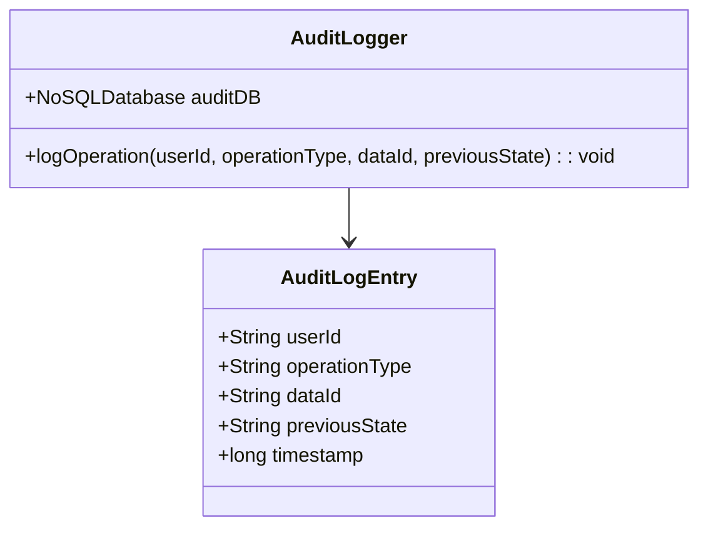

## Introduction

Audit Logging is a critical design pattern in data management that involves tracking and recording all changes and access operations on data, primarily for security and compliance reasons. It helps organizations maintain a detailed history of data modifications and access, which is crucial for auditing, monitoring, and reviewing actions performed within a system.

## Detailed Explanation

### Design Pattern Overview

Audit Logging is employed to establish a comprehensive record of user interactions with data, including creation, updates, deletions, reads, and access attempts. The logs generated aim to:

- **Ensure Data Integrity**: By keeping a trail of who did what and when, you guarantee the traceability of all data changes.
   
- **Enhance Security**: Helps in identifying unauthorized access and potential security breaches.
   
- **Compliance and Legal Requirements**: Adhering to mandates like GDPR, HIPAA, and SOX that require maintaining a log of data access and modifications.

### Architectural Approach

In a NoSQL context, audit logging can be implemented by utilizing a secondary collection or table specifically for logs. Key considerations include:

- **Data Structure**: Each log entry should typically include the operation type, timestamp, user ID, affected data, and previous state.
  
- **Storage Strategy**: Due to potentially high write volumes, systems should opt for scalable storage solutions like distributed NoSQL databases (e.g., Cassandra or Amazon DynamoDB) that can handle large throughput efficiently.
  
- **Retention Policies**: Define how long logs need to be maintained based on business and compliance requirements.

### Implementation Example

Here's a simplified example using Java and a NoSQL database:

```java
public class AuditLogger {

    // Assuming a NoSQL collection or table named 'AuditLogs'
    private final NoSQLDatabase auditDB;

    public AuditLogger(NoSQLDatabase database) {
        this.auditDB = database;
    }

    public void logOperation(String userId, String operationType, String dataId, String previousState) {
        // Create a log entry object
        AuditLogEntry entry = new AuditLogEntry(userId, operationType, dataId, previousState, System.currentTimeMillis());
        
        // Save it to the audit logs collection
        auditDB.save("AuditLogs", entry);
    }
}

public class AuditLogEntry {

    private final String userId;
    private final String operationType;
    private final String dataId;
    private final String previousState;
    private final long timestamp;

    public AuditLogEntry(String userId, String operationType, String dataId, String previousState, long timestamp) {
        this.userId = userId;
        this.operationType = operationType;
        this.dataId = dataId;
        this.previousState = previousState;
        this.timestamp = timestamp;
    }

    // Getters and additional methods
}
```

### Diagram



## Best Practices

- **Consistency in Log Structure**: Ensure all logs follow a standardized format for easy parsing and analysis.
  
- **Integrity Checks**: Regularly verify log integrity to prevent tampering with log data.
  
- **Efficient Querying**: Design the logging storage to allow efficient query execution, especially for frequent compliance reviews.

## Related Patterns and Concepts

- **Event Sourcing**: An architectural pattern where state changes are stored as a sequence of events.

- **Secured Operations**: Complementary to audit logging, ensuring that operations themselves are securely executed.

- **Immutable Data Stores**: Using immutable data structures can further enhance the traceability and reliability of logs.

## Additional Resources

- [Secure Software Development Life Cycle](https://link-to-ssd-docs)
- [Best Practices for Compliance Logging](https://link-to-compliance-docs)
- [Understanding Event Sourcing](https://link-to-event-sourcing-doc)

## Summary

Audit Logging is an indispensable design pattern for any organization aiming to maintain comprehensive and secure records of data access and modifications. It plays a vital role in ensuring compliance with legal standards and fortifying data security frameworks. When properly implemented, it provides the transparency and accountability necessary for modern data-driven environments.
