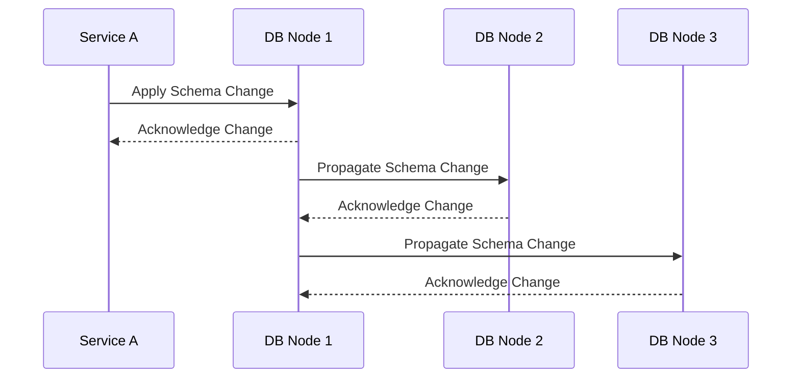

---

linkTitle: "Eventual Schema Consistency"
title: "Eventual Schema Consistency"
category: "3. NoSQL Data Modeling Patterns"
series: "Data Modeling Design Patterns"
description: "Allowing temporary schema differences that converge over time across distributed databases in NoSQL environments, facilitating smooth schema evolution while ensuring data consistency eventually."
categories:
- NoSQL
- Data Modeling
- Schema Evolution
tags:
- NoSQL
- Schema Consistency
- Distributed Databases
- Data Modeling Patterns
- Schema Evolution
date: 2024-07-07
type: docs

canonical: "https://softwarepatternslexicon.com/102/3/33"
license: "© 2024 Tokenizer Inc. CC BY-NC-SA 4.0"
---

## Eventual Schema Consistency

### Introduction

The Eventual Schema Consistency pattern is crucial for NoSQL database environments, where schema evolution is often necessary due to evolving application needs. Unlike traditional databases that require strict schema consistency maintained by a central authority, NoSQL systems often operate under a decentralized architecture, necessitating more flexible approaches like eventual consistency. This pattern allows for temporary differences in schemas across nodes, which gradually resolve as nodes synchronize.

### Architectural Approach

In many distributed NoSQL systems, data is partitioned across multiple nodes. Each node may independently handle schema changes at different times, leading to a short-term period where schemas diverge. These changes are eventually propagated across all nodes and clients, ensuring consistency without requiring downtime or immediate complete synchronization across the system, which can be inefficient and cumbersome in large-scale environments.

Mermaid UML Sequence Diagram: Demonstrating Propagation of Schema Changes



### Best Practices

- **Versioned Schemas**: Tag data versions with schema versions to manage and track consistency across systems.
- **Backward Compatibility**: Ensure new schema changes do not break existing applications operating on the old schema.
- **Graceful Migration Strategies**: Implement strategies such as dual writes where possible, allowing both old and new data formats.
- **Consistent Backlog Processing**: Employ backfill processes to consistently upgrade data stored under the previous schema version.
- **Monitoring and Alerts**: Establish monitoring and alerting mechanisms for deviations and anomalies during schema propagation.

### Example Code

This example demonstrates how a Java-based application handles schema changes using versioned schemas in a distributed database.

```java
import com.fasterxml.jackson.databind.JsonNode;
import com.fasterxml.jackson.databind.ObjectMapper;

public class SchemaUpdater {

    private static final ObjectMapper objectMapper = new ObjectMapper();

    public JsonNode applySchemaChange(JsonNode node, int targetVersion) throws Exception {
        int currentVersion = node.get("schemaVersion").asInt();

        while (currentVersion < targetVersion) {
            node = applyChangesForVersion(node, ++currentVersion);
        }

        return node;
    }

    private JsonNode applyChangesForVersion(JsonNode node, int version) throws Exception {
        // Placeholder for transformation logic for each version
        switch(version) {
            case 2:
                // Migrate schema version 1 to version 2
                // Transformation logic e.g., renaming fields
                break;
            // Further versions can be added as needed
            default:
                throw new Exception("Unsupported schema version:" + version);
        }
        node.get("schemaVersion").asInt();
        return node;
    }
}
```

### Related Patterns

- **Eventual Consistency**: A broader pattern addressing eventual consistency for data across distributed systems.
- **Schema-on-Read**: Delays schema definition until data is read, aligning closely with schema evolution needs.
- **Dual Writes**: Temporarily write to both old and new schema formats to ease transition.

### Additional Resources

- [Martin Fowler on Schema Evolution](https://martinfowler.com/articles/schema-evolution.html)
- [NoSQL Databases and Agile Data Infrastructure by Pramod J. Sadalage and Martin Fowler](https://www.amazon.com/NoSQL-Distilled-Gently-Introduction-Sad-Large-Scale-Systems/dp/0321826620)

### Summary

The Eventual Schema Consistency pattern allows distributed NoSQL databases to handle schema migrations gracefully without sacrificing operational availability or performance. By permitting temporary schema divergences that slowly resolve over time, systems maintain flexibility and adapt to evolving data and application requirements. Using strategies such as versioned schemas, backward compatibility, and precise migration processes, this pattern ensures robust data consistency in scalable, distributed environments.
