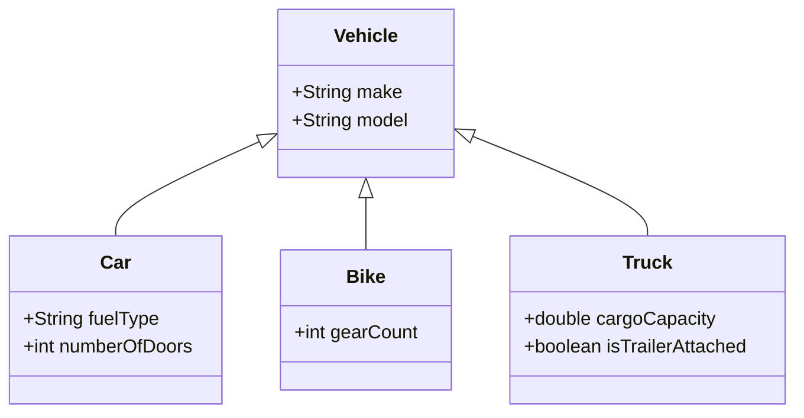

## Polymorphic Schema

In the NoSQL paradigm, particularly within document stores like MongoDB or Couchbase, one of the impactful design patterns is the **Polymorphic Schema**. This pattern accommodates varied data structures within a single collection, thereby offering flexibility and adaptability in data modeling.

### Description

The Polymorphic Schema design pattern allows for a single collection to contain documents of varying structures. This pattern is beneficial in scenarios where the application needs to store different types of entities in the same logical group, which results in a more natural alignment with the domain model of the application.

For example, consider a "Vehicles" collection. In a typical polymorphic schema, this collection might include:
- **Car documents**: Fields such as `make`, `model`, `fuelType`, `numberOfDoors`.
- **Bike documents**: Fields such as `make`, `model`, `gearCount`.
- **Truck documents**: Fields such as `make`, `model`, `cargoCapacity`, `isTrailerAttached`.

This variation is feasible because document stores do not enforce a rigid schema, unlike traditional relational databases. Therefore, developers can benefit from flexible data structures and pivot the application's capabilities rapidly, according to business needs.

### Example Code

Here's an example of how documents might look in a MongoDB collection adopting the Polymorphic Schema pattern:

```json
// Car Document
{
  "_id": "1",
  "type": "car",
  "make": "Toyota",
  "model": "Corolla",
  "fuelType": "Petrol",
  "numberOfDoors": 4
}

// Bike Document
{
  "_id": "2",
  "type": "bike",
  "make": "Yamaha",
  "model": "MT-07",
  "gearCount": 6
}

// Truck Document
{
  "_id": "3",
  "type": "truck",
  "make": "Volvo",
  "model": "FH",
  "cargoCapacity": 33000,
  "isTrailerAttached": true
}
```

### Architectural Approaches and Paradigms

- **Document Stores**: Designed to naturally handle semi-structured data, making them perfect candidates for implementing a polymorphic schema.
- **Schema-less Design**: Emphasizes flexibility over strict normalization found in RDBMS, thus enabling varied document structures.
- **Domain-Driven Design (DDD)**: Allows modeling of entities, aggregates, and value objects, reflecting real-world entities in a dynamic context.

### Best Practices

1. **Consistent Identification**: Use a `type` field to identify the document's entity, facilitating processing and querying logic.
2. **Validation**: Apply application-level validation to ensure that documents meet required structures and constraints.
3. **Indexing**: Optimize indices by focusing on commonly queried fields across all document types.

### Diagrams

Here is a UML Class diagram showing the relationships and structure of a Polymorphic Schema in a "Vehicles" collection:



### Related Patterns

- **Flexible Schema**: A pattern for adding flexibility to database schema, often related but more generic.
- **Schema Evolution**: Managing changes to the schema over time, allowing backward compatibility.
- **Entity-Attribute-Value (EAV)**: Another way to model flexible schemas that can compare with polymorphic approaches.

### Additional Resources

- [MongoDB Documentation](https://docs.mongodb.com) - Official MongoDB site offering in-depth guides on schema design.
- [Couchbase Data Modeling](https://docs.couchbase.com) - Couchbase's approach to flexible and dynamic data models.

### Summary

The Polymorphic Schema pattern is a crucial design choice in NoSQL databases, supporting the flexibility and scalability of modern cloud-native applications. It aligns with the NoSQL design principle of agility, allowing developers to naturally manage diverse datasets within a unified collection. By leveraging this pattern, organizations can drive efficient data management strategies aligning closely with business requirements, ensuring that applications remain adaptable to changes in operational dynamics and user requirements.
