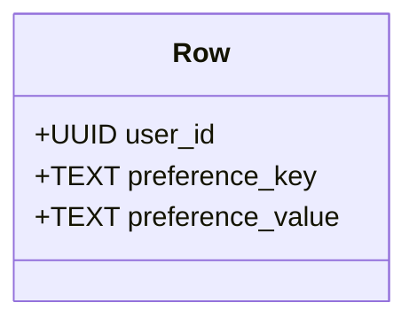

## Introduction

The Wide Column Store Pattern is designed for situations where you need to handle large datasets with dynamic attributes. Unlike traditional relational databases, wide column stores such as Apache Cassandra or Google Bigtable store data in rows with a flexible set of columns, allowing for highly scalable storage and efficient querying of sparse data.

## Detailed Explanation

### Design Pattern Basics

- **Row-Based Storage**: Data is stored in rows, each uniquely identified by a key.
- **Dynamic Columns**: Columns are not predefined, meaning every row can have a different set of columns.
- **Sparse and Efficient**: Ideal for datasets with variable attributes, like user preferences or sensor data.

### Architectural Approach

A wide column store architecture usually involves:

1. **Data Model Design**: Define the keyspace, column families (tables), and clustering keys to ensure efficient data distribution and lookups.
2. **Schema Design**: Each row can contain complex columns (key-value pairs), allowing for flexibility in storing varying data types and numbers of columns.
3. **Replication and Distribution**: These systems often support data replication across nodes for availability, and distribute data for load balancing and fault tolerance.

### Best Practices

- **Denormalization**: Embrace denormalization for faster reads as joins are not supported natively.
- **Appropriate Key Design**: Carefully design row keys to optimize read and write patterns and avoid hot spots.
- **Understand Consistency Requirements**: Configure consistency levels based on your read/write needs versus latency.

### Example Code 

In Apache Cassandra, defining a table using the Wide Column Store Pattern may look like:

```sql
CREATE TABLE user_preferences (
    user_id UUID,
    preference_key TEXT,
    preference_value TEXT,
    PRIMARY KEY (user_id, preference_key)
);
```

### Diagrams



### Related Patterns

- **Time-Series Pattern**: Often combined with wide column stores to handle time-stamped data.
- **Event Sourcing Pattern**: Useful for storing historical states or changes over time, similar to wide column data structures.

## Additional Resources

- Official [Cassandra Documentation](https://cassandra.apache.org/doc/latest/)
- Article on [Bigtable and the Advantages of Wide-Column Databases](https://cloud.google.com/blog/products/databases/a-deep-dive-into-wide-column-databases)

## Summary

The Wide Column Store Pattern is a powerful approach for applications needing to work with large datasets having volatile schema requirements. It provides scalability and flexibility by allowing dynamic column definitions while ensuring efficient data access. The pattern's strength in handling sparse data makes it apt for domains like IoT, social media data, and more, especially within distributed systems. Understanding the nuances of schema design and key distribution is critical for leveraging this pattern effectively in cloud applications.
