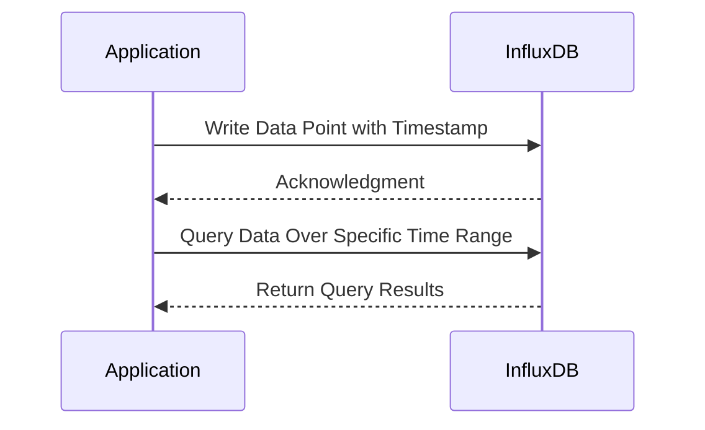

## Description

The Time-Series Data Pattern is a design pattern used in data modeling, primarily when dealing with time-sensitive information. This pattern is highly optimized for time-based queries, which makes it particularly useful in scenarios such as monitoring, analytics, and reporting tasks where the temporal ordering of data is crucial. Time-series data is often recorded at regular intervals, with each entry comprising a timestamp and measured values, allowing for storing, querying, and analyzing trends over time.

## Architectural Approaches

When designing systems that use the Time-Series Data Pattern, certain architectural considerations must be addressed:
1. **Time-Stamped Values**: Ensure each data point is associated with a timestamp, making it easy to query data over duration.
2. **Downsampling and Rollups**: Implement strategies for data aggregation over time (e.g., hourly, daily aggregates) to optimize storage and response times.
3. **Retention Policies**: Define data retention rules to automatically archive or delete old data, balancing historical value with storage costs.
4. **Efficient Storage**: Utilize specialized databases like InfluxDB, TimescaleDB, or AWS Timestream that are designed for efficient storage and retrieval of time-series data.
5. **Order Preserving Partitioning**: For scalability, partition data across multiple nodes while maintaining order by time to optimize query performance.

## Best Practices

- **Data Encoding**: Use efficient encoding techniques like delta encoding or compression to reduce storage requirements for large datasets.
- **Batch Processing**: Implement batch imports for high-volume data entries to optimize performance and leverage bulk processing capabilities of NoSQL databases.
- **Use Appropriate Time Granularity**: Choose the right time granularity that balances the detail required for analysis with performance and storage constraints.
- **Indexing and Query Optimization**: Utilize time-based indexes and query optimization techniques to improve retrieval speed for large datasets.
- **Monitoring and Alerting**: Deploy robust monitoring and alerting mechanisms to detect anomalies or relevant patterns in time-series data.

## Example Code

Example code for storing and querying time-series data using InfluxDB could look as follows:

```clojure
;; Connecting to InfluxDB and writing a time-series entry
(require '[influxdb-client.core :as influx])

(let [client (influx/make-client {:url "http://localhost:9999" 
                                  :token "my-token" 
                                  :org "my-org"})]
  (-> client
      (influx/write-point "metrics" 
          {:measurement "cpu"
           :tags {:host "server1"}
           :fields {:usage 85}
           :time (java.time.Instant/now)})
      (influx/flush))
  (influx/close client))

;; Querying time-series data
(let [client (influx/make-client {:url "http://localhost:9999" 
                                  :token "my-token" 
                                  :org "my-org"})]
  (let [query "from(bucket:\"metrics\")
               |> range(start: -1h)
               |> filter(fn: (r) => r._measurement == \"cpu\")"
        result (influx/query client query)]
    (println result))
  (influx/close client))
```

## Diagrams

### Sequence Diagram to Write and Query Time-Series Data



## Related Patterns

- **Event Sourcing Pattern**: Used for capturing system changes as a sequence of events, which can complement the Time-Series pattern in logging changes.
- **CQRS (Command Query Responsibility Segregation) Pattern**: Can be utilized where command and query responsibilities of time series data are segregated for performance; for example, commands logging the data, and queries analyzing it.

## Additional Resources

- [InfluxDB: Introduction to Time-Series Database](https://www.influxdata.com/time-series-database/)
- [Time-Series SQL: Schema Design and Query Examples](https://docs.timescale.com/getting-started/creating-hypertables)
- [AWS Timestream: Fast, Scalable Time-Series Database](https://aws.amazon.com/timestream/)

## Summary

The Time-Series Data Pattern is essential for applications where temporal data analysis and monitoring are critical. With appropriate storage, indexing strategies, and database technologies, this pattern allows for efficient querying and processing of historical time-series data, thereby driving insightful analytics and timely alerts in modern data-driven applications. By following architectural best practices and leveraging specialized databases, implementing the Time-Series Data Pattern can provide significant advantages in data modeling scenarios necessitating time-aware analysis.
