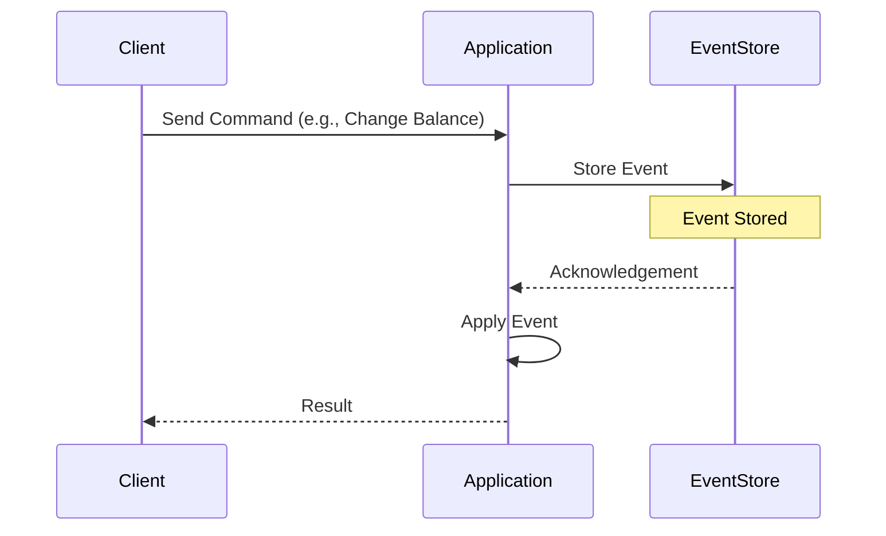

Event sourcing is a powerful design pattern that stores the state of a system as a sequence of events. This approach is fundamental in achieving data consistency in distributed systems, providing benefits like auditing and temporal queries.

## Detailed Explanation

### Core Principles of Event Sourcing
- **Event as a Source of Truth**: Each state change in the system is captured as an immutable event. The current state of the system can always be reconstructed by re-playing the sequence of events.
- **Immutability**: Events that have occurred cannot be altered or deleted, enhancing audit trails and system integrity.
- **Temporal Queries and Auditing**: Ability to query historical data allows for auditing past states and time travel debugging.

### Architectural Approaches
- **Event Store**: A specialized database (such as Apache Kafka, EventStoreDB) designed to capture, store, and usually publish events to ensure high availability and persistence.
- **Commands and Events Separation**: Commands trigger state changes, which are then recorded as events. Commands can be seen as the intention, while events are the record of what happened.

### Paradigms and Best Practices
- **CQRS Pattern**: Event sourcing is often used in tandem with the Command Query Responsibility Segregation (CQRS) pattern, where reads and writes are handled differently to optimize complex systems.
- **Event Versioning**: Events should be versioned to accommodate changes over time without affecting existing processing logic.
- **Idempotency**: Ensure that processing an event multiple times results in the same end state to prevent inconsistencies.

### Example Code

```java
// Simplified Java example for event sourcing process
class Account {
    private UUID id;
    private List<Event> events = new ArrayList<>();
    
    public Account(UUID id) {
        this.id = id;
    }
    
    public void applyEvent(Event event) {
        // Add event to list
        events.add(event);
        // Apply event changes to the state
        // Can include if conditions on event type
    }
    
    public void changeBalance(double amount) {
        // Apply some business logic here
        events.add(new BalanceChangedEvent(this.id, amount));
    }

    // Reconstruction based on events
    public void rebuildFromEvents(List<Event> storedEvents) {
        storedEvents.forEach(this::applyEvent);
    }
}

// Example Event
class BalanceChangedEvent extends Event {
    private double amount;
    public BalanceChangedEvent(UUID accountId, double amount) {
        super(accountId);
        this.amount = amount;
    }

    public double getAmount() {
        return amount;
    }
}
```

### Diagrams
Below is a basic sequence diagram illustrating the event sourcing process:



## Related Patterns
- **CQRS**: Command Query Responsibility Segregation pattern often used in conjunction with event sourcing.
- **Saga Pattern**: Long-running transactions manage events and state transitions in a complex system.
- **Domain-Driven Design (DDD)**: Provides the context in which event sourcing thrives, aligning business processes with software design.

## Additional Resources
- [Martin Fowler on Event Sourcing](https://martinfowler.com/eaaDev/EventSourcing.html)
- [Event Store Documentation](https://eventstore.com/docs/getting-started/writing)
- [Building Microservices with Domain-Driven Design and Event Sourcing](https://www.amazon.com/dp/B085VZ1T1Y)

## Summary
Event sourcing redefines how data changes are stored and applied. By focusing on recording every change as an immutable event, applications gain significant advantages in terms of tracing, auditing, and enabling scalability in distributed systems. It's especially powerful when integrated into event-driven architectures and used with the CQRS pattern. As modern applications strive for greater robustness and historical insights, event sourcing continues to serve as a cornerstone technique in software architecture.
