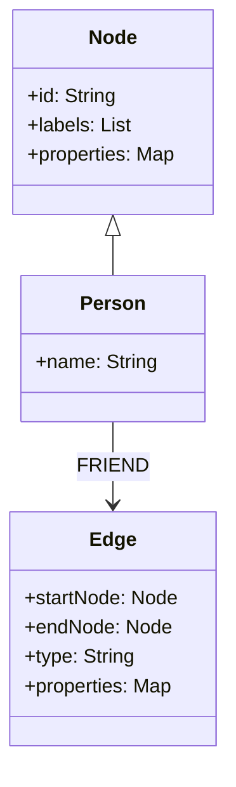
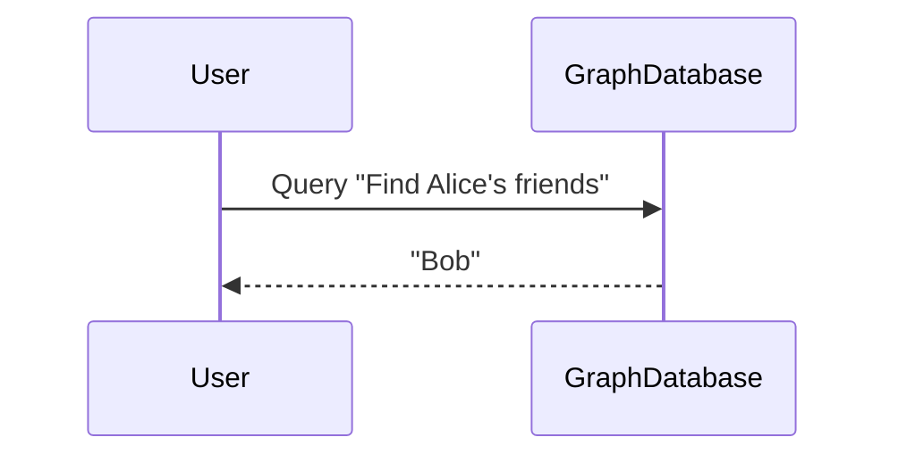

## Overview

Graph modeling with nodes and edges is a powerful approach to organizing and querying data that inherently involves complex relationships. This pattern is instrumental in fields where the interconnections between data points are as significant as the data itself, such as social networks, recommendation systems, and biological network analysis.

## Architectural Approach

In graph databases, data entities are represented as **nodes**, while their relationships are illustrated as **edges**. Each node can store properties, and edges can also have attributes, further defining the nature of the connection. This simple yet flexible structure allows for easy expression of elaborate relationships and patterns.

### Example Code: Neo4j

```cypher
CREATE (Alice:Person {name: 'Alice'})
CREATE (Bob:Person {name: 'Bob'})
CREATE (Alice)-[:FRIEND]->(Bob)
```

In the example above, two person nodes are created, Alice and Bob. A directional edge labeled "FRIEND" indicates that Alice is a friend of Bob.

## Best Practices

1. **Identify Key Nodes and Relationships**: Determine the primary entities and their associations first.
2. **Define Clear Labels and Properties**: Use consistent and descriptive labels for nodes and properties for ease of understanding and querying.
3. **Optimize for Path Queries**: Design your graph schema keeping in mind common traversal patterns to prevent costly operations.
4. **Leverage Indexes**: Utilize indexes on frequently queried properties for fast look-up times.
5. **Use Direction Strategically**: Clearly distinguish the direction of edges to represent accurate relationships, while understanding that some queries may ignore direction based on needs.

## Paradigms and Related Patterns

- **Graph Traversal Algorithms**: Effective traversal is key in graph databases, employing algorithms like Depth-First Search (DFS) and Breadth-First Search (BFS).
- **Property Graph Model**: An extension of the basic graph model, it allows properties to be associated with both nodes and edges.
- **Materialized Views Pattern**: Use case-specific materialized views to speed up complex queries.

## Diagrams

### Mermaid UML Class Diagram



### Mermaid Sequence Diagram for a Query



## Additional Resources

- [Neo4j Documentation](https://neo4j.com/docs/)
- [Graph Databases by O'Reilly](https://www.oreilly.com/library/view/graph-databases-2nd/9781491930892/)
- [Cypher Query Language Reference](https://developer.neo4j.com/develop/cypher)

## Related Patterns

- **Aggregate Pattern**
- **Anti-Corruption Layer**
- **Microservices Choreography**

## Summary

Modeling data using nodes and edges in graph databases perfectly suits scenarios involving intricate relationships and dynamic queries. By focusing on effective graph modeling techniques, businesses can uncover hidden insights and optimize data retrieval processes. As graph databases evolve, adapting their powerful algorithms and structures, the potential to leverage interconnected data continues to grow significantly.
