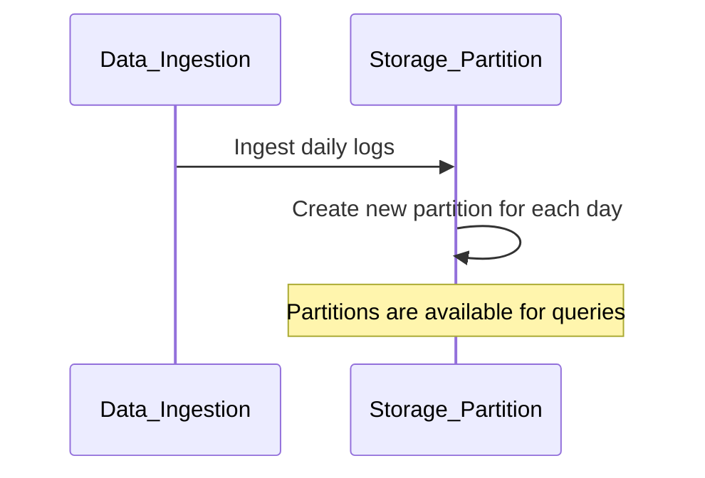

## Time-Based Partitioning

### Description

Time-Based Partitioning is a design pattern used to manage and query time-series data effectively by dividing data into partitions based on specific time intervals, such as daily, monthly, or yearly partitions. This method enhances query performance, ease of data management, and can significantly optimize resource usage in distributed databases or storage solutions.

### Architectural Approach

1. **Partition Strategy**:
   - Define the time interval that suits your use case (hourly, daily, etc.)
   - Align partitions with primary query access patterns (e.g., reporting, monitoring).
   
2. **Storage Layout**:
   - Use file systems, databases, or data lakes capable of partitioned storage.
   - Ensure indexes and metadata follow partition logic for retrieval efficiency.

3. **Automation**:
   - Automate partition creation, archiving, and purging to handle rollover and retention.
   - Use frameworks or tools to optimize and automate these processes, such as Apache Hive or Apache Spark.

### Best Practices

- **Choose the Right Time Interval**: The chosen interval should balance between the granularity of access and the volume of partition metadata.
- **Monitor Partition Size**: Regularly monitor the size and performance impact of partitions to avoid excessive metadata load or scan time.
- **Lifecycle Management**: Implement policies for data retention and purging to manage storage costs.
- **Testing and Optimization**: Continuously test and optimize queries to align with the partition strategy effectively.

### Example Code

Here's an example in Python using pandas to illustrate conceptually how data might be partitioned by day:

```python
import pandas as pd
import datetime

data = {
    'timestamp': [
        '2023-10-01 08:00:00', '2023-10-01 09:00:00',
        '2023-10-02 10:00:00', '2023-10-02 11:00:00'
    ],
    'value': [10, 20, 30, 40]
}

df = pd.DataFrame(data)
df['timestamp'] = pd.to_datetime(df['timestamp'])

def partition_by_day(dataframe):
    return {str(day): group for day, group in dataframe.groupby(dataframe['timestamp'].dt.date)}

partitions = partition_by_day(df)

print(partitions['2023-10-01'])
```

### Diagrams

#### Time-based Partition Diagram


### Related Patterns

1. **Sharding**: Similarly involves partitioning but based more on data properties like geography or customer ID.
2. **TTL (Time-to-Live)**: Often combined with time-based partitioning to automatically remove outdated data.

### Additional Resources

- [Time Partitioning in BigQuery](https://cloud.google.com/bigquery/docs/partitioned-tables)
- [Apache Iceberg Specification](https://iceberg.apache.org/spec/)
- [Learn Time-Series Database Management](https://www.tdwi.org/pages/topics/time-series-databases.aspx)

### Summary

Time-Based Partitioning is essential for managing large volumes of time-series data efficiently. By aligning data partitions with your usage patterns and ensuring automation, this pattern can optimize data storage costs and accelerate query performance. Implementing correct partitioning strategies provides predictable performance, scalability, and simplifies the management of large datasets over time.
