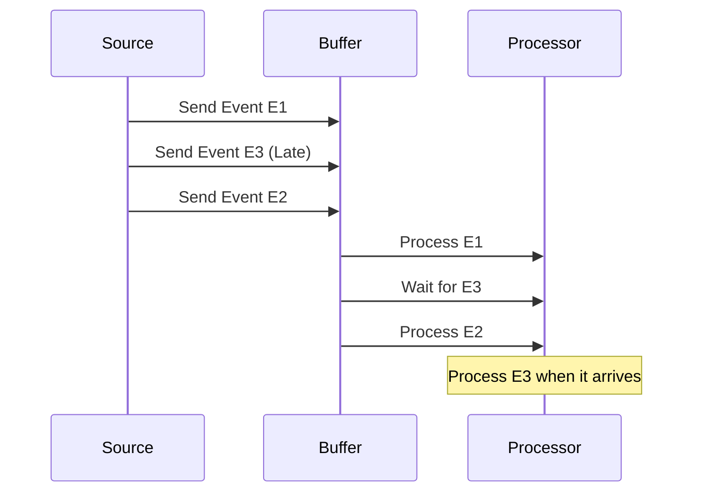

In the realm of time-series data management, one of the common challenges is dealing with data that arrives out of order. This can frequently occur in scenarios involving distributed data streams, such as IoT devices, monitoring systems, and financial transactions. It’s crucial to handle this data effectively to maintain the integrity and accuracy of the time-series dataset.

## Problem

Out-of-order data refers to data points that do not appear in the sequence of occurrence as intended. This can arise due to network latency, device buffering, or batch processing delays. Such discrepancies can distort time-dependent calculations like moving averages, peaks, or trend analysis.

## Solution

### Architectures

1. **Buffering**:
   - Utilize data buffers to temporarily store incoming data streams. This helps in rearranging out-of-order data within a predefined time window before processing.
  
2. **Watermarking**:
   - Implement logical watermarks that signify the progression of event time. Watermarks allow systems to predict when all events up to a certain time have been received, reducing processing latencies without dropping late data.
  
3. **Latency Management**:
   - Define acceptable latencies within which events can be reordered. This includes parameters for how long a system will wait before processing the event or forwarding it for further computation.

4. **Time Windowing**:
   - Use fixed or sliding window mechanisms to process batches of events. When a window closes, late-arriving data is processed separately and adjustments are applied retrospectively if necessary.

5. **Timestamping and Metadata**:
   - Leverage the timestamps embedded within event metadata to reorder data accurately. Incorporate additional metadata to aid in the diagnostics of event order discrepancies.

6. **Event Sourcing and Command Query Responsibility Segregation (CQRS)**:
   - Separate the querying processes from command operations to ensure accurate historical replay and state reconstruction from event stores.
   
### Example Code

Here's a Python example demonstrating a simplistic reordering mechanism using a buffer:

```python
from collections import deque
from datetime import datetime, timedelta

class Event:
    def __init__(self, data, timestamp):
        self.data = data
        self.timestamp = timestamp

class OutOfOrderHandler:
    def __init__(self, allowed_latency_seconds):
        self.allowed_latency = timedelta(seconds=allowed_latency_seconds)
        self.buffer = deque()

    def handle_event(self, event):
        now = datetime.now()
        # Buffer the event
        self.buffer.append(event)

        # Reorder and process events that fall within the allowed latency
        while self.buffer and (now - self.buffer[0].timestamp) > self.allowed_latency:
            event_to_process = self.buffer.popleft()
            self.process_event(event_to_process)

    def process_event(self, event):
        print(f"Processing event: {event.data}, Timestamp: {event.timestamp}")

handler = OutOfOrderHandler(allowed_latency_seconds=60)

handler.handle_event(Event(data="Event A", timestamp=datetime.now() - timedelta(seconds=50)))
handler.handle_event(Event(data="Event B", timestamp=datetime.now() - timedelta(seconds=20)))
handler.handle_event(Event(data="Event C", timestamp=datetime.now() - timedelta(seconds=70)))
```

### Diagrams

Below is a simplified Mermaid sequence diagram illustrating the typical handling of out-of-order data:



## Related Patterns

- **Event Sourcing**: Retain a complete record of state changes for retrospective data correction.
- **CQRS**: Ensure separation of responsibilities to handle updates independently from read operations.
- **Lambda Architecture**: Utilize to support real-time and batch processing of data streams.
  
## Best Practices

- Always plan for late data if network latency can be a factor.
- Use high-resolution timestamps to improve the precision of data sequencing.
- Consider employing a distributed stream processing platform like Apache Flink or Kafka Streams that natively supports out-of-order data management.

## Additional Resources

- "Streaming Systems: The What, Where, When, and How of Large-Scale Data Processing" – Tyson Condie, et al.
- Apache Flink documentation on watermarks: https://flink.apache.org

## Summary

Handling out-of-order data efficiently ensures the reliability of your time-series analysis and maintains data integrity, especially in complex distributed or IoT systems. This pattern emphasizes building latency-tolerant architectures, leveraging suitable data processing tools, and implementing robust timestamp mechanisms. Doing so enables organizations to manage real-time data streams with confidence, accuracy, and scalability.
