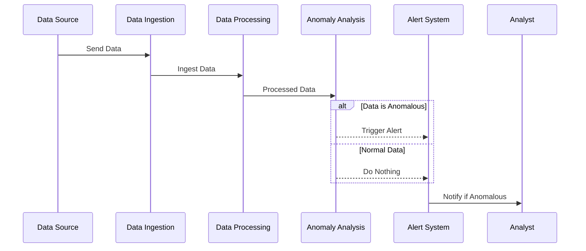

---

linkTitle: "Anomaly Detection"
title: "Anomaly Detection"
category: "4. Time-Series Data Modeling"
series: "Data Modeling Design Patterns"
description: "Identifying and handling unusual patterns or outliers in time-series data to maintain optimal system performance and security."
categories:
- Data Modeling
- Time-Series Analysis
- Data Analysis
tags:
- Anomaly Detection
- Time-Series
- Outlier Detection
- Data Analysis
- Machine Learning
date: 2024-07-07
type: docs

canonical: "https://softwarepatternslexicon.com/102/4/11"
license: "© 2024 Tokenizer Inc. CC BY-NC-SA 4.0"
---

## Anomaly Detection in Time-Series Data

### Introduction

Anomaly detection in time-series data involves identifying and potentially responding to data points or sequences that significantly differ from expected patterns. It is crucial in various domains such as network security, predictive maintenance, and fraud detection, where anomalies may indicate unusual activities or system faults.

### Architectural Approaches

1. **Statistical Methods**: These methods involve using statistical tests to identify anomalies. Techniques include Z-score, moving average, and seasonal decomposition.

2. **Machine Learning Models**: Supervised learning models can be employed to predict and flag anomalies when new data deviates significantly from the learned pattern. Techniques include Support Vector Machines (SVM), ensemble methods, and neural networks.

3. **Deep Learning Techniques**: Approaches such as Autoencoders and Long Short-Term Memory (LSTM) networks can be applied to capture temporal dependencies in the data and highlight anomalies.

4. **Hybrid Approaches**: Combining statistical techniques with machine learning enhances anomaly detection robustness and reduces false positives.

### Best Practices

- **Data Preprocessing**: Clean the data to handle missing values and noise, which may otherwise lead to false detections.
- **Feature Selection**: Extract meaningful features that correlate with anomalies. This enhances the model's ability to flag true anomalies.
- **Threshold Tuning**: Determine and adjust detection thresholds to balance between sensitivity and specificity.
- **Monitoring and Feedback**: Implement continuous monitoring and feedback loops to update models based on changing patterns in the data.

### Example Code

```python
import numpy as np
import pandas as pd
from sklearn.ensemble import IsolationForest

data = np.array([[1, 2, 3, 4, 100, 6, 7, 8, 9, 10]]).reshape(-1, 1)

model = IsolationForest(contamination=0.1)
model.fit(data)

anomalies = model.predict(data)

print(anomalies)
```

### Diagrams

Here’s a sequence diagram illustrating an anomaly detection process in real-time data streams:



### Related Patterns

- **Event Streaming**: Efficiently process and analyze data streams to detect real-time anomalies.
- **Batch Processing**: Use batch processing for model training and periodic anomaly analysis.
- **Data Aggregation**: Aggregate data to reduce noise and enhance the detection of significant anomalies.

### Additional Resources

- [Chapter on Anomaly Detection in Time Series Analysis](https://link_to_anomaly_detection_book_chapter)
- [Machine Learning and Anomaly Detection](https://link_to_machine_learning_for_anomaly_detection)
- [Deep Learning Techniques for Anomaly Detection](https://link_to_dl_for_anomaly_detection)

### Summary

Anomaly detection is an essential aspect of time-series data analysis, offering profound insights into potential data irregularities. The convergence of statistical methods, machine learning, and deep learning opens a myriad of possibilities for timely and accurate detection of anomalies. By integrating these techniques with best practices and continuous improvement, systems can achieve high levels of accuracy and reliability in identifying critical anomalies.

--- 

This narrative outlines the significance and implementation of anomaly detection, offering practical and theoretical frameworks to effectively discern and respond to anomalies within time-series data.
