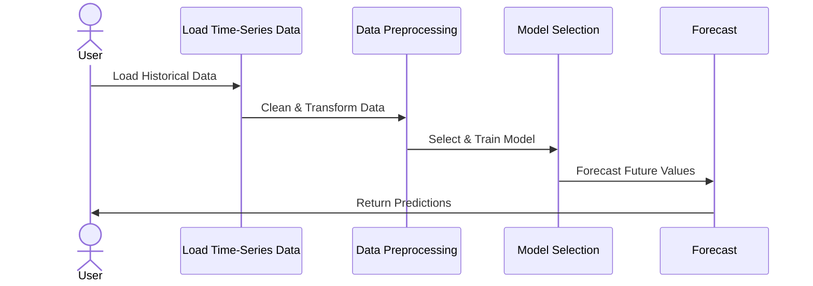

---

linkTitle: "Time-Series Forecasting"
title: "Time-Series Forecasting"
category: "4. Time-Series Data Modeling"
series: "Data Modeling Design Patterns"
description: "Using historical time-series data to predict future values or trends."
categories:
- Data Modeling
- Predictive Analytics
- Data Science
tags:
- Time-Series
- Forecasting
- Data Analysis
- Predictive Modeling
- Machine Learning
date: 2024-07-07
type: docs

canonical: "https://softwarepatternslexicon.com/102/4/12"
license: "© 2024 Tokenizer Inc. CC BY-NC-SA 4.0"
---


## Description

Time-series forecasting involves analyzing historical data collected over time to predict future values or trends. It is a crucial aspect of many industries, providing insights and predictive capabilities for various applications such as finance, weather forecasting, supply chain management, and utilities like electricity demand.

## Architectural Approaches

Several architectural patterns and approaches are used for time-series forecasting, including:

### 1. **ARIMA Models**

AutoRegressive Integrated Moving Average (ARIMA) models are statistical models that are widely used in time-series forecasting. They capture different types of temporal patterns by using past values and errors.

### 2. **Exponential Smoothing**

Exponential Smoothing methods, such as Simple Exponential Smoothing (SES), Holt-Winters smoothing, account for trends and seasonality in data, making them useful for predicting time series with such characteristics.

### 3. **Recurrent Neural Networks (RNNs)**

RNNs, and their variants like Long Short-Term Memory (LSTM) and Gated Recurrent Unit (GRU), are deep learning models suited for sequence prediction, including complex time-series forecasting.

### 4. **Prophet**

Prophet is an open-source forecasting tool developed by Facebook. It is designed to work well with time-series data that have strong seasonal effects and several seasons of historical data.

### 5. **State Space Models**

State space models are used for modeling time-series data by considering both observed and latent variables, providing a flexible and robust framework for forecasting.

## Best Practices

1. **Data Preprocessing**: Ensure data is cleaned and preprocessed to handle missing values, outliers, and other anomalies.

2. **Feature Engineering**: Utilize relevant features and external regressors that can influence the time-series patterns, such as holidays or events.

3. **Model Selection**: Choose the appropriate model based on the data characteristics, such as seasonality, trend, and noise.

4. **Cross-Validation**: Use techniques like time-based cross-validation to ensure the reliability and generalizability of the model.

5. **Parameter Tuning**: Fine-tune model parameters using grid search or other optimization techniques to improve model performance.

## Example Code

Below is a simple Python example using ARIMA model with the `statsmodels` library:

```python
import pandas as pd
from statsmodels.tsa.arima.model import ARIMA

data = pd.read_csv('time_series_data.csv', parse_dates=['date'], index_col='date')

model = ARIMA(data, order=(5,1,0))
model_fit = model.fit()

forecast = model_fit.forecast(steps=10)
print(forecast)
```

## Diagrams

### Mermaid UML Sequence Diagram



## Related Patterns

- **Batch Processing**: Efficiently handle and process large volumes of time-series data for forecasting in a batch manner.
- **Lambda Architecture**: Combining batch and real-time processing to enhance the forecasting model's accuracy and responsiveness.
- **Event Sourcing**: Capturing every change to the data as a sequence of events, which can help in accurately reconstructing historical time-series data.

## Additional Resources

- [Forecasting: Principles and Practice](https://otexts.com/fpp3/)
- [Facebook's Prophet Documentation](https://facebook.github.io/prophet/)

## Summary

Time-series forecasting is a powerful technique to predict future values based on historical data trends and patterns. By selecting the appropriate models and following best practices, organizations can obtain accurate forecasts that drive strategic decisions and operational efficiency.

---
