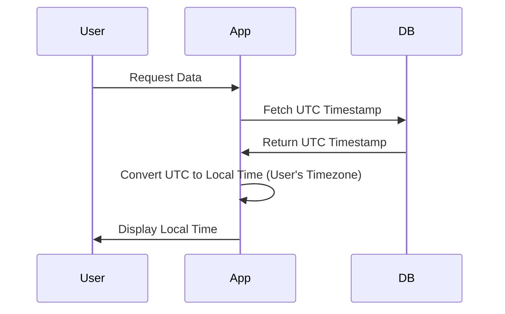

---

linkTitle: "Time Zone Management"
title: "Time Zone Management"
category: "4. Time-Series Data Modeling"
series: "Data Modeling Design Patterns"
description: "Handling time zones in time-series data to ensure accuracy across regions."
categories:
- Data Modeling
- Time-Series
- Cloud Computing
tags:
- Time Zone
- Time-Series Data
- UTC
- Data Modeling
- Best Practices
date: 2024-07-07
type: docs

canonical: "https://softwarepatternslexicon.com/102/4/13"
license: "© 2024 Tokenizer Inc. CC BY-NC-SA 4.0"
---


Time zone management is a crucial aspect of time-series data modeling, especially when dealing with global applications that need to process and display data across multiple regions. Accurately handling time zones ensures that data remains consistent and interpretable regardless of the user's location.

## Description

Time zone management in time-series data refers to the practice of storing, manipulating, and displaying timestamped data in consideration of various local times for different regions. This guarantees that the data is both accurate and meaningful across different geographical locations. The process typically involves storing timestamps in a universal format such as Coordinated Universal Time (UTC) and converting them to the appropriate local time zones when they are accessed or displayed.

## Architectural Approaches

1. **Universal Time Storage**:
   - Store all timestamps in a universal format like UTC in the database.
   - This provides a consistent baseline for all time-related operations and prevents issues related to daylight saving time adjustments or regional time zone changes.

2. **Localized Time Conversion**:
   - Convert UTC timestamps to local time when displaying data to users.
   - This involves detecting the user's time zone and applying the correct conversion so that users perceive the data in their native time zone.

3. **Timestamp Annotation**:
   - Along with storing timestamps in UTC, optionally store the user's time zone information or offset at the time of the event.
   - This approach is useful for audit trails where understanding the origin of timezone data is required.

## Best Practices

- **Centralize Time Zone Logic**: Encapsulate all time zone conversion logic in a singular service or utility to ensure consistency across the application.
  
- **Standardize Timestamp Storage**: Use a single, standardized time format (preferably ISO 8601) across all systems to eliminate ambiguities.

- **Validate Time Zone Information**: Regularly update your time zone database to account for newly introduced or altered time zones, such as changes in daylight saving policies.
  
- **User Interface Considerations**: Clearly indicate the time zone in user interfaces when displaying times to prevent misunderstandings.

## Example Code

Here is an example in Java demonstrating how to store and convert a timestamp using Java's `ZonedDateTime`:

```java
import java.time.ZonedDateTime;
import java.time.ZoneId;
import java.time.format.DateTimeFormatter;

public class TimeZoneExample {
    public static void main(String[] args) {
        // Store timestamp in UTC
        ZonedDateTime utcTime = ZonedDateTime.now(ZoneId.of("UTC"));
        System.out.println("UTC Time: " + utcTime.format(DateTimeFormatter.ISO_ZONED_DATE_TIME));

        // Convert to user-specific local time
        ZonedDateTime localTime = utcTime.withZoneSameInstant(ZoneId.of("America/New_York"));
        System.out.println("Local Time (New York): " + localTime.format(DateTimeFormatter.ISO_ZONED_DATE_TIME));
    }
}
```

## Diagrams

Below is a Mermaid sequence diagram illustrating the time zone conversion process:



## Related Patterns

- **Time Window Pattern**: Useful for analyzing data within specific periods.
- **Event Sourcing**: Often involves timestamped events, making UTC storage essential for replaying events globally.

## Additional Resources

- [IANA Time Zone Database](https://www.iana.org/time-zones): Regularly updated resources for time zone management.
- [Java Time API](https://docs.oracle.com/javase/8/docs/api/java/time/package-summary.html): Documentation for `java.time`, including `ZonedDateTime`.

## Summary

Effective time zone management is vital in any application involving time-series data across different regions. By storing timestamps in UTC and converting to local time when needed, applications can ensure accuracy and user-friendliness. With standardized storage formats and updated time zone information, developers can maintain reliable data operations on a global scale.
