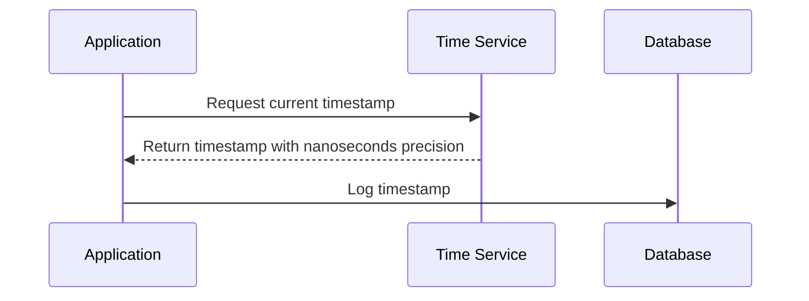

## High-Precision Timestamps

### Introduction
The **High-Precision Timestamps** design pattern involves capturing and storing timestamps with a high level of precision, such as microseconds or nanoseconds. This pattern is essential for scenarios requiring tight time synchronization and detailed tracking, such as high-frequency trading, real-time analytics, and distributed systems monitoring.

### Problem Statement
Standard timestamp precision (seconds, milliseconds) is insufficient in domains where operations are measured in microseconds or nanoseconds. A lack of precision can result in inaccurate data logs, which impacts decision-making and system diagnostics.

### Solution
Implement systems and databases that support high-precision timestamp data types. Capture and store timestamps with sufficient granularity based on the specific application requirements.

### Architectural Approach
1. **Use of Languages and Libraries**: Programming languages like Java, Scala, and Go provide libraries/extensions to handle high-precision timestamps. For instance, Java offers `Instant` and `Clock` classes for nanosecond precision.

2. **Database Support**: Select databases supporting high-precision temporal data types. PostgreSQL, for example, offers timestamptz with microsecond precision. Likewise, some NoSQL databases provide custom plugins or types for handling nanosecond precision.

3. **Timestamp Synchronization**: Implement network time protocol (NTP) or other synchronization methodologies to ensure consistency across distributed systems maintaining high-precision timestamps.

### Best Practices
- **Consistent Time Sources**: Use reliable and synchronized time sources to ensure consistency across distributed systems.
- **Storage Optimization**: Consider storage implications of high-precision data and optimize accordingly using columnar storages that efficiently handle temporal data.
- **Interfaces and Conversions**: Ensure that APIs and user interfaces accommodate high-precision timestamps without truncation or loss of data during conversions.

### Example Code
```java
import java.time.Instant;

public class HighPrecisionTimestampExample {
    public static void main(String[] args) {
        Instant timestamp = Instant.now(); // Capture current time with nanoseconds precision
        System.out.println("High Precision Timestamp: " + timestamp);
    }
}
```

### Diagrams

#### Sequence Diagram of High-Precision Timestamp Logging



### Related Patterns
- **Event Sourcing**: Log high-precision events to track application state changes precisely.
- **Audit Logging**: Use high-precision timestamps for comprehensive and indisputable audit trails.
- **Chronological Sharding**: Shard data based on high-precision timestamps for better retrieval performance.

### Additional Resources
- [Java Time Package Documentation](https://docs.oracle.com/javase/8/docs/api/java/time/package-summary.html)
- [PostgreSQL Date/Time Types](https://www.postgresql.org/docs/current/datatype-datetime.html)
- [Network Time Protocol (NTP) Overview](http://www.ntp.org/documentation.html)

### Summary
High-precision timestamps are vital for applications requiring exact time tracking, such as high-frequency trading and distributed systems diagnostics. Using appropriate languages, databases, and synchronization techniques, systems can effectively implement this pattern to ensure accuracy and reliability in time-sensitive applications.
