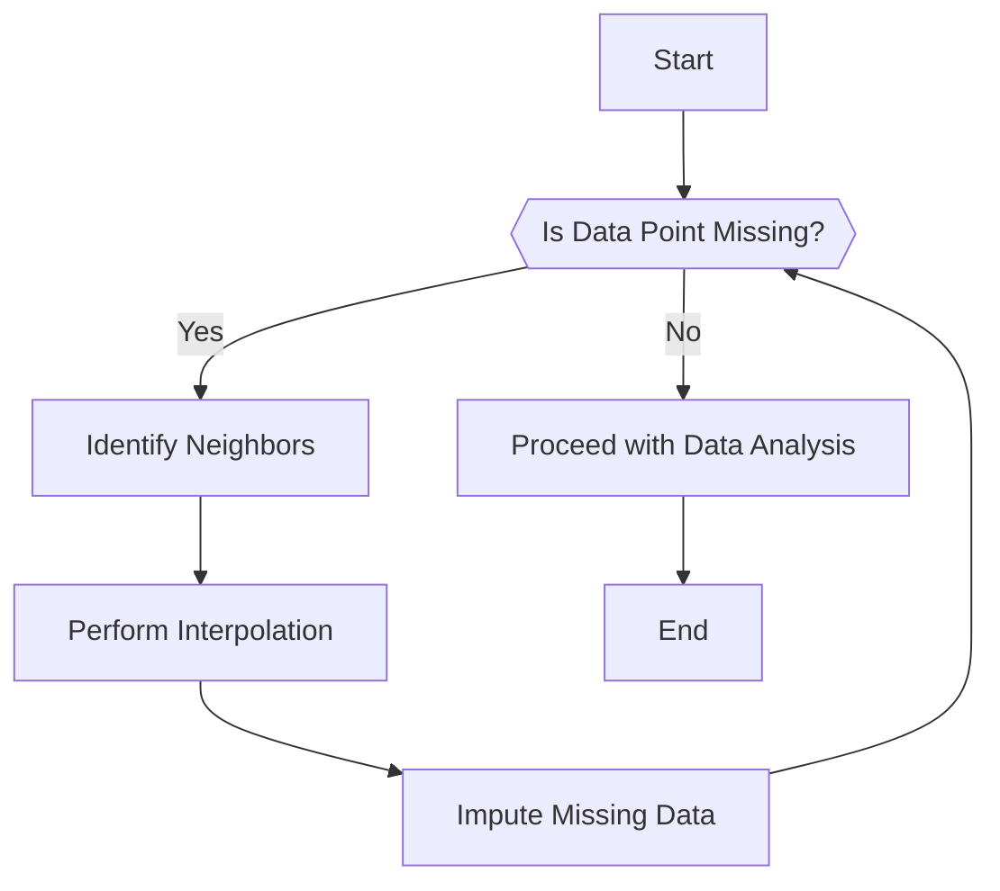

## Introduction

In time-series data modeling, handling data gaps is crucial for maintaining data integrity and ensuring accurate analyses. Data gaps occur when there are missing entries in a dataset, often due to sensor failures, data transmission issues, or data collection intervals. The "Data Gaps Handling" design pattern provides strategies to estimate and fill these gaps, enabling more robust data analysis.

## Architectural Approaches

### Interpolation

Interpolation involves estimating the missing values based on known values at neighboring time points. Common techniques include:

- **Linear Interpolation**: Assumes a straight line between two known points, calculating missing values along this line.
- **Spline Interpolation**: Uses a piecewise-defined polynomial function to smoothly fit known points, providing a more flexible interpolation useful for nonlinear data trends.
- **Polynomial Interpolation**: Fits a polynomial to several known points to estimate intermediate missing values, suitable for complex dataset structures.

### Exponential Smoothing

This technique applies weighted averages, exponentially decreasing the weights for past observations, to forecast missing data. It effectively handles time series with trends and seasonality.

### Machine Learning Based Imputation

Advanced machine learning models, such as Random Forests or Neural Networks, can predict missing data points by learning patterns from the complete sections of the dataset. This method is particularly useful for multidimensional or irregular datasets.

## Example Code

Here’s a basic example in Python demonstrating linear interpolation using Pandas:

```python
import pandas as pd
import numpy as np

time_series = pd.Series([1.0, np.nan, np.nan, 4.0, 5.0], index=pd.date_range('2024-01-01', periods=5))

interpolated_series = time_series.interpolate(method='linear')

print(interpolated_series)
```

## Diagrams

Here's a visual representation of handling data gaps using interpolation:



## Related Patterns

- **Data Smoothing**: Reducing noise in time-series data, often used in conjunction with data gap handling to improve data quality.
- **Data Normalization**: Standardizing time-series data, especially important when integrating data from different sources with varying scales.
- **Event-Based Architecture**: Ensuring timely data processing and dealing with data in real-time can help minimize perceived data gaps.

## Additional Resources

- [Pandas Documentation on Interpolation](https://pandas.pydata.org/pandas-docs/stable/reference/api/pandas.DataFrame.interpolate.html)
- [Time-Series Analysis and Its Applications](https://www.springer.com/gp/book/9780387759586) - A comprehensive textbook on time-series analysis methodologies.
- [Forecasting: Principles and Practice](https://otexts.com/fpp3/) - An online textbook offering insights into forecasting techniques including handling missing data.

## Summary

Efficient handling of data gaps is vital for accurate and reliable time-series analysis. By leveraging techniques such as interpolation, exponential smoothing, and machine learning-based imputation, practitioners can mitigate the impact of missing data points. This not only enhances data quality but also facilitates predictive modeling and data-driven decision-making in various domains.
