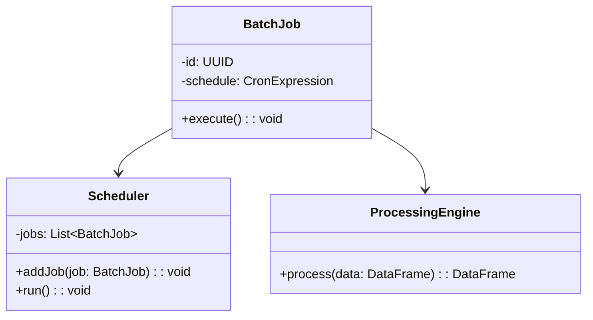

## Batch Processing Design Pattern

### Description
Batch Processing is a data processing design pattern that works by processing accumulated data in units called batches. This method is efficient for handling time-series data and is highly prevalent in scenarios where immediate processing is not crucial. It enables periodic operations, aggregations, and transformations on data, ensuring enhanced system performance by relieving the real-time computational load.

### Architectural Approach
Batch processing is generally implemented in environments where data can wait to be processed together, often at scheduled intervals. It is structured around the following key components:

- **Batch Jobs**: These are predefined operational routines run at set times to process data. They include sub-tasks such as data validation, transformation, and aggregation.
- **Schedulers**: These are tools or systems that trigger batch jobs at regular intervals or specified times, such as cron jobs or enterprise schedulers.
- **Storage Systems**: Simplify accumulation and contain data streams, like data warehouses or cloud-based storage, to preserve data prior to processing.
- **Processing Engines**: Systems like Apache Hadoop or Apache Spark that provide the necessary computational resources to process batches of data.

### Example Code

Here's an example using Spark to aggregate sales data in batches:

```scala
import org.apache.spark.sql.SparkSession
import org.apache.spark.sql.functions._

object BatchAggregator {
  def main(args: Array[String]): Unit = {
    val spark = SparkSession.builder
      .appName("DailySalesAggregator")
      .getOrCreate()

    val salesDF = spark.read
      .option("header", "true")
      .csv("path/to/daily_sales.csv")

    val aggregatedSales = salesDF
      .groupBy("product_id")
      .agg(sum("amount").as("total_sales"))

    aggregatedSales.write
      .mode("overwrite")
      .csv("path/to/aggregated_sales.csv")
  }
}
```

### Mermaid UML Class Diagram



### Related Patterns

- **Stream Processing**: Contrast to batch processing, which allows continuous data processing with minimal latency.
- **Lambda Architecture**: This involves combining both batch and stream processing to leverage the best of both worlds.
- **Event-Driven Processing**: Focuses on real-time data processing in response to events.

### Additional Resources

- [Reliability Guide: Scheduling Batch Jobs](https://aws.amazon.com/blogs/databases/reliability-guide/)
- [Apache Spark Official Documentation](https://spark.apache.org/docs/latest/)
- [The Unified Model of Stream and Batch Processing at Scale](https://cloud.google.com/blog/products/data-analytics/unifying-batch-and-stream-processing)

### Summary

Batch Processing provides an effective solution for handling time-series data by accumulating it and processing it in bulk. This reduces immediate computational overhead while benefitting from economies of scale in data processing. When used alongside related patterns such as stream processing or lambda architecture, Batch Processing helps create balanced and robust data processing pipelines suitable for large-scale applications, including financial records, sales data, and log file analysis.
