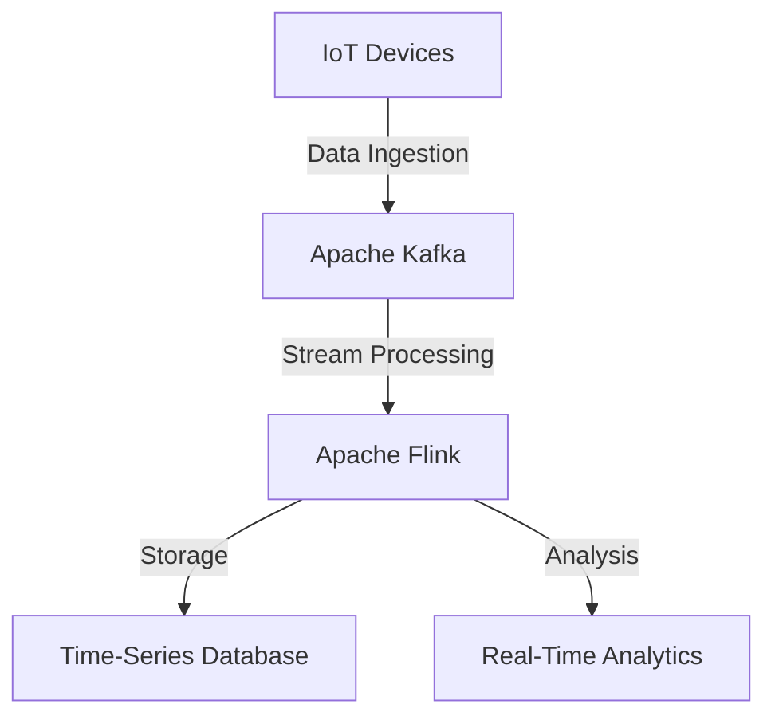

## Introduction

Real-Time Streaming is a design pattern used to process incoming time-series data in real-time, allowing for instant analysis and timely actions. With advancements in cloud technologies and an increasing demand for real-time data processing, this pattern is crucial for applications like tracking IoT sensor data, financial transactions, social media feeds, and more.

## Architectural Approach

1. **Data Ingestion**: Ingest data as it arrives using messaging systems or distributed streaming platforms such as Apache Kafka, AWS Kinesis, or Google Cloud Pub/Sub. These systems are designed to handle high-throughput and low-latency data ingestion.

2. **Data Processing**: Process the data in motion using stream processing frameworks like Apache Flink, Apache Spark Streaming, or Kafka Streams. These frameworks provide functions to filter, aggregate, window, and transform streaming data efficiently.

3. **Data Storage**: Store processed data in a time-series database or a distributed storage solution like Apache Cassandra, InfluxDB, or AWS S3.

4. **Data Analysis**: Utilize machine learning models and data mining algorithms to analyze and derive insights from stored data.

## Best Practices

- Ensure low-latency communication by optimizing network configurations and choosing geographically appropriate data centers.
- Use partitioning and sharding for high scalability and elastic performance.
- Implement fault-tolerance with mechanisms such as replay logs or upstream retention of data.
- Use load balancing and auto-scaling features offered by cloud providers to handle varying data loads.
  
## Example Code

```scala
// Example using Apache Kafka and Kafka Streams in Scala
import org.apache.kafka.streams.scala.StreamsBuilder
import org.apache.kafka.streams.scala.kstream.KStream

object RealTimeProcessing {

  def processStream(inputTopic: String, outputTopic: String): Unit = {
    val builder = new StreamsBuilder()
    val stream: KStream[String, String] = builder.stream[String, String](inputTopic)

    val processedStream = stream
      .filter((_, value) => value != null && value.nonEmpty)
      .mapValues(value => value.toUpperCase)  // A simple transformation

    processedStream.to(outputTopic)
  }
}
```

## Diagrams

### Real-Time Streaming Architecture



## Related Patterns

- **Batch Processing**: Unlike real-time streaming, it processes large volumes of data in batches at scheduled intervals.
- **Event Sourcing**: Captures changes to application state as a sequence of events, useful in recovering or reconstructing data states.

## Additional Resources

- [Apache Kafka Documentation](https://kafka.apache.org/documentation/)
- [Apache Flink Documentation](https://nightlies.apache.org/flink/)
- [Real-Time Data Streaming in Google Cloud](https://cloud.google.com/solutions/real-time-streaming)

## Summary

Real-Time Streaming is essential for applications requiring the immediate processing and analysis of incoming data. By leveraging technologies such as Apache Kafka and stream processing frameworks, data-driven organizations can react to changes with minimal delay, enabling smarter, real-time decision-making. Efficient handling of these patterns can lead to performance gains, scalability, and enhanced insights from time-series data.
