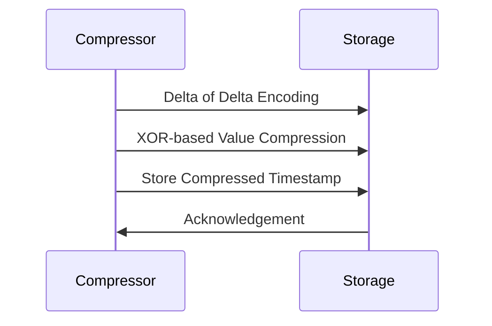

### Introduction

As the adoption of Internet of Things (IoT) devices and real-time analytics continues to grow, the volume of time-series data generated in various sectors is skyrocketing. Efficient storage and retrieval of this data is imperative, which makes time-series compression algorithms crucial for any data-intensive organization. These algorithms reduce storage requirements and improve query performance without losing significant data fidelity.

### Design Pattern Explanation

Time-series compression involves using algorithms designed to exploit the characteristics of sequential data points:

- **Delta Encoding**: Records differences between consecutive points rather than the points themselves.
- **Run-Length Encoding**: Encodes repetitive values as a single value and count pair.
- **Bit-Packing**: Minimizes the use of memory by efficiently aligning data bits.

One notable algorithm widely used for compressing time-series data is Facebook's Gorilla algorithm.

### Example - Facebook's Gorilla Algorithm

Gorilla compression is specifically optimized for the kind of streaming metric data found in time-series databases. It employs three major techniques:

1. **Delta of Delta Encoding**: Instead of storing raw timestamp deltas, it records the difference between consecutive deltas which are usually smaller.
2. **XOR-based Value Compression**: XOR encoding is used for compressing float values, storing only the changing bits.
3. **Variable-Length Bit Representation**: Saves storage by representing integer deltas using the smallest necessary bit lengths.

Here's a simplified version in pseudo-code for basic compression using XOR:

```javascript
function compress(values):
    prev_value = 0
    compressed_data = []
    for value in values:
        xor_value = value XOR prev_value
        compressed_data.append(xor_value)
        prev_value = value
    return compressed_data
```

### Diagram

Below is a simplified sequence diagram illustrating the compression process:



### Related Patterns

- **Data Chunking**: Improves compression by breaking down data streams into smaller manageable chunks for better pattern recognition and compression.
- **Data Deduplication**: Removes repetitive data, thus reducing storage needs and works well as a complementary pattern to compression.

### Best Practices

- **Selectively Choose Algorithm**: Consider data characteristics before choosing a compression technique.
- **Balance Compression and Performance**: Excessive compression can lead to performance overhead during data retrieval.
- **Regularly Evaluate Algorithms**: As datasets grow and change, ensure the selected algorithm remains optimal.

### Additional Resources

- [Gorilla: A Fast and Efficient Storage Engine for Time Series Data](https://www.vldb.org/pvldb/vol8/p1816-teller.pdf)
- [An Open-Source Time-Series Database: TimescaleDB](https://www.timescale.com/)

### Summary

Time-series compression algorithms are crucial for any modern data infrastructure dealing with large streams of time-stamped data points. By incorporating efficient compression algorithms, organizations can significantly reduce storage costs while still maintaining rapid access to their valuable data. Strategically adopting the most suitable technique to accommodate distinct data characteristics is essential for generating optimal results.
