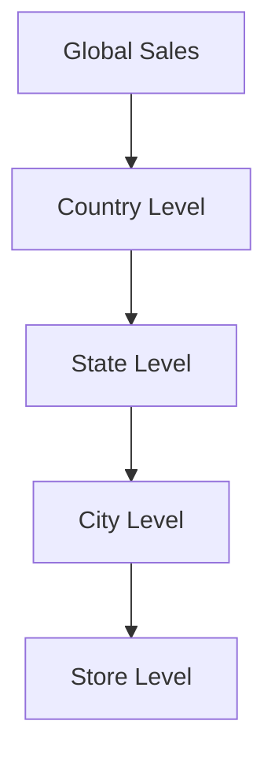

### Hierarchical Time-Series Modeling

Hierarchical Time-Series Modeling is a design pattern used to organize and analyze time-series data at multiple levels of a hierarchy. This pattern is particularly useful in scenarios where data is collected across different, nested entities, and there is a need to perform aggregate analysis at various levels.

#### Description

In hierarchical time-series modeling, time-series data is structured such that each data point is part of a hierarchical structure. This approach allows for detailed analysis at the lowest level, while also enabling the aggregation and analysis at higher levels of the hierarchy. This modeling technique supports both roll-up and drill-down analytics, providing flexibility in terms of the granularity of analysis.

#### Architectural Approach

1. **Data Structuring**: Data is structured in a top-down hierarchy, where each level encapsulates the ones below it. Therefore, higher levels represent broader categories, while lower levels represent finer details.
   
2. **Aggregation and Drill-Down**: Hierarchical modeling supports aggregation operations, where data can be summed or averaged at higher-level nodes, and drill-down operations, where specific details at lower levels can be examined.
   
3. **Storage Optimization**: Uses well-established storage techniques such as tree-like structures or multi-indexing in databases for efficient querying and analysis.
   
4. **Scalability**: Suitable for distributed systems where large volumes of time-series data are processed. Supports sharding based on hierarchical paths to optimize distributed storage.

#### Best Practices

- **Define Clear Hierarchies**: Ensure that the hierarchy makes contextual and business sense. Start with broader categories and proceed to more specific ones.

- **Efficient Storage Solutions**: Use databases and storage solutions like TimescaleDB or Apache Druid, designed to handle large-scale time-series data efficiently.

- **Use Aggregation Functions**: Pre-compute aggregates where possible to optimize query performance at higher hierarchy levels.

- **Time-Zone Consideration**: When dealing with global data, ensure time-zone accuracy in your hierarchies.

#### Example Code

```java
// Example using a SQL-based approach
SELECT 
    country, 
    state, 
    city, 
    SUM(sales_amount) as total_sales
FROM 
    sales_data
WHERE 
    sale_date BETWEEN '2023-01-01' AND '2023-12-31'
GROUP BY 
    ROLLUP(country, state, city);
```

This query uses SQL's ROLLUP feature to aggregate sales data at different hierarchical levels.

#### Diagrams

Let's visualize the hierarchical model using Mermaid:



#### Related Patterns

- **Aggregate Reporting**: Patterns focused on providing summary data across different dimensions.
- **Multidimensional Data Modeling**: Used for creating models that support analysis across multiple axes and dimensions.

#### Additional Resources

- [Time-Series Forecasting Principles](https://forecastingprinciples.com)
- [Introduction to Hierarchical Time-Series Aggregation](https://dataramblings.com/hierarchy-aggregation)

#### Final Summary

Hierarchical Time-Series Modeling is an essential pattern for structuring complex time-related data across multiple hierarchy levels. It provides businesses the capability to analyze data granularly while maintaining the flexibility of aggregated reporting across different levels. This pattern is powerful in scenarios involving extensive datasets, enabling efficient and scalable analytics and forecasting.
