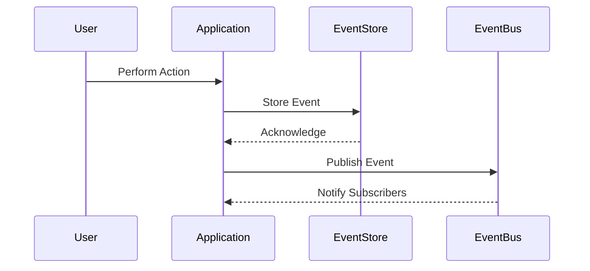

## Introduction

Event Sourcing is an architectural pattern that captures all changes made to an application's state as a sequence of immutable events. This approach allows the system to reconstitute or "source" its current state by replaying those events from the beginning of time. Event Sourcing decouples the external representation of state and its underlying transition logic, making it invaluable in domains that need audit logs, complex event processing, or a source of truth for state transitions.

## Architectural Approach

1. **Event Storage**: All events are stored in a durable event store. This store needs to be append-only to ensure immutability.
2. **Event Replay**: To reconstruct the current state, the system replays all stored events starting from the initial event.
3. **Event Publishing**: Typically, events are published to an event bus where subscribers can react to those events or build projections.

## Best Practices

- **Event Immutability**: Once an event is stored, it should never change. Any error should be corrected by incrementally adding compensating or corrective events.
- **Snapshotting**: To optimize performance in large datasets, periodically create snapshots of the state at a given point in time to avoid replaying the entire event history.
- **Versioning**: As the system evolves, more than one version of events may need to be supported to handle backward compatibility.

## Example Code

Here is a simple example using Java to illustrate basic concepts of event creation and replay:

```java
public interface Event {}

public class ProductAddedEvent implements Event {
    public final String productId;
    public final int quantity;

    public ProductAddedEvent(String productId, int quantity) {
        this.productId = productId;
        this.quantity = quantity;
    }
}

public class EventStore {
    private List<Event> eventLog = new ArrayList<>();

    public void addEvent(Event event) {
        eventLog.add(event);
        // Publish to an event bus if applicable
    }

    public List<Event> getEvents() {
        return new ArrayList<>(eventLog);
    }
}

public class Inventory {
    private int stockLevel;

    public void apply(Event event) {
        if (event instanceof ProductAddedEvent) {
            stockLevel += ((ProductAddedEvent) event).quantity;
        }
    }

    public int getStockLevel() {
        return stockLevel;
    }
}

// Usage example
EventStore store = new EventStore();
store.addEvent(new ProductAddedEvent("123", 10));

Inventory inventory = new Inventory();
store.getEvents().forEach(inventory::apply);

System.out.println("Current Stock Level: " + inventory.getStockLevel());
```

## Diagrams

Below is a simplified Mermaid sequence diagram illustrating the flow of events in an Event Sourcing system:



## Related Patterns

- **Command Query Responsibility Segregation (CQRS)**: Often used in conjunction with Event Sourcing to separate the read and write models, optimizing for different data demands.
- **Saga Pattern**: Manages complex transactional and compensating actions in a distributed system, benefiting from the consistent state management provided by Event Sourcing.
- **Domain-Driven Design (DDD)**: Aligns well with Event Sourcing by focusing on domain events and the core language of business processes.

## Additional Resources

- *"Domain-Driven Design: Tackling Complexity in the Heart of Software"* by Eric Evans
- Martin Fowler's [Event Sourcing](https://martinfowler.com/eaaDev/EventSourcing.html)
- Greg Young's [Introducing Event Sourcing](https://leanpub.com/esversioned)

## Summary

Event Sourcing elevates the significance of capturing and processing a complete series of state transitions through events. This approach facilitates better audit capabilities, reconstructible state history, and improved consistency for modern systems operating under distributed architectures. When combined with other synergistic patterns like CQRS or Domain-Driven Design, Event Sourcing can offer immense value to designs requiring robust state management solutions.
