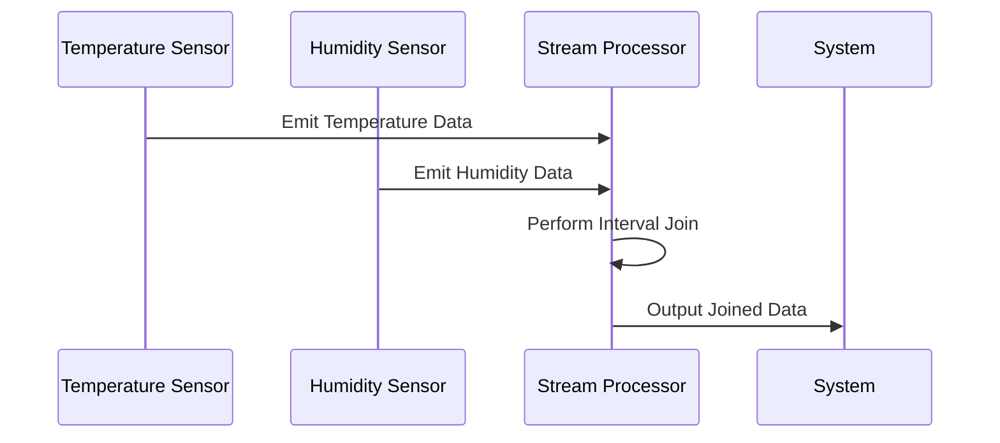

## Time-Series Joins

**Description**

Time-Series Joins are a critical design pattern employed to merge two or more time-series datasets based on time intervals or matching keys. This pattern is particularly essential in scenarios where decisions depend on the comparative analysis of different datasets collected over time, such as environmental monitoring or financial trading systems. The process typically involves synchronizing records by their timestamp to evaluate correlations or causations and combining datasets in a meaningful way to extract insights.

### Architectural Overview

Time-Series Joins can be effectively handled by specific architectural approaches such as:

1. **Stream Processing Systems**: Using frameworks like Apache Flink or Kafka Streams, which inherently support the processing of real-time data streams, enabling timely analysis and join operations as data flows through the system.
   
2. **Batch Processing**: If dealing with larger datasets and historical data, leveraging architectures based on Apache Spark allows for batch processing to efficiently perform joins at scale.
   
3. **Database Solutions**: Modern databases like TimescaleDB or InfluxDB offer native support for time-series joins within query operations, optimizing performance and simplifying query construction.

### Best Practices

- **Time Alignment**: Ensure the datasets are synchronized in terms of time granularity. Pre-processing steps might include resampling the data to a common time interval.
  
- **Handling Missing Data**: Develop strategies to handle missing values, such as interpolation, extrapolation, or more complex imputation methods.

- **Window Join**: When dealing with high-velocity streams, utilize window joins to segment data into manageable chunks for processing.

- **Temporal Indexing**: Utilize indexing mechanisms to speed up querying and joining operations. Leveraging temporal-based indices can significantly enhance performance.

### Example Code

Below is a simplified Scala code illustration using Apache Flink to perform a time-based stream join:

```scala
import org.apache.flink.streaming.api.scala._
import org.apache.flink.streaming.api.windowing.time.Time

case class TemperatureReading(sensorId: String, timestamp: Long, temperature: Double)
case class HumidityReading(sensorId: String, timestamp: Long, humidity: Double)

val temperatureStream: DataStream[TemperatureReading] = ???
val humidityStream: DataStream[HumidityReading] = ???

val joinedStream = temperatureStream
  .keyBy(_.sensorId)
  .intervalJoin(humidityStream.keyBy(_.sensorId))
  .between(Time.minutes(-10), Time.minutes(10))
  .process((left, right) => s"Sensor: ${left.sensorId}, Temp: ${left.temperature}, Humidity: ${right.humidity}")

joinedStream.print()
```

### Diagram

#### Mermaid Sequence Diagram



### Related Patterns

- **Lambda Architecture**: Combining real-time processing with batch processing is often necessary when working with time-series joins, allowing a comprehensive view by merging live data streams with historical datasets.
  
- **Change Data Capture (CDC)**: Capturing changes in datasets can be vital in maintaining up-to-date joins.

### Additional Resources

- [Apache Flink Documentation](https://flink.apache.org/)
- [Kafka Streams Guide](https://kafka.apache.org/documentation/streams/)
- [Handling Time Series Joins in TimeScaleDB](https://docs.timescale.com/)

### Summary

Time-Series Joins are a powerful mechanism for synchronously merging datasets that are time-dependent, facilitating insightful and data-driven decisions. Application domains extend from IoT, where sensors produce massive quantities of time-bound data, to financial markets taking advantage of continual data feeds. Mastery of this pattern ensures organizations can effectively harness the power of temporal data, drawing comprehensive insights for optimizing operations or enhancing intelligence deliverables.
