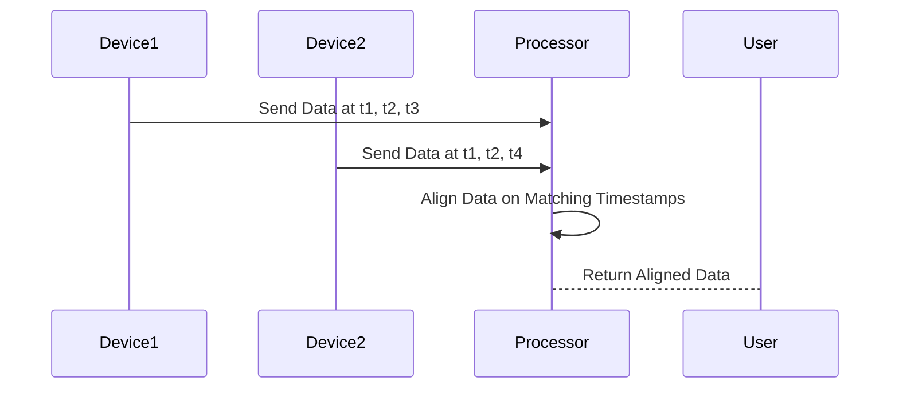

---

linkTitle: "Time-Aligned Data Processing"
title: "Time-Aligned Data Processing"
category: "Time-Series Data Modeling"
series: "Data Modeling Design Patterns"
description: "Ensuring operations are performed on data points that are synchronized in time. This pattern is critical for accurate time-series data analysis and modeling, as it involves aligning data points from different sources or measurement devices that may not naturally synchronize due to varying sample rates or timestamp discrepancies."
categories:
- Data Processing
- Time-Series Data
- Data Alignment
tags:
- Time-Series
- Data Coupling
- Data Synchronization
- Time-Alignment
- Data Modeling
date: 2024-07-07
type: docs

canonical: "https://softwarepatternslexicon.com/102/4/24"
license: "© 2024 Tokenizer Inc. CC BY-NC-SA 4.0"
---

## Time-Aligned Data Processing

Time-Aligned Data Processing is a vital design pattern in the context of time-series data modeling where the goal is to ensure operations are executed on datasets that are synchronized in time. This requirement may arise because time-series data can originate from multiple sources, each with different sampling rates, time zones, or even temporal inconsistencies due to network delays or processing latencies.

### Detailed Explanation

The essence of this design pattern is about aligning datasets so that corresponding data points reflect the same moment in time. This is foundational for accurate analyses, such as calculating correlations, making predictions, and detecting patterns or anomalies.

#### Key Principles:

1. **Temporal Consistency**: Ensuring that each pair of data points from different datasets corresponds to the exact or closest possible real-time instance.
2. **Sampling Rate Adjustments**: Handling datasets with varying sampling rates by techniques such as upsampling or downsampling to the desired rate.
3. **Time Zone Normalization**: Converting all timestamps to a common time zone to prevent time drift.
4. **Interpolation**: Estimating missing values in lower-resolution datasets to align them with higher-resolution ones.

### Architectural Approaches

- **Buffering and Windowing**: Implements data buffering to temporarily store data before processing. This helps in synchronizing streams that have inherent delays.
- **Time-Based Join Operations**: Similar to SQL join operations but based strictly on time keys, enabling precise synchronization.
- **Temporal Aggregators**: Aggregates data over specified time windows, such as minute-based or hour-based windows, to achieve alignment.

### Best Practices

- **Choose the Right Interpolation Method**: Depending upon the nature of data, use linear, polynomial, or spline interpolation to estimate and align data points.
- **Use Resilient Message Brokers**: Implement message brokers (like Apache Kafka) to handle asynchronous data streams efficiently.
- **Leverage Stream Processing Frameworks**: Utilize real-time processing frameworks such as Apache Flink to maintain time-aligned processing at scale.

### Example Code

Let's illustrate a simple example of time-aligned data processing using Python with Pandas:

```python
import pandas as pd

data_a = {'timestamp': ['2024-07-07 00:00:00', '2024-07-07 00:01:00', '2024-07-07 00:03:00'],
          'value': [1.0, 2.0, 3.0]}
data_b = {'timestamp': ['2024-07-07 00:00:30', '2024-07-07 00:02:00', '2024-07-07 00:03:00'],
          'value': [4.0, 5.0, 6.0]}

df_a = pd.DataFrame(data_a)
df_b = pd.DataFrame(data_b)

df_a['timestamp'] = pd.to_datetime(df_a['timestamp'])
df_b['timestamp'] = pd.to_datetime(df_b['timestamp'])

df_a.set_index('timestamp', inplace=True)
df_b.set_index('timestamp', inplace=True)

df_a_resampled = df_a.resample('30S').ffill()
df_b_resampled = df_b.resample('30S').ffill()

aligned_data = df_a_resampled.join(df_b_resampled, lsuffix='_A', rsuffix='_B')

print(aligned_data)
```

### Diagrams

Below is a simple Mermaid sequence diagram illustrating data alignment:



### Related Patterns

- **Event Sourcing**: Ensures consistent event-based data history and retrieval.
- **Real-Time Aggregation**: Involves aggregating and analyzing streaming data in real time.
- **Data Transformation**: Facilitative for data cleaning and restructuring before analysis.

### Additional Resources

- [Pandas Documentation](https://pandas.pydata.org/pandas-docs/stable/) for learning about handling time-series data.
- [Apache Kafka](https://kafka.apache.org/) for efficiently managing data streams.
- [Apache Flink](https://flink.apache.org/) for stream and batch processing, especially beneficial in implementing this pattern in large systems.

### Summary

The Time-Aligned Data Processing pattern is crucial for enhancing the accuracy of time-series analytics by ensuring datasets from disparate sources are in sync chronologically. This pattern focuses on temporal consistency through methods like interpolation and resampling, essential for reliable time-series data modeling and processing.


