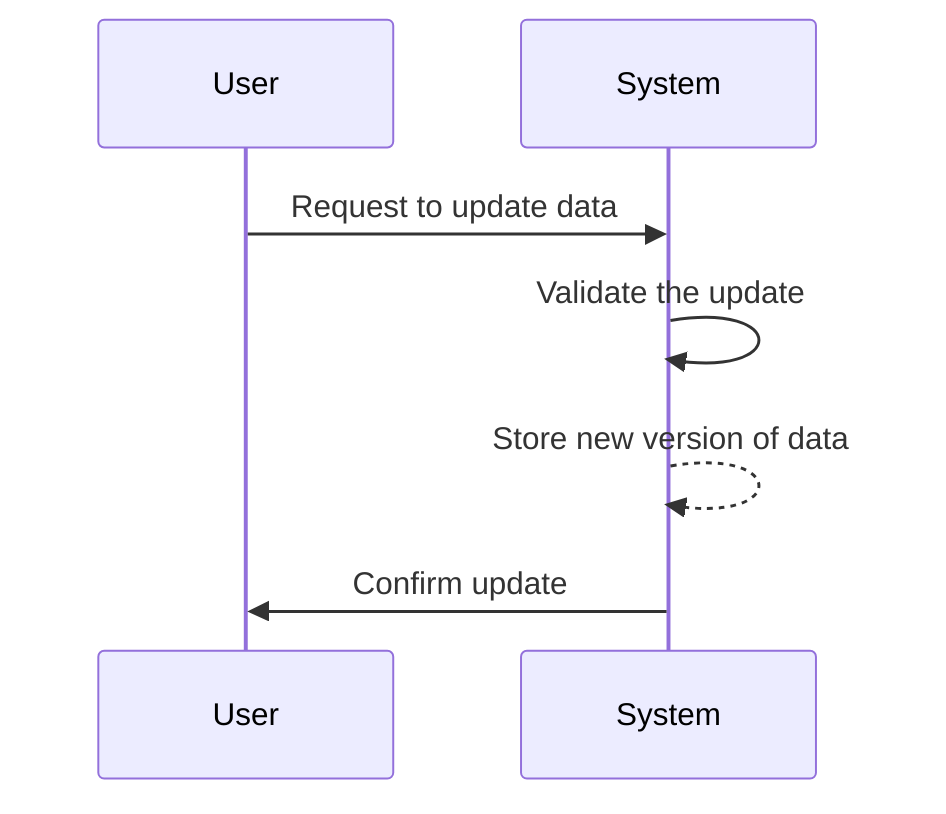

## Introduction to Data Versioning

Data Versioning is a design pattern that focuses on managing different versions of data within time-series datasets. This pattern is crucial when data corrections or updates are necessary, enabling not just preservation of historical data integrity, but also allowing for comparisons and analysis of how data has evolved over time. It is particularly useful in scenarios where the accuracy of measurements can change post-factum, due to sensor recalibration or improved data processing algorithms.

## Architectural Approach

The architectural approach for implementing data versioning involves maintaining distinct versions of each data point rather than overwriting existing data. This can be achieved in several ways:

1. **Append-Only Data Model**: Introduces a new entry for every update or correction, maintaining a complete history of data changes. Each entry can be timestamped with a modification date to keep track of when changes occurred.

2. **Tagging Version Numbers**: Each data entry is tagged with a version number, which gets incremented with each new update, aiding in identifying the chronological progression of data modifications.

3. **Use of Metadata**: Store metadata about data changes, such as the reason for update, user performed the update, or the type of correction made, to provide context for each version.

## Best Practices

- **Normalize Data Changes**: Ensure consistency of how changes are logged across your entire data set to facilitate seamless comparison and analysis.

- **Automated Version Control Systems**: Implement automated checks and balances to track data updates and ensure that erroneous changes can swiftly be identified and resolved.

- **Balancing Storage Costs**: Be mindful of storage requirements. Maintain a balance between keeping all versions and archiving old versions to optimize storage cost.

## Example Code

Below is a simplified example using SQL to illustrate how a table might be structured to support data versioning:

```sql
CREATE TABLE temperature_readings (
    id SERIAL PRIMARY KEY,
    sensor_id INT NOT NULL,
    reading DECIMAL(5, 2) NOT NULL,
    recorded_at TIMESTAMP NOT NULL,
    version INT NOT NULL DEFAULT 1,
    change_reason TEXT,
    modified_at TIMESTAMP DEFAULT CURRENT_TIMESTAMP
);

-- Insert new reading
INSERT INTO temperature_readings (sensor_id, reading, recorded_at, change_reason)
VALUES (1, 23.5, '2024-07-07 10:00:00', 'Initial reading');

-- Correct reading with a new version
INSERT INTO temperature_readings (sensor_id, reading, recorded_at, version, change_reason)
VALUES (1, 23.6, '2024-07-07 10:00:00', 2, 'Calibration adjustment');
```

## Diagrams

Below is a sequence diagram illustrating how a data versioning process can happen:



## Related Patterns

- **Event Sourcing**: Captures all changes to an application state as a sequence of events allowing reconstruction of past states, fitting well with versioning systems.
- **Audit Log**: Provides a history of all actions taken on a dataset, enabling tracking of who made what change and when.

## Additional Resources

- **Git Data Model**: By Git, a distributed version control system that has principles which can influence data version management.
- **Delta Lake**: A storage layer that brings ACID transactions to big data, enabling version control and historical data analysis.

## Summary

Data versioning is an indispensable pattern in the management of time-series data. It ensures the integrity and accountability of historical data by providing mechanisms for preserving and comparing different versions. By employing practices such as append-only models, version tagging, and thorough metadata documentation, organizations can enhance the reliability and fidelity of their data systems.
