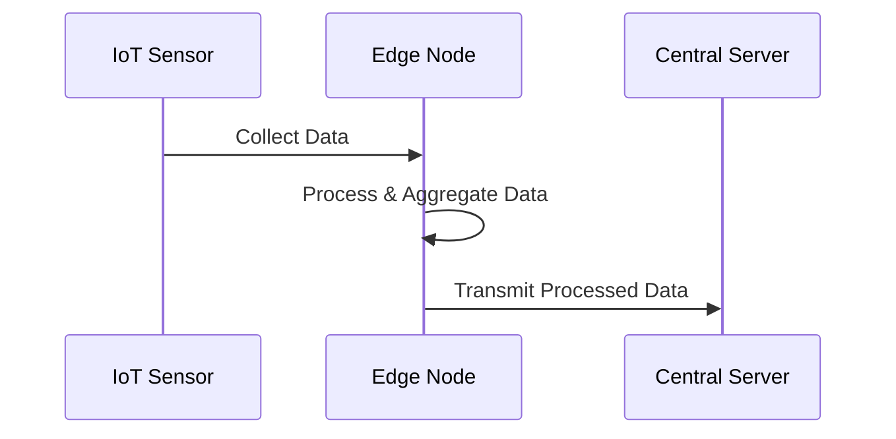

## Edge Computing for Time-Series

### Description

Edge computing is a paradigm that brings computation and data storage closer to the location where it is needed to improve response times and save bandwidth. For time-series data modeling, this approach involves processing data at the edge devices—such as IoT sensors or other distributed nodes—before transmitting the results to a central server or the cloud. By processing time-series data at the edge, systems can significantly reduce latency, lower bandwidth consumption, and ensure real-time data analytics capabilities.

### Architectural Approach

Edge computing architecture for time-series data often involves several components:

- **Sensors/Devices**: These are the data sources, collecting time-series data.
- **Edge Gateways/Nodes**: Devices located near the sensors perform initial data processing like filtering, aggregating, or transforming time-series data into useful information.
- **Centralized Cloud/Server**: Receives processed data, stores it, and optionally conducts further analysis or long-term storage.

### Design and Implementation

1. **Data Aggregation**: At edge devices, aggregate time-series data to reduce the amount of data sent over the network. For example, instead of sending raw sensor readings, send statistical summaries (mean, max, min).

2. **Event Detection**: Use algorithms within edge devices to detect important events in the data stream, thus preventing unnecessary data transmission. E.g., only transmit data if a temperature reading exceeds a certain threshold.

3. **Local Storage and Caching**: Implement local data caching to handle intermittent connectivity, ensuring data isn't lost if the connection to the central server fails.

4. **Security**: Secure data at the edge through encryption and proper access controls to prevent unauthorized access during transmission.

### Example Code

```java
// Example of edge data processing using Java
public class EdgeDataProcessor {

    public static void main(String[] args) {
        double[] sensorData = {20.5, 21.3, 22.8, 21.0, 19.7};
        double threshold = 22.0;

        for (double data : sensorData) {
            if (data > threshold) {
                transmitData(data);
            }
        }
    }

    private static void transmitData(double data) {
        // Send data to central server
        System.out.println("Data transmitted: " + data);
    }
}
```

### Diagrams

Below is a simplified diagram demonstrating the Edge Computing for Time-Series architecture using Mermaid syntax:



### Related Patterns

- **Stream Processing**: Handling continuous data streams and performing computations on-the-fly.
- **Batch Processing**: Performing computations on collected data at regular intervals.
- **Fog Computing**: Extending cloud computing capabilities to the edge with added functionalities like caching and security.

### Additional Resources

- [NIST Edge Computing White Paper](https://www.nist.gov/publications/nist-sp1900-202)
- [IoT and Edge Computing for Smart Environments](https://ieeexplore.ieee.org/document/7498689)
- [Edge Computing: Basic Tenets and Concepts](https://www.researchgate.net/publication/334387182)

### Final Summary

In the context of time-series data management, edge computing provides significant benefits by reducing latency, conserving bandwidth, and enhancing real-time processing capabilities. This architectural approach promotes efficient data handling, especially for IoT and smart environments, by moving computation closer to data generation points. As organizations increasingly adopt IoT and smart systems, edge computing for time-series data emerges as a crucial component in enhancing performance and ensuring scalability.
