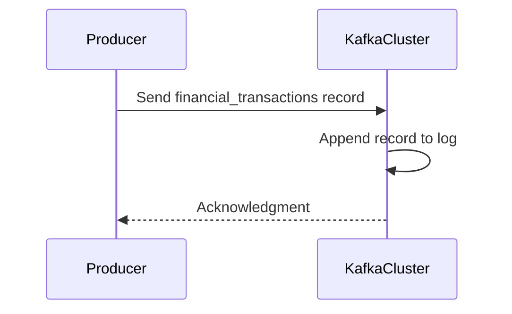

## Description

Append-Only Logging is a design pattern in which data entries are continuously added to a data storage system while ensuring immutability; that is, once an entry is made, it cannot be altered or deleted. This pattern is particularly effective for capturing the full history of an application, as every state change is preserved, creating a complete and unalterable audit trail. The append-only nature makes it especially valuable for systems where maintaining a historical sequence of all transactions or events is critical, such as financial databases, blockchain technologies, and logging systems.

## Key Characteristics

- **Immutability**: Once data is recorded, it cannot be changed, ensuring a reliable and tamper-proof history.
- **Simplicity in operation**: Since entries are never updated or deleted, the complexity of operations is significantly reduced.
- **Historical Integrity**: Facilitates straightforward auditing and verification processes since historical data remains intact.

## Architectural Approaches

In a cloud environment, implementing append-only logging involves leveraging distributed storage systems capable of handling large-scale data append operations efficiently. These systems often include:

- **Distributed Log Systems**: Technologies like Apache Kafka provide a comprehensive way to handle append-only logs, ensuring high-throughput and retention of event data in a fault-tolerant manner.
- **Time-Series Databases**: Specialized DBMS such as InfluxDB or TimeScaleDB that are optimized for handling time-stamped data and append-only workloads.
- **Object Storage Solutions**: Cloud providers offer object storage services (e.g., AWS S3, Azure Blob Storage) which are ideal for storing immutable data records due to their cost-effectiveness and scalability.

## Best Practices

- **Partitioning**: Implement partitioning by time, such as daily partitions, to manage data growth and improve query performance.
- **Indexing**: Employ efficient indexing strategies to enable fast lookup of historical data.
- **Retention Policies**: Define clear data retention policies to maintain the system's scalability and manage storage costs effectively.
- **Security**: Use encryption and access controls to ensure data integrity and protect against unauthorized access.

## Example Code

Here is a simplified example of an append-only log implementation using Apache Kafka in Scala:

```scala
import org.apache.kafka.clients.producer.{KafkaProducer, ProducerRecord}

val properties = new java.util.Properties()
properties.put("bootstrap.servers", "localhost:9092")
properties.put("key.serializer", "org.apache.kafka.common.serialization.StringSerializer")
properties.put("value.serializer", "org.apache.kafka.common.serialization.StringSerializer")

val producer = new KafkaProducer[String, String](properties)

val topic = "financial_transactions"
val key = "txn123"
val value = "{\"amount\": 100, \"currency\": \"USD\"}"

val record = new ProducerRecord[String, String](topic, key, value)
producer.send(record)

producer.close()
```

## Diagrams

### Mermaid Sequence Diagram



### Related Patterns

- **Event Sourcing**: Another pattern for storing application state as a sequence of events which can be replayed for reconstructing past states.
- **Audit Trails**: Capturing all user actions or changes in a system to uphold compliance and governance.

## Additional Resources

- [Apache Kafka Documentation](https://kafka.apache.org/26/documentation/)
- [Event Sourcing Pattern](https://martinfowler.com/eaaDev/EventSourcing.html)
- [AWS S3 for Logging](https://aws.amazon.com/s3/)

## Summary

Append-Only Logging provides a robust paradigm for maintaining an immutable sequence of data entries, crucial for systems where historical integrity and traceability are of paramount importance. This pattern leverages distributed systems techniques to efficiently store, retrieve, and manage time-dependent data, providing essential support for audits, debugging, and events replay. By adopting best practices like partitioning, indexing, and implementing effective data retention and security measures, organizations can harness the full potential of append-only logging to build reliable and transparent systems.

