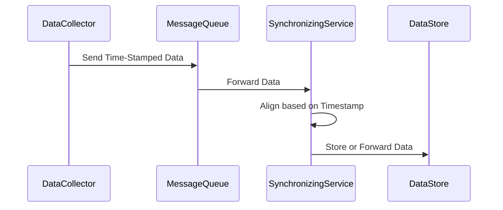

## Time-Series Data Synchronization

### Overview

Time-series data synchronization is a critical pattern in data engineering that focuses on aligning data from various sources based on timestamps. This pattern is especially prevalent in distributed systems where logs, metrics, or any chronological data records need to be aggregated, analyzed, or visualized uniformly. Synchronization helps ensure that time-related analyses remain accurate despite discrepancies arising from data collection lags and network delays.

### Architectural Approaches

1. **Synchronous Processing Pipelines**:
    - **Description**: Ensure data is processed in real-time as it's ingested by using streaming technologies.
    - **Technologies**: Apache Kafka, Apache Flink, and Spark Streaming.
    - **Use-Case**: Real-time dashboards and alerts where immediate data reflection is critical.

2. **Batch Time Alignment**:
    - **Description**: Collect data intermittently and aggregate based on timestamp in smaller chunks.
    - **Technologies**: Apache Hadoop, DataFlow on Google Cloud.
    - **Use-Case**: End-of-day business intelligence reports or back-office data processing.

3. **Hybrid Approaches**:
    - **Description**: Combine real-time and batch processing to allow for flexibility. Data initially processed in real-time can later be re-processed in a batch environment for deep insights.
    - **Technologies**: Using Lambda Architecture (mix of AWS Lambda functions and Spark batch processing).
    - **Use-Case**: Use cases where immediate and periodic longer-running report generation is needed.

### Best Practices

- **Consistent Timestamping**: Ensure source systems are synchronized using Network Time Protocol (NTP) or similar to reduce discrepancies.
- **Idempotency in Processing**: Implement strategies to handle duplicate messages in event streams.
- **Timezone Management**: Store all timestamps in UTC and convert to application-specific time zones as required.

### Example Code

```scala
case class ServerLog(timestamp: Long, message: String)

def synchronizeLogs(logs: List[ServerLog]): List[ServerLog] = {
  logs.sortBy(_.timestamp)
}

val logs = List(
  ServerLog(1672501200, "Error: Disk space low"), 
  ServerLog(1672501260, "Warning: CPU high"),
  ServerLog(1672501230, "Info: Backup completed")
)

val synchronizedLogs = synchronizeLogs(logs)
synchronizedLogs.foreach(log => println(s"${log.timestamp}: ${log.message}"))
```

### Diagrams

#### Sequence Diagram for Data Synchronization Process



### Related Patterns

- **Event Sourcing**: Maintaining a log of events for reconstructing state.
- **CQRS (Command Query Responsibility Segregation)**: Using separate models for updates and reads can optimize time-series synchronization by decoupling concerns.
- **Data Partitioning**: Ensures data is split based on time slots to simplify alignment and synchronization tasks.

### Additional Resources

- *Book*: "Designing Data-Intensive Applications" by Martin Kleppmann offers insights into data synchronization strategies.
- *Article*: "The Lambda Architecture" outlines how real-time processing can be harmonized with batch processing for time-series data.

### Summary

Time-Series Data Synchronization is crucial for aligning distributed datasets chronologically to ensure consistency in data analysis and insights extraction. By using appropriate technologies and synchronization strategies, organizations can improve data integrity and timeliness, which are essential for decision-making and operational efficiency. Leveraging this pattern effectively can lead to robust and agile systems capable of handling large-scale, distributed time-series datasets.
