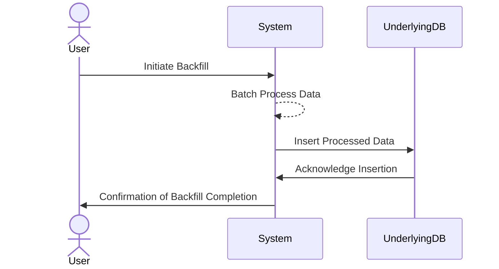

Backfilling data is a critical pattern in time-series data management, enabling systems to remain consistent while integrating historical data post initial load. This pattern is crucial for systems where past data analysis is vital, such as financial systems, IoT applications, and monitoring services.

## Description

Backfilling involves inserting historical data into a time-series database that initially ran without it. This pattern is especially useful when you need a complete timeline for analytics, forecasting, or compliance purposes. It also helps synchronize data from deteriorated or inconsistent sources by ensuring accuracy and enhancing data analysis capabilities.

## Architectural Approaches

- **Batch Processing**: Often used to process historical data in large volumes, leveraging frameworks like Apache Spark or AWS Glue to handle ETL processes efficiently.
  
- **Incremental Backfilling**: Implementing an approach where data is backfilled in chunks or smaller batches. Tools like Apache NiFi or Airflow can help automate these incremental tasks, lessening the load on databases and reducing downtime.

- **Parallel Processing**: Utilizing cloud-based infrastructures, like AWS Lambda or GCP Cloud Functions, to distribute data backfilling tasks across multiple nodes, speeding up the process.

## Best Practices

- **Data Consistency**: Ensure that the data sources are consistent and trustworthy. Use checksums or hashing techniques to validate data integrity throughout backfilling.

- **Resource Optimization**: Schedule backfill operations during off-peak hours and monitor resource utilization to avoid impacting ongoing operations adversely.

- **Error Handling**: Implement robust error tracking and handling mechanisms to rerun failed operations or transactions seamlessly.

- **Testing**: Prior to full-scale backfill, run tests on smaller datasets to refine the backfilling process and ensure system performance isn't negatively impacted.

## Example Code

Using Apache Spark for backfilling:

```scala
import org.apache.spark.sql.SparkSession

val spark = SparkSession.builder()
  .appName("Backfilling Data")
  .config("spark.some.config.option", "some-value")
  .getOrCreate()

val historicalData = spark.read.option("header", "true")
  .csv("path/to/historical/data.csv")

historicalData.write
  .format("com.databricks.spark.csv")
  .option("header", "true")
  .mode("append")
  .save("path/to/save/backfilled/data")
```

## Diagram



## Related Patterns

- **Lambda Architecture**: Efficiently incorporates both batch and stream processing of data, allowing for backfilling alongside real-time processing.
  
- **Event Sourcing**: Utilizes events as the foundation of its state, making it easier to backfill historical event data effectively.

## Additional Resources

- [Time-Series Databases: New Ways to Store and Access Data](https://www.oreilly.com)
- [Data Pipeline Architectures Through Cloud Services](https://cloud.google.com/architecture)

## Summary

Backfilling data establishes a foundation for successful time-series analysis by integrating missing historical records into operational databases. By leveraging tools and following best practices, organizations can ensure seamless data integration, robust analysis, and maintain data integrity while enhancing their ability to derive meaningful insights from their data history. By implementing a thoughtful backfilling strategy, you unlock the full potential of historical data, creating opportunities for further business intelligence and decision-making processes.
