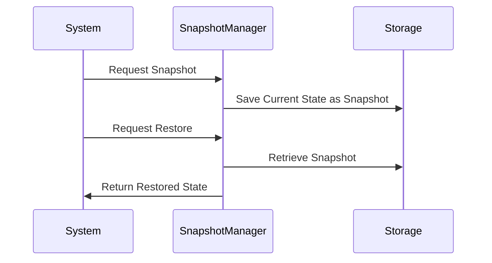

Snapshotting is a crucial design pattern in data modeling, particularly in time-series data applications. It involves capturing and storing the state of a system at discrete points in time. These snapshots serve as a reference for various purposes, such as backup, disaster recovery, auditing, and system regression testing. By taking periodic snapshots, systems can ensure consistency, retain historical information, and recover from failures efficiently.

## Explanation

### Design Pattern Characteristics
Snapshotting is utilized in scenarios where maintaining the historical state of a dataset is imperative. It enables a system to:
- Reconstruct past states by leveraging stored snapshots.
- Perform efficient data recovery in the event of system errors or corruptions.
- Simplify auditing processes by providing clear evidence of past states.

### Use Cases
- **Database Backup**: Regular snapshots are taken to back up the complete state of a database, ensuring a fail-safe mechanism against data loss.
- **Virtual Machines**: Virtualization platforms often rely on snapshotting to capture the state of a virtual machine, allowing quick restoration when issues arise.
- **Cloud Services**: Cloud service providers use snapshots for data replication, backup, and migration processes.

### Implementation Strategies
#### Incremental Snapshotting
Instead of capturing the entire state each time, incremental snapshotting saves only the changes since the last snapshot. This approach reduces storage requirements and speeds up the snapshotting process.

#### Snapshot and Restore API
Many distributed data storage systems such as Elasticsearch offer Snapshot and Restore APIs. These interfaces allow users to create, store, and restore snapshots programmatically, integrating seamlessly with automation scripts.

## Example Code

Here's a basic example of how snapshotting might be implemented in a Java-based system:

```java
import java.nio.file.*;
import java.io.*;

public class SnapshotManager {
    private static final String SNAPSHOT_DIRECTORY = "snapshots/";

    public static void takeSnapshot(String data, String snapshotName) throws IOException {
        // Ensure snapshots directory exists
        Files.createDirectories(Paths.get(SNAPSHOT_DIRECTORY));

        // Write snapshot to file
        Files.write(Paths.get(SNAPSHOT_DIRECTORY + snapshotName + ".snapshot"), data.getBytes());
    }

    public static String restoreSnapshot(String snapshotName) throws IOException {
        // Read snapshot from file and return its data
        return new String(Files.readAllBytes(Paths.get(SNAPSHOT_DIRECTORY + snapshotName + ".snapshot")), "UTF-8");
    }

    public static void main(String[] args) {
        try {
            String systemState = "State of the system at a specific time";
            takeSnapshot(systemState, "daily-snapshot");

            // Later restoration
            String restoredState = restoreSnapshot("daily-snapshot");
            System.out.println("Restored State: " + restoredState);
        } catch (IOException e) {
            e.printStackTrace();
        }
    }
}
```

## Diagram

Here's a Mermaid Sequence Diagram illustrating the Snapshotting process:



## Related Patterns
- **Event Sourcing**: Complementary to snapshotting, event sourcing captures change events rather than state, allowing for reconstruction of state through event replay.
- **Command-Query Responsibility Segregation (CQRS)**: While snapshotting deals with state directly, CQRS divides data operations into separate models for updating and querying.
  
## Additional Resources
- Explore cloud provider documentation for specific snapshotting solutions, such as AWS EBS Snapshots or Google Cloud Persistent Disk Snapshots.
- Investigate open-source storage solutions like Apache Hadoop or Cassandra, which offer built-in snapshot capabilities.

## Summary
Snapshotting is a fundamental design pattern for systems that demand state preservation and fast recovery. By effectively capturing the system state at regular intervals, snapshotting guarantees data reliability, facilitates compliance, and enhances the system's robustness against disasters. Integrating snapshotting with existing infrastructure requires understanding both the technical and strategic implications, ensuring that the approach aligns with organizational objectives and resource constraints.
