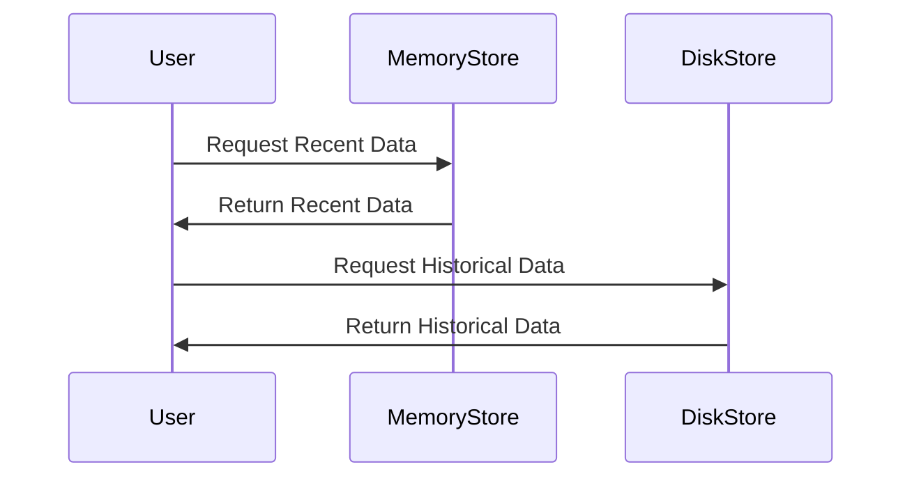

## Hybrid Storage Models

### Introduction
The Hybrid Storage Models design pattern involves integrating multiple storage technologies to handle time-series data efficiently. This approach takes advantage of the strengths of different storage mediums to optimize performance, cost, and data availability.

### Design Pattern Description
The core concept behind Hybrid Storage Models is to leverage the complementary strengths of various storage systems to cater to the needs of diverse data access patterns. Typically, recent data is accessed more frequently, thus benefiting from in-memory storage for speed. Older, less frequently accessed data can be kept on cost-effective disk-based storage, which balances overall system costs and performance.

### Architectural Approaches
- **In-Memory and Disk Combination**: Use in-memory databases or caching layers for high-speed access to recent data points and disk-based systems like HDD or SSD for archiving older data.
- **Tiered Storage Systems**: Implement tiered storage architecture to balance between performance and cost. Data is moved between tiers based on predefined policies, such as frequency of access or data aging.
- **Multi-Database Approach**: Employ different databases optimized for specific tasks, such as using NoSQL databases for writing and relational databases for querying.

### Best Practices
- **Data Partitioning**: Implement partitioning strategies to segregate time-series data based on time periods for optimized storage and retrieval.
- **Access Pattern Analysis**: Regularly analyze data access patterns to fine-tune the storage model and adjust policies as needed.
- **Automated Tier Management**: Use automated tools to manage data migration between different storage tiers to minimize manual interventions.

### Example Code
Below is a conceptual example of using a hybrid storage model with both in-memory and disk-based systems:

```java
// Pseudo-code representation of a Hybrid Storage System
public class HybridStorageSystem {
    private MemoryStore memoryStore;  // In-memory storage for fast access
    private DiskStore diskStore;      // Disk storage for long-term data

    public void saveData(TimeSeriesData data) {
        memoryStore.save(data);
        diskStore.save(data);
    }

    public TimeSeriesData getRecentData(String key) {
        return memoryStore.getData(key);
    }

    public TimeSeriesData getHistoricalData(String key) {
        return diskStore.getData(key);
    }
}
```

### Diagrams
#### Sequence Diagram


### Related Patterns
- **Cold and Hot Data Storage**: Complementary pattern that also deals with efficiently storing frequently accessed (hot) and infrequently accessed (cold) data.
- **Data Archiving and Retention**: This pattern focuses on retaining older data for compliance or analytic reasons while optimizing storage cost.

### Additional Resources
- [Cloud Native Data Infrastructure](https://cloud-native-data-infra.example.com)
- [Storage Tier Classification and Management](https://list-of-resources.example.com)
- [In-Memory Database Guide](https://in-memory-database-guide.example.com)

### Summary
Hybrid Storage Models offer a pragmatic and efficient approach to managing time-series data by utilizing the best characteristics of different storage technologies. By understanding access patterns and data lifecycles, enterprises can significantly enhance the performance and cost-effectiveness of their data storage solutions.
