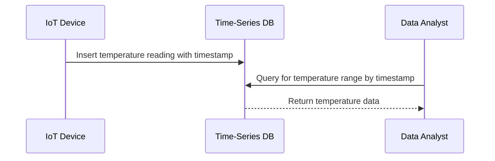

## Time-Stamped Data

### Description

Time-Stamped Data is a design pattern commonly employed in scenarios where timing is a crucial attribute of the data being stored and processed. Each data point in this pattern is inherently linked with a timestamp that represents the exact moment when the event was logged. This pattern is especially prevalent in time-series data applications, enabling accurate temporal analysis and pattern recognition over periods.

### Detailed Explanation

Time-stamped data stores typically follow a schema where each entry or record includes a `timestamp` field that marks the point in time when the data was captured. This temporal data modeling is fundamental for applications that require historical data trending, real-time monitoring, and time-based querying.

#### Key Aspects:
- **Precision and Accuracy**: Timestamps typically include time zone information and can range from coarse granularity (e.g., date) to fine granularity (e.g., nanoseconds) depending on system requirements.
- **Time-Series Databases**: Databases like InfluxDB, TimescaleDB, and specialized NoSQL stores effectively handle time-stamped data, optimized for operations like range queries and aggregation over time windows.
- **Schema Consideration**: Determines how time is represented and stored - as Unix epoch, ISO 8601 strings, or database-specific date/time types.

### Architectural Approaches

- **Data Partitioning**: Use timestamps to partition data, improving write performance and enabling efficient data purging strategies.
- **Indexing**: Indexing on timestamps is critical to optimize the retrieval of data within a specified time range.
- **Compression Techniques**: Employ compression algorithms tailored for time-series data to reduce storage overhead without compromising on the speed of retrieval.

### Example Code

Here is a simplified example of a time-stamped data schema in SQL:

```sql
CREATE TABLE temperature_readings (
    id SERIAL PRIMARY KEY,
    sensor_id INT NOT NULL,
    temperature DOUBLE PRECISION NOT NULL,
    recorded_at TIMESTAMPTZ NOT NULL DEFAULT NOW()
);

-- Query to retrieve data within a specific time range.
SELECT * FROM temperature_readings
WHERE recorded_at BETWEEN '2023-10-01' AND '2023-11-01'
ORDER BY recorded_at;
```

### Diagrams

#### Uml Sequence Diagram: Data Ingestion and Retrieval



### Related Patterns

- **Event Sourcing**: Utilizes time-stamped data to capture every change to an application's state as an event sequence.
- **Change Data Capture (CDC)**: Monitors database changes, often leveraging timestamps to track modifications in data pipelines.

### Additional Resources

- [Time-Series Databases: New Ways to Store and Access Data](https://example.com/time-series-databases)
- [Data Models for Time-Series Data: A Thorough Comparison](https://example.com/data-model-time-series)
- [InfluxDB Documentation](https://example.com/influxdb-docs)

### Summary

Time-Stamped Data is an essential design pattern in data modeling for applications relying on historical and real-time analytics. Precise time data representation ensures accuracy in monitoring, reporting, and decision-making processes. Leveraging best practices such as partitioning and indexing can greatly optimize the performance and scalability of time-based data systems.
