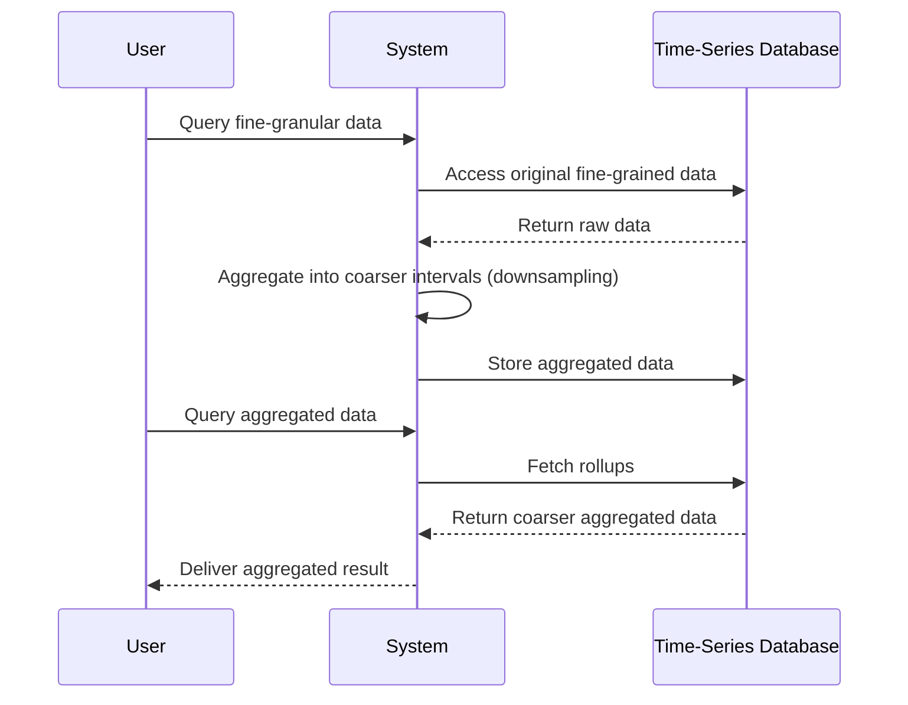

## Overview

In modern data environments, especially those dealing with time-series data, handling large volumes of high-resolution data over time can become increasingly challenging. **Downsampling and Rollups** serve as crucial techniques for managing this issue by aggregating granular data points into a more manageable form while retaining essential information.

### Purpose

- **Data Volume Reduction**: By aggregating detailed data points, these patterns help reduce the overall storage requirements.
- **Performance Improvement**: They simplify queries by operating over reduced data sets, thereby improving execution times.
- **Long-term Analysis**: Allow for historical data to remain accessible and analysis-ready without maintaining every minute detail.

## How It Works

Downsampling and Rollups involve the process of aggregating fine-grained data into larger time intervals. For instance:

- **Downsampling**: Involves reducing the sampling rate of data by aggregating multiple data points into one. For example, if the original data is recorded every minute, downsampling might aggregate this data into hourly averages.
  
- **Rollups**: Refine the aggregated data, further summarizing it into higher-level intervals, such as daily, weekly, or monthly aggregates. Rollup operations could involve calculating sums, means, max, min, etc.

### Example Code

```scala
// Assuming a data collection of second-level time-stamped temperature readings

case class TemperatureReading(timestamp: Instant, temperature: Double)

val readings: List[TemperatureReading] = fetchData()

// Downsampling to minute averages
val minuteAverages = readings
  .groupBy(reading => reading.timestamp.truncatedTo(ChronoUnit.MINUTES))
  .mapValues(temps => temps.map(_.temperature).sum / temps.size)

// Rollup to hourly averages from minute data
val hourlyRollups = minuteAverages
  .groupBy { case (timestamp, _) => timestamp.truncatedTo(ChronoUnit.HOURS) }
  .mapValues(minutes => minutes.map(_._2).sum / minutes.size)
```

### Diagram



## Best Practices

- **Determine Aggregation Levels**: Carefully choose the appropriate level of aggregation based on use cases and data analytics needs.
- **Automate the Process**: Employ automated tools or scheduled jobs to consistently downsample and create rollups.
- **Data Retention Strategy**: Define retention policies for both raw and aggregated data, ensuring balance between storage costs and data availability.

## Related Patterns

- **Time-Windowed Storage**: Further optimizes storage by organizing time-series data in fixed-size windows.
- **Event Sourcing**: Captures a system’s state as a sequence of events and may leverage downsampling for space efficiency.
- **Lambda Architecture**: Combines batch and real-time processing, benefiting from downsampled data for batch analytics.

## Additional Resources

- [Time-Series Data Management with Apache Druid](https://druid.apache.org/)
- [InfluxData - Aggregation and Query](https://docs.influxdata.com/influxdb/)
- [Downsampling Methods in Time-Series](https://towardsdatascience.com)

## Summary

**Downsampling and Rollups** are indispensable in the realm of time-series data modeling, providing efficiency and scalability in data management. These patterns enable enterprises to maintain effective data strategies that prioritize both storage efficiency and analytical capability over extended periods. By selecting the right aggregation techniques and storage models, businesses can optimize their data architectures for improved performance and reduced costs.
