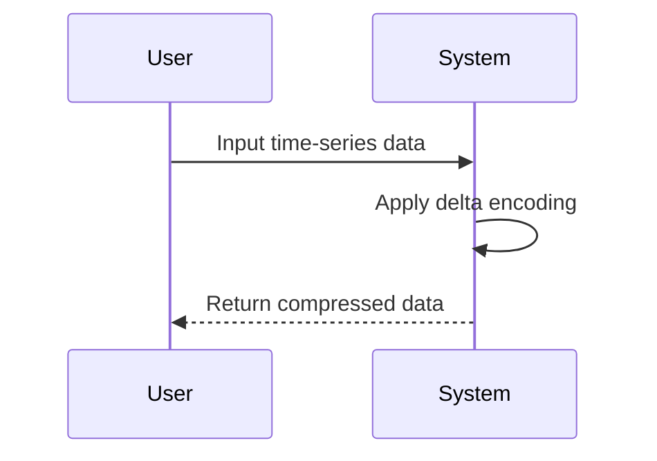

## Compression Techniques

### Introduction

Compression techniques are essential for managing the expansive and often voluminous time-series data generated by various applications, including IoT devices, financial markets, and monitoring systems. By utilizing specialized data compression algorithms, it's possible to significantly reduce storage requirements while maintaining data fidelity and retrieval speed.

### Design Pattern Description

Compression techniques focus on reducing the footprint of stored data without losing its essential structure and semantics. These techniques are particularly useful in time-series databases, where data is sequential and often exhibits patterns or similarities between successive data points. The choice of compression algorithm can significantly influence both the speed and efficiency of data handling processes.

### Architectural Approach

1. **Delta Encoding**: This method stores the difference between each value and the preceding one. This is effective because time-series data often varies minimally from one timestamp to the next.

2. **Run-Length Encoding (RLE)**: Useful when the time-series data has long runs of a single value. RLE compresses these sequences into a single value and a count.

3. **Bit-Packing**: This involves storing multiple data points in a single data frame to utilize space efficiently, especially when data is smaller than the word size of the system.

4. **Dictionary Encoding**: Common in systems where a small number of unique values appear frequently in the dataset.

5. **Chunk Compression**: Divides the dataset into chunks and applies compression techniques like GZIP or Snappy on a per-chunk basis.

### Example Code

Here's a simple Java implementation of delta encoding.

```java
public class DeltaEncoding {
    public static int[] encode(int[] data) {
        int[] deltaEncoded = new int[data.length];
        deltaEncoded[0] = data[0];
        for (int i = 1; i < data.length; i++) {
            deltaEncoded[i] = data[i] - data[i - 1];
        }
        return deltaEncoded;
    }

    public static void main(String[] args) {
        int[] timeSeriesData = {100, 102, 103, 105, 109};
        int[] encodedData = encode(timeSeriesData);
        
        System.out.println("Delta Encoded Data:");
        for (int i : encodedData) {
            System.out.print(i + " ");
        }
    }
}
```

### Diagram



### Related Patterns

- **Event Sourcing**: Works well with time-series data for maintaining historical data.
- **CQRS (Command Query Responsibility Segregation)**: Divides data transformations and queries, which can be optimized for compressed data storage.

### Additional Resources

- "Time-Series Data Management" by Wolfgang Lehner and Felix Naumann.
- "Data Compression: The Complete Reference" by David Salomon.

### Summary

Applying compression techniques to time-series data offers a robust method to handle growing datasets efficiently. Utilizing approaches like delta encoding and bit-packing, professionals can store large datasets in reduced spaces without sacrificing accessibility or speed. For applications generating continuous data streams, these techniques not only economize on storage but also enhance data throughput and reliability across distributed systems.
