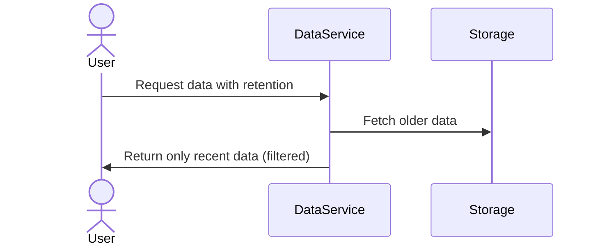

## Overview

Retention policies are crucial for managing time-series data lifecycle, ensuring that the storage is optimized and aligned with business value and compliance requirements. They define how long data should be retained in the system, determining when it should be deleted or archived. This design pattern is particularly applicable in environments with large data volumes and frequent data generation, such as IoT, financial markets, and telemetry systems.

## Design Pattern Components

### Purpose and Benefits

The implementation of retention policies offers significant benefits:

- **Cost Efficiency**: By only retaining relevant data, organizations can reduce storage costs.
- **Compliance and Legal Requirements**: Many industries have guidelines for data retention, and this pattern ensures adherence.
- **System Performance**: Regularly purging old data keeps the data volume manageable, enhancing query performance.

### Implementation Strategies

1. **Time-Based Deletion**: Automatically remove data older than a predefined age, such as purging logs after a month.
   
   ```sql
   DELETE FROM sensor_logs WHERE timestamp < current_date - INTERVAL '1 month';
   ```

2. **Tiered Storage**: Move older data to different storage tiers that are less costly but slower, such as from SSD to HDDs or to cold cloud storage.

3. **Data Aggregation**: Retain detailed data for a short period and aggregate data for longer periods. For example, keep daily raw data for a month but monthly aggregated summaries for a year.

4. **Policy-Based Archiving**: Use automated policies to transition data to archival storage solutions after its primary retention period has elapsed.

### Example Code

Below is an example implementation in a Java microservice to manage data retention based on a specified policy.

```java
import java.time.LocalDate;
import java.util.List;

public class RetentionPolicyManager {

    public void enforceRetentionPolicy(List<DataRecord> records, LocalDate cutoffDate) {
        records.removeIf(record -> record.getTimestamp().isBefore(cutoffDate));
    }
}

// Usage
RetentionPolicyManager manager = new RetentionPolicyManager();
manager.enforceRetentionPolicy(dataRecords, LocalDate.now().minusMonths(1));
```

### Diagram



## Related Patterns

- **Data Archival**: Complements retention policies by defining strategies to transition data into long-term storage.
- **Data Aging**: Similar concept focusing on gradually degrading data fidelity or completeness over time.
- **Data Aggregation**: Works in tandem by reducing data size while still retaining useful information over longer periods.

## Best Practices

- **Configurable Policies**: Ensure retention parameters, such as data age and aggregation criteria, are configurable to adapt to changing requirements.
- **Monitor Impact**: Continuously monitor storage and performance impacts to ensure policies are effective.
- **Compliance Alignment**: Regular audits should ensure policies meet regulatory requirements.

## Additional Resources

- [Google Cloud Retention Policy Documentation](https://cloud.google.com/docs)
- [AWS Data Lifecycle Management](https://aws.amazon.com/datalifecycle-manager/)
- "Effective Data Management" book available on [O'Reilly Media](https://www.oreilly.com/).

## Summary

Retention policies are integral to elegantly manage data lifecycle, reduce costs, and maintain system performance. By auto-deleting or archiving data based on time and relevancy, organizations can stay compliant with regulations and focus on high-value data analysis. This pattern advocates for a structured, configurable approach to data retention aligned with organizational goals.
