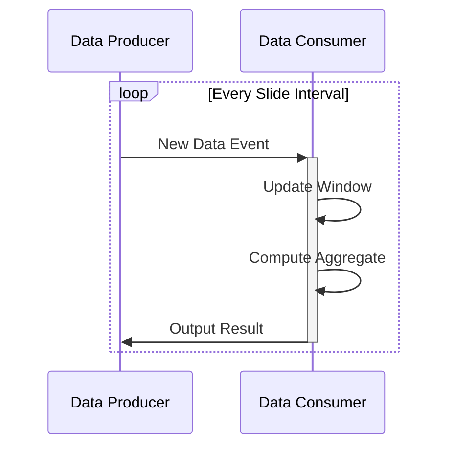

## Introduction
Sliding Window Aggregation is a powerful design pattern used in real-time data processing environments. It enables efficient calculation of aggregate metrics within a moving time window, providing insights into recent data trends. This pattern is essential for scenarios like monitoring system health (e.g., average CPU usage) or tracking statistics over short durations (e.g., live user engagement on a website).

## Detailed Explanation
### Architectural Approach
The Sliding Window Aggregation pattern revolves around maintaining a fixed-size window of data that slides over time. As new data arrives, the window updates by adding new entries and removing old ones according to a defined time interval.

**Key Concepts:**
- **Time Window**: The period for which data is kept in memory for aggregation.
- **Slide Interval**: The frequency at which the window moves forward over the data stream.
- **Window Size**: The total duration covered by the window.

### Example
Consider an application monitoring system where you need to calculate the average CPU usage over the past 5 minutes, updated every minute:
1. Keep a time window of 5 minutes (window size).
2. Slide the window every 1 minute (slide interval).
3. For each slide, calculate the average CPU usage from the data points within the current window frame.

### Example Code
Using Apache Flink for demonstration:
```java
DataStream<SensorReading> readings = ...; // source data stream

readings
    .keyBy(SensorReading::getSensorId)
    .window(SlidingProcessingTimeWindows.of(Time.minutes(5), Time.minutes(1)))
    .aggregate(new AverageAggregate())
    .print();
```

### Diagram


## Related Patterns
- **Tumbling Window Aggregation**: Similar to sliding windows but without overlap. Each window starts immediately after the previous one ends.
- **Session Windowing**: Used to group events by sessions with dynamic window sizes based on activity gaps.

## Additional Resources
- [Apache Flink Documentation](https://flink.apache.org/documentation)
- [Real-Time Stream Processing in Kafka with Kafka Streams](https://kafka.apache.org/documentation/streams/)
- [Data Stream Development with Apache Flink](https://www.amazon.com/Data-Stream-Development-Apache-Flink/dp/1617298376)

## Summary
Sliding Window Aggregation is indispensable for real-time analytics, enabling efficient data analysis over rolling timeframes. By maintaining a continuous assessment of the recent data, organizations can swiftly respond to insights and adapt to changes in real time. This pattern's flexible design suits various use cases, from performance monitoring to real-time user analytics.
