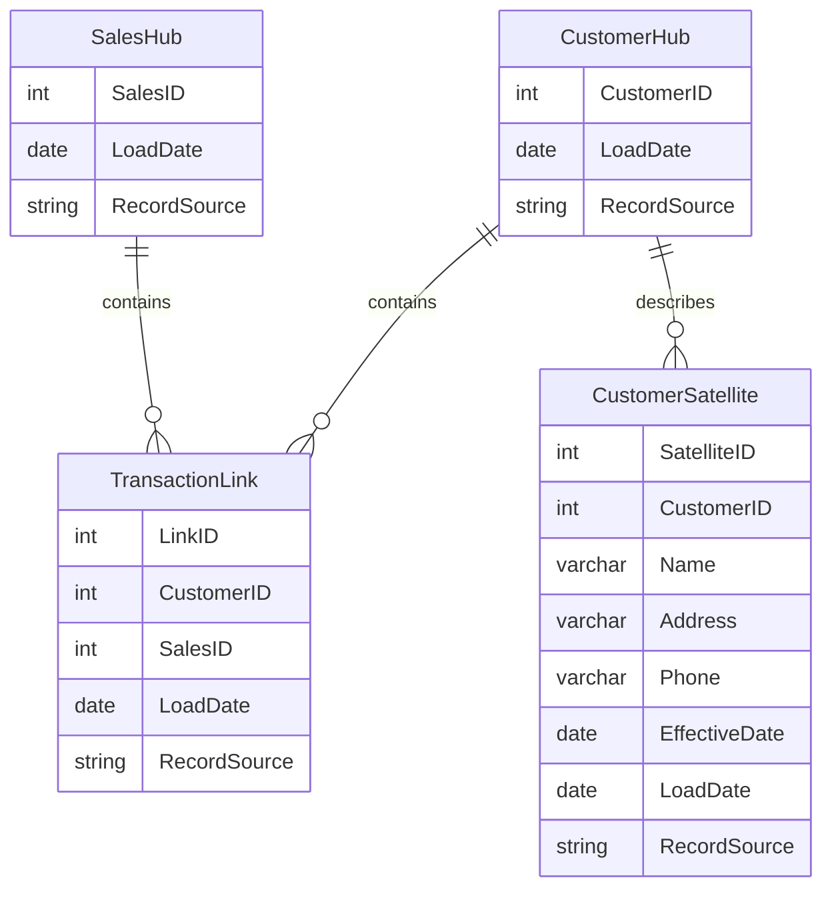

## Introduction

Data Vault Modeling is a database modeling method designed explicitly for data warehousing and business intelligence. It provides a flexible, scalable, and agile data modeling solution suitable for dealing with the complexity of today's large-scale data environments. By separating data into hubs, links, and satellites, Data Vault ensures traceability and adaptability while maintaining historical accuracy.

## Components

### 1. Hubs
- **Purpose**: Represent core business concepts or entities.
- **Characteristics**: 
  - Contains only the unique identifier (business key) of an entity.
  - Includes metadata such as load date and record source.
- **Example**: A `CustomerHub` may store unique customer IDs along with metadata about when the record was added and from which source.

### 2. Links
- **Purpose**: Capture and maintain the relationships between hubs/business entities.
- **Characteristics**:
  - Only contain foreign keys to hubs.
  - Store metadata like load date and record source.
- **Example**: A `TransactionLink` may connect `CustomerHub` and a `SalesHub`, representing customer transactions.

### 3. Satellites
- **Purpose**: Hold the descriptive attributes related to hubs or links.
- **Characteristics**:
  - Store change history, providing a full historical audit.
  - Include metadata like effective date and load date.
- **Example**: A `CustomerSatellite` may contain attributes such as customer name, address, phone number, etc.

## Architectural Approach

Data Vault is process-driven and supports multiple data delivery approaches. It leverages the strengths of both normalization and dimensional approaches, allowing for more agile data processing. This modular design adapts easily to changes in the data landscape, making it suited for modern agile and DevOps environments.

## Best Practices

- **Start with Business Keys**: Determine business keys before you build hubs.
- **Decouple Systems**: Use links and satellites to decouple entities, which allows for greater flexibility in data ingestion and transformation.
- **Metadata Management**: Rely on comprehensive metadata to maintain auditability and lineage.
- **Continuous Integration**: Implement CI/CD practices for continuous testing and integration of data changes.

## Example Code

Assuming the use of SQL for table creation:

```sql
CREATE TABLE CustomerHub (
    CustomerID INT PRIMARY KEY,
    LoadDate DATETIME,
    RecordSource VARCHAR(50)
);

CREATE TABLE TransactionLink (
    LinkID INT PRIMARY KEY,
    CustomerID INT,
    SalesID INT,
    LoadDate DATETIME,
    RecordSource VARCHAR(50),
    FOREIGN KEY (CustomerID) REFERENCES CustomerHub(CustomerID),
    FOREIGN KEY (SalesID) REFERENCES SalesHub(SalesID)
);

CREATE TABLE CustomerSatellite (
    SatelliteID INT PRIMARY KEY,
    CustomerID INT,
    Name VARCHAR(255),
    Address VARCHAR(255),
    Phone VARCHAR(15),
    EffectiveDate DATETIME,
    LoadDate DATETIME,
    RecordSource VARCHAR(50),
    FOREIGN KEY (CustomerID) REFERENCES CustomerHub(CustomerID)
);
```

## Diagrams

Here is a simple UML representation using Mermaid:



## Related Patterns

- **Dimensional Modeling**: Use dimensional approaches alongside Data Vault for reporting marts.
- **Master Data Management (MDM)**: Help govern the Data Vault business keys.
- **ETL Patterns**: Implement ETL processes to load and maintain data within the vault.

## Additional Resources

- *The Data Vault Guru* by Dan Linstedt provides comprehensive insights into implementing Data Vault Modeling.
- Online courses on platforms like Coursera and Udemy.

## Summary

Data Vault Modeling is an innovative approach for organizing, storing, and retrieving large volumes of complex data. By dividing data into hubs, links, and satellites, Data Vault builds upon the strengths of other modeling methods to provide a flexible, robust, and scalable data warehousing solution. It is particularly beneficial in environments with frequent changes because of its atomicity, providing a foundational data model for business intelligence and analytics solutions.
