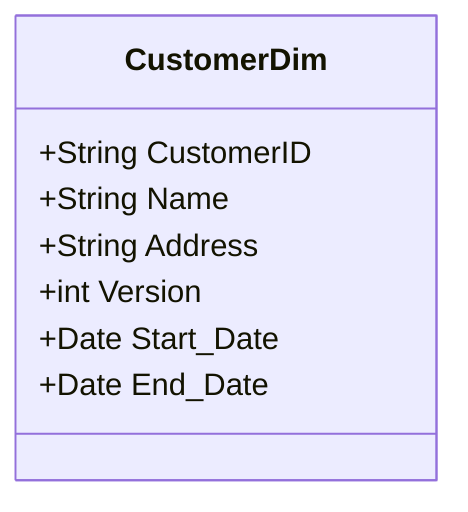
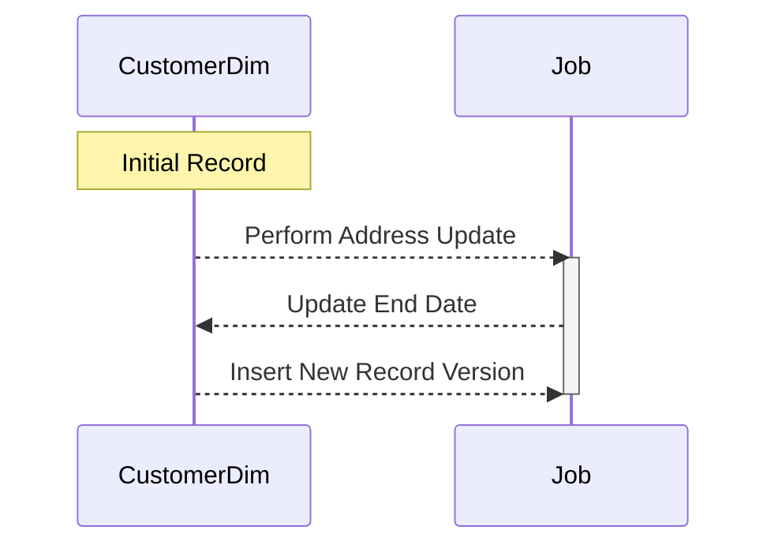

## Introduction

The Slowly Changing Dimensions (SCD) Type 2 design pattern is a crucial technique in the realm of data warehousing and ETL processes. SCD Type 2 provides a method for managing changes within your dimension tables where you need to maintain historical data. This is accomplished by creating new records with versioning and effective dates, ensuring historical accuracy and enabling powerful analytical capabilities.

## Detailed Explanation

### Key Concepts

- **Dimension Tables**: These are structures in a data warehouse that describe the entities upon which facts are analyzed. Examples of dimensions include customers, products, and locations.

- **Slowly Changing Dimensions**: A reference to the phenomenon that while dimension data does not change frequently, when it does, it complicates data tracking.

- **SCD Type 2**: This type of SCD not only records changes but also maintains a full history by storing multiple versions of dimension records with pointers to effective date ranges.

### Implementation Approaches

1. **New Record Insertion**: When a change occurs, insert a new record into the dimension table with an updated version number and effective date details (often including `Start_Date` and `End_Date` columns).

2. **End Date Updating**: Mark the current version of the record as expired by updating its end date when a new version of a row is introduced.

3. **Versioning**: Introduce a version field to each row to uniquely identify the sequence of updates for a dimension record.

### Example Code

Here’s a simplified example showing how this might be implemented for handling customer addresses:

```sql
-- Current record for a customer before an address change
CustomerDim
------------------------------
| CustomerID | Name   | Address         | Version | Start_Date | End_Date   |
|------------|--------|-----------------|---------|------------|------------|
| 1          | Alice  | 123 Main St     | 1       | 2023-01-01 | 9999-12-31 |

-- Address changes
UPDATE CustomerDim
SET End_Date = '2024-01-01'
WHERE CustomerID = 1 AND End_Date = '9999-12-31';

INSERT INTO CustomerDim (CustomerID, Name, Address, Version, Start_Date, End_Date)
VALUES (1, 'Alice', '456 Elm St', 2, '2024-01-02', '9999-12-31');
```

### Diagram

Below is a Mermaid diagram illustrating the transition from one version to another for the "CustomerDim" table:





## Related Patterns

- **SCD Type 1**: Overwrites old data without preserving historical changes.
- **SCD Type 3**: Adds new columns to capture only limited history.
- **Star Schema**: Often used in combination with SCD to ensure flexible querying and querying performance.

## Best Practices

- **ETL Process**: Incorporate robust ETL processes to manage data loading and historical handling consistently.
- **Data Validation**: Ensure data consistency through rigorous validation rules and automated checks to handle duplicates or discrepancies.
- **Indexing Strategy**: Optimize queries by indexing on version or effective date columns to maintain performance.

## Additional Resources

- [Kimball Group's Dimensional Modeling Techniques](https://www.kimballgroup.com)
- [Data Vault 2.0 for comprehensive historical data management](https://datavaultalliance.com)

## Summary

In conclusion, the Slowly Changing Dimensions (SCD) Type 2 design pattern offers an effective method for maintaining a historical view of dimension data. By capturing each change as a new record, SCD Type 2 ensures that analyses can track historical trends accurately, a critical need for robust data warehousing solutions. By employing versioning and effective data management practices, organizations can readily handle changes in complex data ecosystems.
