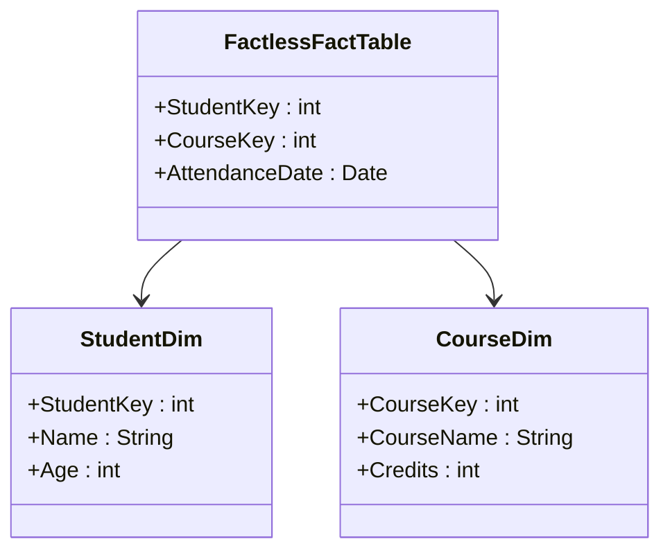

## Introduction to Factless Fact Tables

Factless fact tables play a unique role in dimensional modeling within a data warehouse environment. Unlike traditional fact tables that contain quantitative data (measures), factless fact tables instead focus on capturing the occurrence of events or the presence of conditions. This can be particularly useful in scenarios where the mere existence of an event is the key point of interest, such as tracking student attendance or promotional events.

## Defining Factless Fact Tables

### Characteristics:
- **Lack of Measures**: No measurable (quantitative) facts are included. The main intention is to record that an event happened.
- **Dimensional Focus**: Still connected to multiple dimension tables to provide context about the event.
- **Simplicity**: Purely associative in nature; used to enforce constraints or track events.

### Examples:
1. **Student Attendance**: Recording the presence of students in courses—associating `StudentDim`, `CourseDim`, without measures.
2. **Promotion Participation**: Tracking which products were featured in promotions, using dimensions like `ProductDim` and `PromotionDim`.

## Architectural Approaches

### Data Warehouse Context
In a data warehouse, factless fact tables serve as helpful constructs in situations where the relationship between dimensions can represent meaningful data without numerical aggregation. This approach enriches data analysis capabilities by filling in essential context that might not be captured otherwise.

### Implementation Strategy
1. **Identify Events/Conditions**: Determine which events are critical to capture without traditional measures.
2. **Dimensional Linking**: Connect relevant dimension tables. Keep only essential keys to prevent unnecessary complexity.
3. **ETL Process Considerations**: Devise efficient data loading processes that accurately reflect event occurrence without redundancy.

## Best Practices

- **Use Sparingly**: Utilize factless fact tables selectively when their use presents clear analytical value.
- **Combine Reporting**: Integrate with fact tables that have measures to create comprehensive reports.
- **Ensure Data Integrity**: Enforce consistent dimensional data to maintain integrity across related events.

## Example Code

To illustrate, consider the following SQL pattern for a student attendance capture:

```sql
CREATE TABLE StudentAttendanceFact (
    StudentKey INT FOREIGN KEY REFERENCES StudentDim(StudentKey),
    CourseKey INT FOREIGN KEY REFERENCES CourseDim(CourseKey),
    AttendanceDate DATE,
    PRIMARY KEY (StudentKey, CourseKey, AttendanceDate)
);
```

## Diagrams

A basic UML representation might look like this:



## Related Patterns

- **Event Fact Table**: When events have few but critical measures, such as 'Timestamp' or 'Quantity'.
- **Aggregate Fact Table**: Aggregates where all measures are absent; data is pre-summarized.

## Additional Resources

- Kimball, Ralph. "The Data Warehouse Toolkit: The Definitive Guide to Dimensional Modeling."
- "Building the Data Warehouse" by W.H. Inmon.

## Summary

Factless fact tables expand the analytical reach of a data warehouse model, emphasizing relationships and occurrences over quantifiable metrics. Understanding when and how to implement this pattern can drive more nuanced insights into the conditions and events of your business processes, leading to well-rounded business intelligence capabilities.
