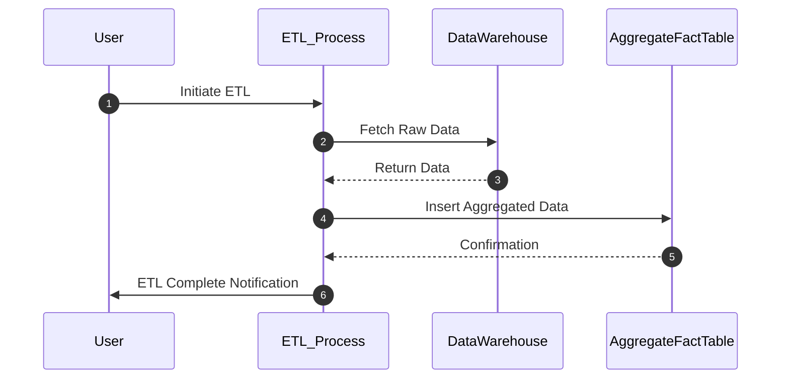

In the realm of data warehousing, *aggregate fact tables* are pivotal for optimizing query performance by storing pre-aggregated data. They reduce the time required for extensive computations at the time of query execution and are particularly beneficial for business intelligence applications that frequently access high-level summaries of data.

## Description

Aggregate Fact Tables are a design pattern used in data warehouse modeling where data is grouped and stored in a way that enables quicker access and enhanced performance for query operations. The primary objective is to reduce computational demand by avoiding the repetitiveness of dynamic calculations, leading to faster query response times. This pattern is especially valuable in scenarios that require dashboards or reports operating on vast amounts of transactional data that are less frequently updated but repeatedly queried in summarized form.

### Example

Consider a data warehousing solution for a retail business where there's a need to analyze sales performance. Instead of querying each transaction for a time period, which could be computationally expensive and time-consuming:

- An `Aggregate Fact Table`, *MonthlySalesFact*, can be created to aggregate sales data by month.
- This table will contain columns like `Month`, `ProductID`, `TotalSalesAmount`, `TotalUnitsSold`, thereby reducing the original detail data.
  
For example:

| Month      | ProductID | TotalSalesAmount | TotalUnitsSold |
|------------|-----------|------------------|----------------|
| 2024-06-01 | 101       | 250,000          | 8,500          |
| 2024-06-01 | 102       | 150,000          | 5,400          |

These pre-calculated metrics allow quick interrogation by business analysts without incurring the overhead of processing transaction-level data every time.

## Architectural Approaches

1. **Data Aggregation Pipelines**: Implement ETL processes to periodically collate and aggregate data from lower granularity detailed fact tables into aggregate fact tables. Leverage tools like Apache Kafka and Apache Spark for efficient processing.

2. **Materialized Views**: Use database capabilities to create materialized views which are queryable like tables but automatically updated from the base tables. Examples include views in databases like PostgreSQL or Oracle.

3. **Hybrid Approaches**: Combine both live query options and pre-calculated aggregates using services like Amazon Redshift, which allows on-the-fly aggregation while still maintaining performance for detailed queries.

## Best Practices

- **Determine Aggregate Levels**: Identify what levels of data aggregation are most beneficial (e.g., daily, weekly, monthly).
- **Use of Indices**: Apply appropriate indexing strategies on aggregate fact tables to further boost query performance.
- **Storage Optimization**: Regularly purge or archive older aggregated data to keep the size of aggregate tables in check.
- **Scheduled Updates**: Implement schedules for refreshing aggregate tables to ensure fresh data availability without compromising performance.

## Example Code

Below is an example of how an aggregate table might be created and populated using SQL:

```sql
CREATE TABLE MonthlySalesFact AS
SELECT
  DATE_TRUNC('month', TransactionDate) AS Month,
  ProductID,
  SUM(SaleAmount) AS TotalSalesAmount,
  SUM(Quantity) AS TotalUnitsSold
FROM
  SalesTransactionDetail
GROUP BY
  DATE_TRUNC('month', TransactionDate),
  ProductID;
```

## Diagrams

Here's a simple UML sequence diagram showing the process of updating an aggregate fact table:



## Related Patterns

- **Star Schema**: Often, aggregate fact tables are part of a star schema to facilitate faster query response with minimal joins.
- **Dimensional Modeling**: Aggregate tables make use of dimensional modeling concepts by summarizing data points within a cube.

## Additional Resources

- Kimball, Ralph, and Margy Ross. *The Data Warehouse Toolkit: The Definitive Guide to Dimensional Modeling*.
- Inmon, W. H. *Building the Data Warehouse*.

## Summary

Aggregate Fact Tables are essential for improving query performance in large-scale data warehouse environments. They provide a practical solution for handling large datasets, allowing business analysts to retrieve summarized, high-level data efficiently. By intelligently designing and implementing these tables, organizations can significantly enhance their data processing capabilities and business intelligence operations.
