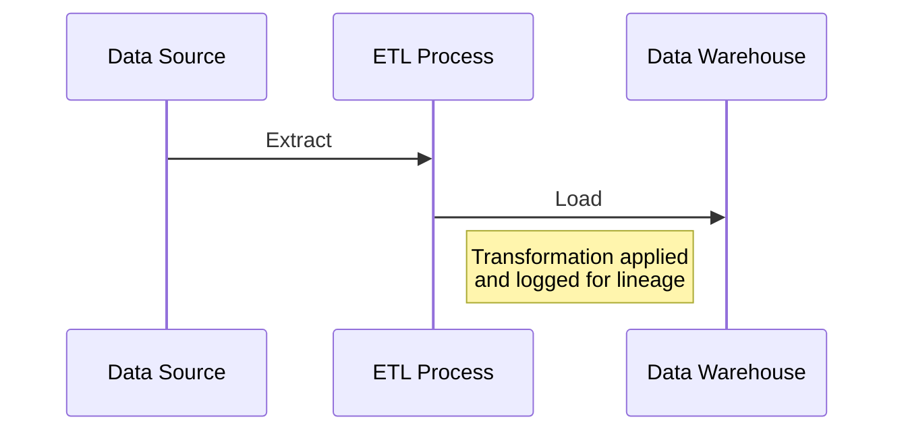

## Overview

Data Lineage refers to the process of understanding, recording, and visualizing the data flow through different systems, providing insight into data's history, from its origin to consumption. It is integral to data governance, ensuring data quality, compliance, and trustworthiness across enterprise data warehouses.

## Detailed Explanation

### Importance of Data Lineage

Data lineage is crucial for:

- **Transparency**: Enables data scientists and analysts to comprehend data transformations and make informed decisions.
- **Compliance**: Meets regulatory requirements by tracing data flows and their transformations, critical for audits and policy adherence.
- **Troubleshooting**: Identifies errors in data processes by allowing backwards tracking to the root cause.
- **Impact Analysis**: Assesses the effects of changes in data processes on downstream data consumers.

### Architectural Approaches

#### Metadata Management

At the core of data lineage is robust metadata management, which documents:

- **Source Metadata**: Details about original data sources.
- **Transformation Metadata**: Information on ETL (Extract, Transform, Load) processes applied to data.
- **Lineage Metadata**: Data flow between datasets and systems.

#### Modern Data Lineage Solutions

- **Automated Lineage Tracking**: Tools automatically track and visualize data flows.
- **Cloud-Native Lineage Tools**: Platforms like AWS Glue, Azure Data Catalog, and GCP's Data Catalog provide built-in capabilities for tracking lineage on the cloud.
- **Open Source Tools**: Tools like Apache Atlas and OpenLineage offer open-source solutions for data lineage, allowing for customization and integration with existing systems.

### Best Practices

- **Consistent Documentation**: Maintain comprehensive metadata records at every stage of data processing.
- **Integration with Data Governance Tools**: Lineage should be part of a larger data governance framework.
- **Leverage Automation**: Utilize automated tools to reduce manual efforts and human errors.
- **Regular Updates**: Keep lineage information current with system changes and new data patches.

### Example Code

Consider an ETL process pipeline in Python, where a simple logging mechanism is implemented to track transformations:

```python
import pandas as pd
import logging

logging.basicConfig(filename='data_lineage.log', level=logging.INFO)

def log_lineage(source, transformation, destination):
    logging.info(f"Source: {source}, Transformation: {transformation}, Destination: {destination}")

def transform_data(input_file, output_file):
    source = input_file
    data = pd.read_csv(source)

    transformation = "Drop NA values"
    data = data.dropna()

    destination = output_file
    data.to_csv(destination)
    
    # Log the lineage
    log_lineage(source, transformation, destination)

transform_data('raw_data.csv', 'clean_data.csv')
```

### Diagrams



### Related Patterns

- **Data Governance Pattern**: A framework that overlaps with data lineage, ensuring data is managed securely and compliantly.
- **ETL Pattern**: Summarizes data extraction, transformation, and loading processes, pertinent for lineage tracking.
- **Data Catalog Pattern**: Catalogs data sources and metadata, essential for understanding data lineage.

### Additional Resources

- [The Importance of Data Lineage in Data Warehouses (Blog Post)](https://www.datamanagement.com/blog/data-lineage)
- [Building a Data Lineage System with OpenLineage (Open Source Guide)](https://openlineage.io/docs/build-lineage)
- [AWS Glue Data Lineage Documentation](https://docs.aws.amazon.com/glue/latest/dg/aws-glue-data-lineage.html)

## Summary

Data lineage is a fundamental component in data warehousing and governance, providing end-to-end visibility of data's lifecycle. It ensures data quality, compliance, and reliability by documenting every transformation and movement across an organization's data landscape. Through a combination of advanced tools and rigorous practices, organizations can maintain transparent and auditable data management processes.
