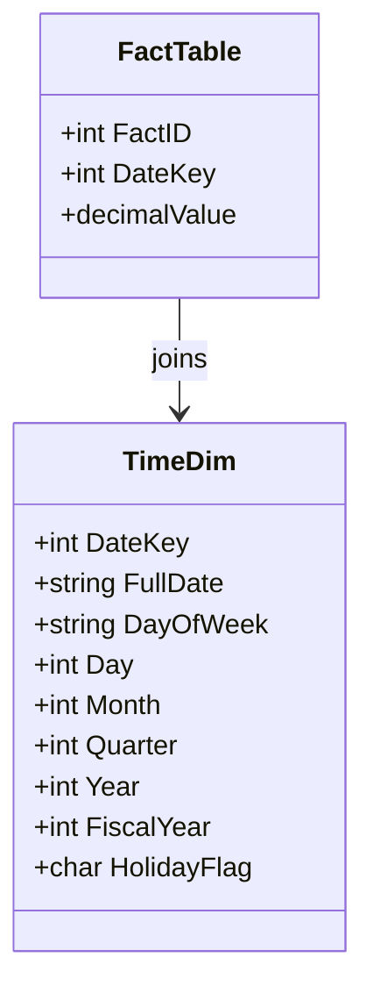

## Time Dimension

### Description
The Time Dimension is a crucial component in data warehouse design, acting as a dimension table that provides detailed chronological information. It encompasses elements such as date hierarchies and fiscal calendars, enabling coherent data aggregation and time-based analytics. By structuring data into specific time periods—days, weeks, months, quarters, and years—businesses can effectively perform comprehensive historical analysis and trend analysis over time.

### Architectural Approaches
The Time Dimension often appears in star schema and snowflake schema designs, supporting OLAP operations. By hosting time-related attributes, it enhances operations such as year-to-date comparisons, period-over-period reporting, and variance analysis.

### Best Practices
- **Granularity**: Choose an appropriate granularity, like daily or monthly, aligning it with your business needs.
- **Fiscal Calendars**: Include fiscal calendar specifics to improve custom period reporting.
- **Attributes**: Add rich time metadata—such as holidays or weekends—to make date-based filters more functional.
- **Lookups**: Optimize the design by indexing key columns to expedite joins and lookups.

### Example Code
Here's a simple SQL example of creating a basic Time Dimension table. 

```sql
CREATE TABLE TimeDim (
    DateKey INT PRIMARY KEY,
    FullDate DATE,
    DayOfWeek VARCHAR(10),
    Day INT,
    Month INT,
    Quarter INT,
    Year INT,
    FiscalYear INT,
    HolidayFlag CHAR(1)
);
```

This example includes common time attributes which can be expanded to include fiscal weeks, holidays, or any other business-specific time segments.

### Diagrams
Below is a simple Mermaid UML Class Diagram representing a Time Dimension integration within a Star Schema:



### Related Patterns
- **Star Schema**: The Time Dimension is an essential part of a star schema enabling efficient querying and reporting.
- **Snowflake Schema**: In more normalized data models, time attributes may be broken into further normalized dimensions.
- **Role-Playing Dimension**: Variations of the Time Dimension, e.g., Order Date, Shipping Date, can occur in data warehouses.

### Additional Resources
- **The Kimball Group**: Known for extensive data warehousing resources on dimension modeling.
- **"The Data Warehouse Toolkit"** by Ralph Kimball: Provides a deeper understanding and example implementations.

### Summary
The Time Dimension is fundamental for time-series analysis in data warehouses. By capturing various time-based attributes, organizations can unlock valuable insights and remove ambiguities in temporal data interpretation. Its adaptability to different planning calendars like fiscal years further augments its utility, providing profound advantages over typical date columns used in transactional databases.
