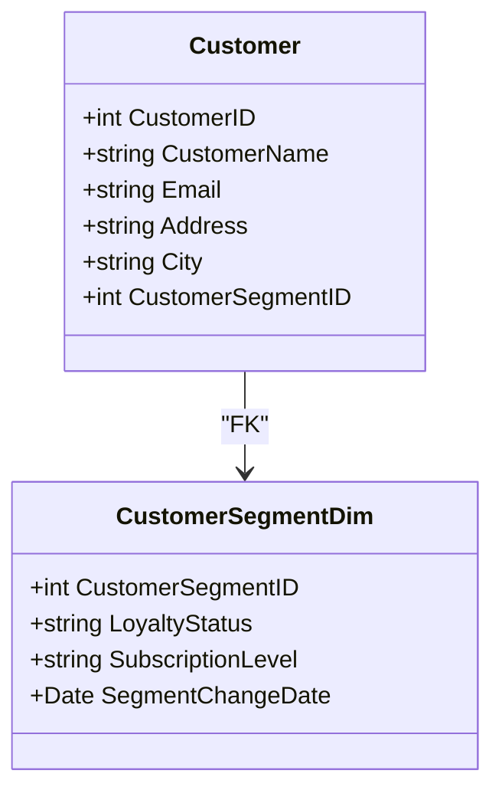

## Mini-Dimensions

### Description

The Mini-Dimensions design pattern addresses performance and manageability issues in data warehouses where dimensions have attributes that change frequently. By isolating these volatile attributes into separate, smaller dimensions, or "mini-dimensions," it reduces the need to frequently update large dimension tables, thereby enhancing query performance and simplifying maintenance.

### Use Case

Consider a scenario in a customer analytics system where a `Customer` dimension contains infrequently changing personal details alongside frequently changing customer segmentation data, such as loyalty status or subscription levels. Updating the entire `Customer` dimension whenever a segmentation change occurs can lead to performance bottlenecks.

### Solution

The solution is to create a separate dimension, a "mini-dimension," that encapsulates these rapidly changing attributes. This smaller dimension can be joined with the main dimension through a foreign key, reducing the size of the data that needs to be updated regularly.

For example, you might split off the frequently changing attributes into a `CustomerSegmentDim`, which includes columns like `CustomerID`, `LoyaltyStatus`, `SubscriptionLevel`, and `SegmentChangeDate`. The primary `Customer` dimension would no longer carry these attributes but instead would include a foreign key linking to `CustomerSegmentDim`.

### Example Code

To illustrate, consider the following SQL DDL statements:

```sql
-- Main Customer Dimension
CREATE TABLE Customer (
    CustomerID INT PRIMARY KEY,
    CustomerName VARCHAR(100),
    Email VARCHAR(255),
    Address VARCHAR(255),
    City VARCHAR(100),
    CustomerSegmentID INT,
    FOREIGN KEY (CustomerSegmentID) REFERENCES CustomerSegmentDim(CustomerSegmentID)
);

-- Mini-Dimension for Customer Segments
CREATE TABLE CustomerSegmentDim (
    CustomerSegmentID INT PRIMARY KEY,
    LoyaltyStatus VARCHAR(50),
    SubscriptionLevel VARCHAR(50),
    SegmentChangeDate DATE
);
```

### Diagram

Below is a UML class diagram depicting the relationship between the main dimension and the mini-dimension.



### Best Practices

- **Determine Volatility**: Only move attributes to mini-dimensions if their changes necessitate frequent updates.
- **Balance Granularity**: Avoid creating overly granular mini-dimensions which could lead to a proliferation of complex joins in queries.
- **Optimize Joins**: Ensure that index strategies support efficient joining of mini-dimensions with the main dimensions.

### Related Patterns

- **Slowly Changing Dimensions (SCDs)**: Manage changes to dimension data over time using type classifications like Type 1, Type 2, etc.
- **Junk Dimensions**: Manage unpredictable or low-cardinality attributes in separate, consolidated dimensions.
- **Snowflaking**: Normalizes dimensions into additional dimension tables, similar to mini-dimensions.

### Additional Resources

For more on data warehouse design patterns and the use of mini-dimensions, consider consulting resources such as "The Data Warehouse Toolkit" by Ralph Kimball and "Agile Data Warehouse Design" by Lawrence Corr.

### Summary

The Mini-Dimensions pattern is a sound approach to dealing with dimensions that have frequently changing attributes in a data warehouse environment. By offloading these attributes into separate smaller dimensions, organizations can improve system performance, simplify updates, and maintain a streamlined structure for data querying and analysis.
