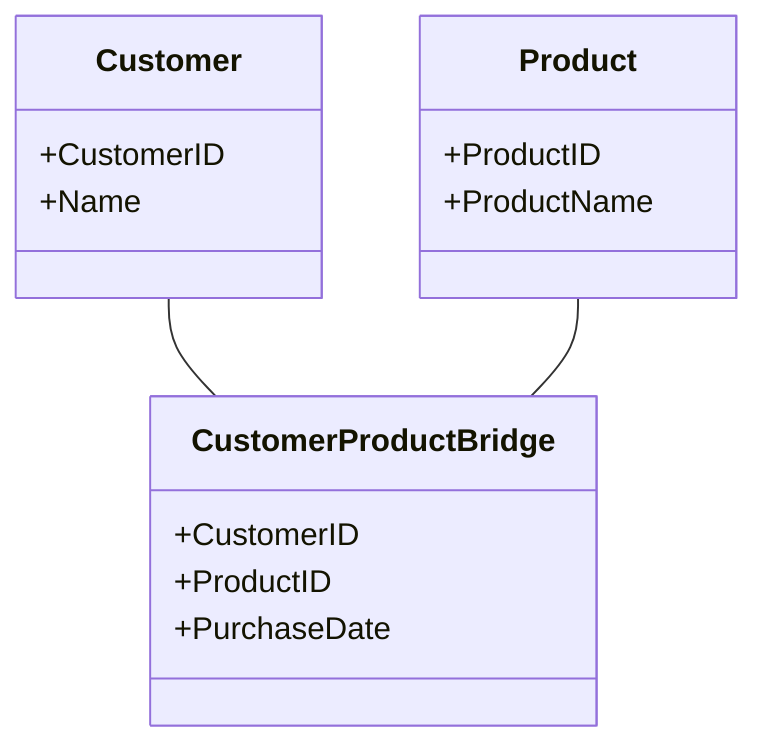

---

linkTitle: "Bridge Tables"
title: "Bridge Tables"
category: "5. Data Warehouse Modeling Patterns"
series: "Data Modeling Design Patterns"
description: "Bridge Tables are essential in data warehouse environments to efficiently handle many-to-many relationships between dimensions and fact tables."
categories:
- Data Modeling
- Data Warehouse
- Schema Design
tags:
- Bridge Table
- Data Warehouse
- Schema Design
- Many-to-Many Relationship
- Data Modeling Patterns
date: 2024-07-07
type: docs

canonical: "https://softwarepatternslexicon.com/102/5/19"
license: "© 2024 Tokenizer Inc. CC BY-NC-SA 4.0"
---

## Introduction to Bridge Tables

In the realm of data warehousing, effectively managing complex relationships between tables is critical, especially when addressing many-to-many relationships. Bridge Tables serve as an ingenious solution by acting as an intermediate structure that links two tables having a many-to-many relationship, typically dimensions and fact tables.

## Description of Bridge Tables

Bridge Tables, sometimes known as associative or junction tables, facilitate connections between entities that cannot be related directly through primary and foreign key constraints in a relational database. They are instrumental in scenarios where a dimension can relate to multiple records in a fact table and vice versa, without introducing redundancy or complicating queries.

### Structure of a Bridge Table

A typical Bridge Table consists of foreign keys referencing the primary keys of the tables it intends to connect. Additionally, it can include non-key attributes that are relevant to the association. For instance, in a "CustomerProductBridge" table, you might find the following structure:

- **CustomerID**: A foreign key referencing the Customers dimension.
- **ProductID**: A foreign key referencing the Products dimension.
- **PurchaseDate**: An optional attribute that captures the date of the purchase, specific to this pair.

## Architectural Approaches

### Benefits

- **Normalization**: Simplifies the schema by normalizing many-to-many relationships.
- **Flexibility**: Facilitates querying and reporting without redundancy.
- **Scalability**: As data grows, bridge tables maintain efficiency by avoiding large composite dimensions.

### Challenges

- **Complexity**: Introduces additional layer of joins in queries, which could impact performance.
- **Data Integrity**: Maintaining correct associations and cardinalities can be difficult over time.

### Best Practices

1. **Indexing**: Use appropriate indexing strategies on key columns to speed up joins and searches.
2. **Cardinality Analysis**: Understand the cardinality and prepare the Bridge Table design accordingly to ensure it supports business queries efficiently.
3. **Selective Attributes**: Limit attributes in a bridge only to those necessary for the relationship, keeping the table streamlined.

## Example

Here is how you might represent a Bridge Table in SQL:

```sql
CREATE TABLE CustomerProductBridge (
    CustomerID INT,
    ProductID INT,
    PurchaseDate DATE,
    PRIMARY KEY (CustomerID, ProductID),
    FOREIGN KEY (CustomerID) REFERENCES Customers(CustomerID),
    FOREIGN KEY (ProductID) REFERENCES Products(ProductID)
);
```

## Diagram Representation

A UML Class Diagram helps visualize the Bridge Table architecture:



## Related Patterns

- **Junction Table**: Similar concept in relational databases for resolving many-to-many relationships.
- **Fact Constellation Schema**: Involves the use of multiple fact tables that are linked through shared dimensions.

## Additional Resources

- [Designing a Data Warehouse: The Bridge Tables](https://www.examplelink1.com)
- [Understanding Bridge Tables in Star Schemas](https://www.examplelink2.com)
- [Optimizing Many-to-Many Relationships](https://www.examplelink3.com)

## Summary

Bridge Tables are pivotal in data warehousing scenarios where complex inter-table relationships arise. They provide a mechanism to normalize many-to-many associations, offering both flexibility and scalability to the data model. Leveraging bridge tables requires careful consideration of indexing and the essential attributes included in these tables. By mastering the use of Bridge Tables, we unlock powerful capabilities in building efficient and maintainable data warehouse schemas.

