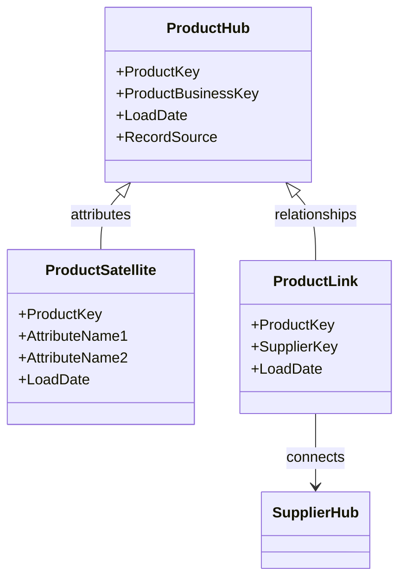

In the realm of data modeling, specifically within Data Vault modeling, **Hub Entities** play a crucial role. They represent core business concepts with unique identifiers, enabling a robust and scalable framework for data warehousing and integration.

## Detailed Explanation

Hub Entities serve as central points in a data warehouse's architecture. Each hub is designed to capture and store the unique identifiers of specific business entities. Examples of Hub Entities may include `CustomerHub`, `ProductHub`, `OrderHub`, etc., where each hub stores the surrogate or business key that uniquely identifies an entity across the organization.

### Architectural Approaches

1. **Centralized Identifier Management**: Routing all business activity in the warehouse through hubs ensures a single source of truth for entity identification.
2. **Auditability and Extendibility**: Hubs provide auditability through consistent, timestamped records of entities as they evolve. They support extending the model by adding more hubs or linking existing ones without reworking existing models substantially.
3. **Integration via Links and Satellites**: While hubs represent the core entities, they are connected using links (for relationships between entities) and satellites (for descriptive attributes and change over time).

### Best Practices

- **Normalize Unique Keys**: Ensure that hub tables contain only surrogate keys and are normalized to represent a single type of core business entity.
- **Record Source**: Include metadata about the source of each record to track data provenance.
- **Minimal Attributes in Hubs**: Limit the hub to only the business or surrogate key and load date, avoiding adding attributes that belong in satellites.

## Example Code

Below is an example SQL schema that represents a simple Product Hub table:

```sql
CREATE TABLE ProductHub (
    ProductKey INT PRIMARY KEY AUTO_INCREMENT,
    ProductBusinessKey VARCHAR(50) NOT NULL,
    LoadDate TIMESTAMP DEFAULT CURRENT_TIMESTAMP,
    RecordSource VARCHAR(50) NOT NULL
);
```

### Diagram

Here is a Mermaid UML diagram representing the relationship between a Hub and its Satellites and Links:



## Related Patterns

- **Satellite Entities**: Often accompany hub entities, capturing descriptive data attributes and history.
- **Link Entities**: Model relationships and associations between different hub entities.

## Additional Resources

- *Data Vault 2.0 Architecture* by Dan Linstedt
- *Building a Scalable Data Warehouse with Data Vault 2.0* by Hans Hultgren
- Online courses on data modeling and warehousing architectures.

## Summary

Hub Entities are foundational components in the **Data Vault modeling** technique, which is designed for scaling and flexibility in a data warehouse environment. They ensure unique identification for core business objects, supporting integration across different data sources and enhancing the model's auditability and extendibility. By incorporating Hub Entities into your data modeling strategy, you leverage the benefits of a robust and future-ready data warehousing structure.
